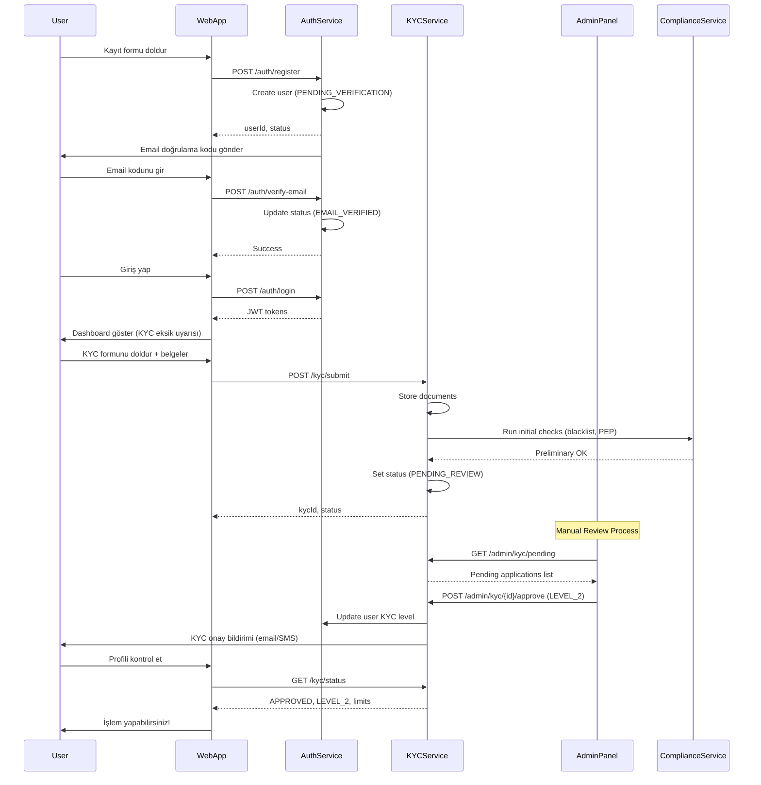
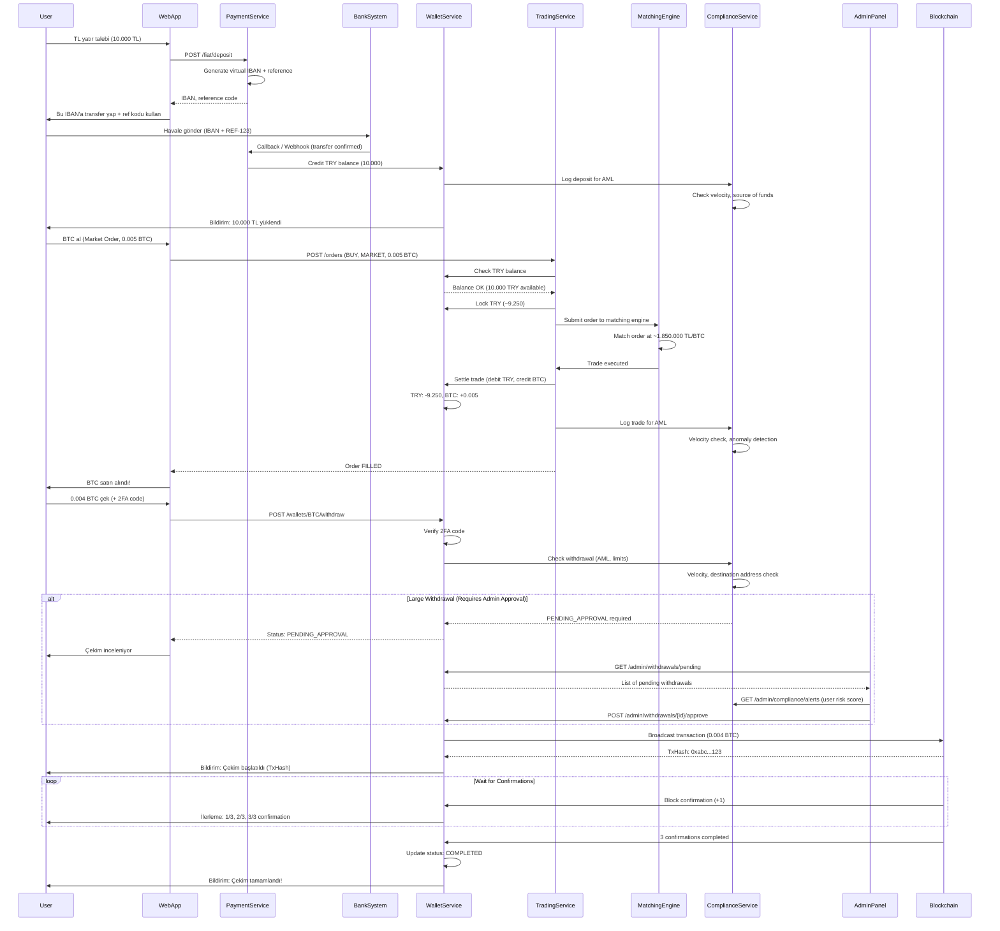
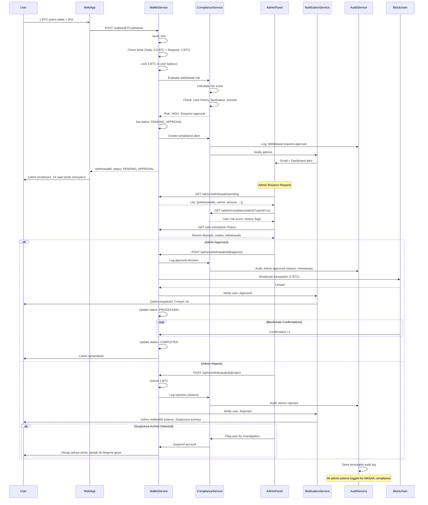

# Kurumsal Kripto Varlık Borsası Platformu
## Complete API Specification Document v1.0

---

## Document Information

**Version:** 1.0  
**Last Updated:** 2025-11-19  
**Maintained by:** Techsonamy Platform Team  
**Status:** Draft for Technical Review

---

## Table of Contents

1. [API Design Principles](#1-api-design-principles)
2. [Common Patterns](#2-common-patterns)
3. [API Endpoints Summary Tables](#3-api-endpoints-summary-tables)
4. [Detailed API Endpoints](#4-detailed-api-endpoints)
5. [WebSocket APIs](#5-websocket-apis)
6. [Rate Limiting](#6-rate-limiting)
7. [Security Considerations](#7-security-considerations)
8. [API Documentation](#8-api-documentation)
9. [Versioning & Deprecation Policy](#9-versioning--deprecation-policy)
10. [Error Handling Best Practices](#10-error-handling-best-practices)
11. [Key User Flows](#11-key-user-flows)
12. [Testing & Sandbox Environment](#12-testing--sandbox-environment)
13. [Appendices](#appendices)

---

## 1. API Design Principles

### 1.1 Architecture Style
- **RESTful API** for synchronous operations
- **WebSocket** for real-time data streams (market data, order updates)
- **Event-driven** internal communication between microservices

### 1.2 API Versioning
- **URL-based versioning**: `/api/v1/`, `/api/v2/`
- Major version in URL, minor versions handled via backward compatibility
- Deprecated endpoints maintained for minimum 6 months with clear deprecation headers

### 1.3 Authentication & Authorization
- **OAuth 2.0** / **OpenID Connect** for user authentication
- **JWT tokens** for API access:
  - Access Token (short-lived: 15-30 min)
  - Refresh Token (long-lived: 30 days)
- **API Keys** for server-to-server communication
- **mTLS** for sensitive microservice communication

### 1.4 Security Headers
```
Authorization: Bearer {JWT_TOKEN}
X-API-Key: {API_KEY}
X-Request-ID: {UUID}
X-Client-Version: {APP_VERSION}
X-Device-ID: {DEVICE_ID}
```

---

## 2. Common Patterns

### 2.1 Request Format
```json
{
  "requestId": "uuid-v4",
  "timestamp": "2025-11-19T10:30:00Z",
  "data": {
    // Request payload
  }
}
```

### 2.2 Success Response Format
```json
{
  "success": true,
  "requestId": "uuid-v4",
  "timestamp": "2025-11-19T10:30:00.123Z",
  "data": {
    // Response payload
  },
  "meta": {
    "page": 1,
    "pageSize": 50,
    "totalCount": 1500
  }
}
```

### 2.3 Error Response Format
```json
{
  "success": false,
  "requestId": "uuid-v4",
  "timestamp": "2025-11-19T10:30:00.123Z",
  "error": {
    "code": "INSUFFICIENT_BALANCE",
    "message": "Insufficient balance for this order",
    "details": {
      "required": "1000.00",
      "available": "750.50",
      "currency": "TRY"
    },
    "traceId": "trace-uuid"
  }
}
```

### 2.4 Standard Error Codes
| Code | HTTP Status | Description |
|------|-------------|-------------|
| `INVALID_REQUEST` | 400 | Invalid request parameters |
| `UNAUTHORIZED` | 401 | Authentication required |
| `FORBIDDEN` | 403 | Insufficient permissions |
| `NOT_FOUND` | 404 | Resource not found |
| `INSUFFICIENT_BALANCE` | 400 | Insufficient funds |
| `ORDER_NOT_FOUND` | 404 | Order does not exist |
| `MARKET_CLOSED` | 400 | Market is not active |
| `RATE_LIMIT_EXCEEDED` | 429 | Too many requests |
| `KYC_REQUIRED` | 403 | KYC verification needed |
| `LIMIT_EXCEEDED` | 400 | Transaction limit exceeded |
| `INTERNAL_ERROR` | 500 | Internal server error |
| `SERVICE_UNAVAILABLE` | 503 | Service temporarily unavailable |

### 2.5 Pagination
```json
{
  "data": [...],
  "meta": {
    "page": 1,
    "pageSize": 50,
    "totalCount": 1500,
    "totalPages": 30,
    "hasNext": true,
    "hasPrevious": false
  },
  "links": {
    "self": "/api/v1/orders?page=1&pageSize=50",
    "next": "/api/v1/orders?page=2&pageSize=50",
    "last": "/api/v1/orders?page=30&pageSize=50"
  }
}
```

### 2.6 Filtering & Sorting
- **Filtering**: Query parameters with prefix `filter_`
  ```
  GET /api/v1/orders?filter_status=OPEN&filter_symbol=BTCTRY
  ```
- **Sorting**: `sort` parameter with `+` (asc) or `-` (desc)
  ```
  GET /api/v1/orders?sort=-createdAt,+price
  ```

---

## 3. API Endpoints Summary Tables

### 3.1 Auth Service Endpoints

| Endpoint | Method | Auth | Rate Limit | Description |
|----------|--------|------|------------|-------------|
| `/api/v1/auth/register` | POST | Public | 10/hour | Yeni kullanıcı kaydı |
| `/api/v1/auth/verify-email` | POST | Public | 10/hour | E-posta doğrulama |
| `/api/v1/auth/login` | POST | Public | 20/hour | Kullanıcı girişi |
| `/api/v1/auth/refresh` | POST | Refresh Token | 100/hour | Token yenileme |
| `/api/v1/auth/logout` | POST | User JWT | 100/hour | Oturum kapatma |
| `/api/v1/auth/password/reset-request` | POST | Public | 5/hour | Şifre sıfırlama talebi |
| `/api/v1/auth/password/reset` | POST | Reset Token | 5/hour | Şifre sıfırlama |

### 3.2 User & KYC Service Endpoints

| Endpoint | Method | Auth | Rate Limit | Description |
|----------|--------|------|------------|-------------|
| `/api/v1/users/profile` | GET | User JWT | 200/min | Kullanıcı profili görüntüleme |
| `/api/v1/users/profile` | PUT | User JWT | 50/min | Profil güncelleme |
| `/api/v1/kyc/submit` | POST | User JWT | 10/day | KYC dokümanları gönderme |
| `/api/v1/kyc/status` | GET | User JWT | 200/min | KYC durumu sorgulama |

### 3.3 Trading Service Endpoints

| Endpoint | Method | Auth | Rate Limit | Description |
|----------|--------|------|------------|-------------|
| `/api/v1/markets` | GET | Public | 100/min | Aktif piyasalar listesi |
| `/api/v1/markets/{symbol}/ticker` | GET | Public | 100/min | Piyasa özet bilgisi |
| `/api/v1/markets/{symbol}/orderbook` | GET | Public | 100/min | Emir defteri |
| `/api/v1/markets/{symbol}/trades` | GET | Public | 100/min | Son işlemler |
| `/api/v1/orders` | POST | User JWT | 50/min | Yeni emir oluşturma |
| `/api/v1/orders/{orderId}` | GET | User JWT | 200/min | Emir detayı |
| `/api/v1/orders` | GET | User JWT | 200/min | Kullanıcının emirleri |
| `/api/v1/orders/{orderId}` | DELETE | User JWT | 50/min | Emir iptali |
| `/api/v1/trades` | GET | User JWT | 200/min | Kullanıcının işlem geçmişi |

### 3.4 Wallet Service Endpoints

| Endpoint | Method | Auth | Rate Limit | Description |
|----------|--------|------|------------|-------------|
| `/api/v1/wallets/balances` | GET | User JWT | 200/min | Tüm bakiyeler |
| `/api/v1/wallets/{asset}/balance` | GET | User JWT | 200/min | Belirli varlık bakiyesi |
| `/api/v1/wallets/{asset}/deposit-address` | GET | User JWT | 100/min | Yatırma adresi |
| `/api/v1/wallets/{asset}/withdraw` | POST | User JWT + 2FA | 30/min | Çekim talebi |
| `/api/v1/wallets/deposits` | GET | User JWT | 200/min | Yatırma geçmişi |
| `/api/v1/wallets/withdrawals` | GET | User JWT | 200/min | Çekim geçmişi |

### 3.5 Payment Service Endpoints (Fiat)

| Endpoint | Method | Auth | Rate Limit | Description |
|----------|--------|------|------------|-------------|
| `/api/v1/fiat/deposit` | POST | User JWT | 30/min | TL yatırma talebi |
| `/api/v1/fiat/withdraw` | POST | User JWT + 2FA | 30/min | TL çekim talebi |
| `/api/v1/fiat/transactions` | GET | User JWT | 200/min | Fiat işlem geçmişi |

### 3.6 Public Market Data Endpoints

| Endpoint | Method | Auth | Rate Limit | Description |
|----------|--------|------|------------|-------------|
| `/api/v1/public/time` | GET | Public | 100/min | Sunucu zamanı |
| `/api/v1/public/markets` | GET | Public | 100/min | Tüm piyasalar |
| `/api/v1/public/ticker/{symbol}` | GET | Public | 100/min | Piyasa ticker'ı |
| `/api/v1/public/orderbook/{symbol}` | GET | Public | 100/min | Emir defteri |
| `/api/v1/public/trades/{symbol}` | GET | Public | 100/min | Son işlemler |
| `/api/v1/public/klines/{symbol}` | GET | Public | 100/min | OHLCV (Candlestick) verileri |

### 3.7 Admin Service Endpoints

| Endpoint | Method | Auth | Rate Limit | Description |
|----------|--------|------|------------|-------------|
| `/api/v1/admin/auth/login` | POST | Admin Credentials | 20/hour | Admin girişi |
| `/api/v1/admin/users` | GET | Admin JWT | 1000/min | Kullanıcı listesi |
| `/api/v1/admin/users/{userId}` | GET | Admin JWT | 1000/min | Kullanıcı detayı |
| `/api/v1/admin/users/{userId}/status` | PUT | Admin JWT | 500/min | Kullanıcı durumu değiştirme |
| `/api/v1/admin/users/{userId}/limits` | PUT | Admin JWT | 500/min | Kullanıcı limitlerini güncelleme |
| `/api/v1/admin/kyc/pending` | GET | Admin JWT | 1000/min | KYC onay bekleyen kullanıcılar |
| `/api/v1/admin/kyc/{kycId}/approve` | POST | Admin JWT | 500/min | KYC onaylama |
| `/api/v1/admin/kyc/{kycId}/reject` | POST | Admin JWT | 500/min | KYC reddetme |
| `/api/v1/admin/orders` | GET | Admin JWT | 1000/min | Tüm emirler (global) |
| `/api/v1/admin/trades` | GET | Admin JWT | 1000/min | Tüm işlemler |
| `/api/v1/admin/withdrawals/pending` | GET | Admin JWT | 1000/min | Onay bekleyen çekimler |
| `/api/v1/admin/withdrawals/{id}/approve` | POST | Admin JWT | 500/min | Çekim onaylama |
| `/api/v1/admin/withdrawals/{id}/reject` | POST | Admin JWT | 500/min | Çekim reddetme |
| `/api/v1/admin/compliance/alerts` | GET | Admin JWT | 1000/min | Uyum uyarıları |
| `/api/v1/admin/reports/trading` | GET | Admin JWT | 100/min | İşlem raporları |
| `/api/v1/admin/reports/masak` | GET | Admin JWT | 100/min | MASAK raporları |
| `/api/v1/admin/markets/{symbol}/status` | POST | Admin JWT | 500/min | Piyasa durumu değiştirme |
| `/api/v1/admin/system/config` | POST | Admin JWT | 500/min | Sistem konfigürasyonu |

---

## 4. Detailed API Endpoints

### 4.1 Auth Service APIs

#### POST /api/v1/auth/register
Yeni kullanıcı kaydı (pre-KYC)

**Request:**
```json
{
  "email": "user@example.com",
  "password": "SecurePass123!",
  "phoneNumber": "+905551234567",
  "referralCode": "REF123"
}
```

**Response:**
```json
{
  "success": true,
  "data": {
    "userId": "usr_abc123",
    "email": "user@example.com",
    "status": "PENDING_VERIFICATION",
    "verificationRequired": ["EMAIL", "PHONE"]
  }
}
```

---

#### POST /api/v1/auth/verify-email
E-posta doğrulama

**Request:**
```json
{
  "email": "user@example.com",
  "code": "123456"
}
```

---

#### POST /api/v1/auth/login
Kullanıcı girişi

**Request:**
```json
{
  "email": "user@example.com",
  "password": "SecurePass123!",
  "deviceId": "device-uuid",
  "twoFactorCode": "123456"
}
```

**Response:**
```json
{
  "success": true,
  "data": {
    "accessToken": "eyJhbGc...",
    "refreshToken": "refresh_token_here",
    "expiresIn": 1800,
    "tokenType": "Bearer",
    "user": {
      "userId": "usr_abc123",
      "email": "user@example.com",
      "kycLevel": "LEVEL_2",
      "roles": ["USER"]
    }
  }
}
```

---

### 4.2 Trading Service APIs

#### POST /api/v1/orders
Yeni emir oluşturma

**Request (Market Order):**
```json
{
  "symbol": "BTCTRY",
  "side": "BUY",
  "type": "MARKET",
  "quantity": "0.01000000"
}
```

**Request (Limit Order):**
```json
{
  "symbol": "BTCTRY",
  "side": "SELL",
  "type": "LIMIT",
  "price": "1900000.00",
  "quantity": "0.05000000",
  "timeInForce": "GTC"
}
```

**Response:**
```json
{
  "success": true,
  "data": {
    "orderId": "ord_abc123",
    "clientOrderId": "client_ref_123",
    "symbol": "BTCTRY",
    "side": "BUY",
    "type": "LIMIT",
    "price": "1850000.00",
    "quantity": "0.01000000",
    "status": "NEW",
    "timeInForce": "GTC",
    "createdAt": "2025-11-19T10:30:00Z"
  }
}
```

---

### 4.3 Wallet Service APIs

#### GET /api/v1/wallets/balances
Tüm bakiyeler

**Response:**
```json
{
  "success": true,
  "data": [
    {
      "asset": "BTC",
      "available": "0.15000000",
      "locked": "0.02000000",
      "total": "0.17000000",
      "valueInTRY": "314500.00"
    },
    {
      "asset": "TRY",
      "available": "50000.00",
      "locked": "10000.00",
      "total": "60000.00"
    }
  ],
  "totalValueInTRY": "374500.00"
}
```

---

#### POST /api/v1/wallets/{asset}/withdraw
Çekim talebi

**Request:**
```json
{
  "asset": "BTC",
  "amount": "0.05000000",
  "address": "bc1qxy2kgdygjrsqtzq2n0yrf2493p83kkfjhx0wlh",
  "network": "BTC",
  "memo": null,
  "twoFactorCode": "123456"
}
```

**Response:**
```json
{
  "success": true,
  "data": {
    "withdrawalId": "wdr_xyz789",
    "asset": "BTC",
    "amount": "0.05000000",
    "fee": "0.0005",
    "address": "bc1qxy2kgdygjrsqtzq2n0yrf2493p83kkfjhx0wlh",
    "status": "PENDING_APPROVAL",
    "createdAt": "2025-11-19T10:30:00Z"
  }
}
```

---

## 5. WebSocket APIs

### 5.1 Connection
```
wss://api.example.com/ws
```

### 5.2 Public Channels

#### Ticker Updates
**Subscribe:**
```json
{
  "method": "SUBSCRIBE",
  "params": {
    "channel": "ticker",
    "symbol": "BTCTRY"
  }
}
```

**Message Format:**
```json
{
  "channel": "ticker",
  "symbol": "BTCTRY",
  "data": {
    "lastPrice": "1850000.00",
    "priceChange": "2.5",
    "volume24h": "1250000000.00",
    "timestamp": 1700392200123
  }
}
```

---

#### Order Book Updates
**Subscribe:**
```json
{
  "method": "SUBSCRIBE",
  "params": {
    "channel": "orderbook",
    "symbol": "BTCTRY",
    "depth": 20
  }
}
```

---

### 5.3 Private Channels (Authenticated)

#### Order Updates
**Subscribe:**
```json
{
  "method": "SUBSCRIBE",
  "params": {
    "channel": "orders",
    "auth": {
      "token": "JWT_TOKEN"
    }
  }
}
```

**Message Format:**
```json
{
  "channel": "orders",
  "data": {
    "orderId": "ord_abc123",
    "status": "FILLED",
    "executedQuantity": "0.01000000",
    "averagePrice": "1850000.00",
    "timestamp": 1700392200123
  }
}
```

---

## 6. Rate Limiting

### 6.1 Rate Limit Headers
```
X-RateLimit-Limit: 1000
X-RateLimit-Remaining: 950
X-RateLimit-Reset: 1700392800
```

### 6.2 Rate Limits by Endpoint Type

| Endpoint Category | Limit | Window |
|------------------|-------|---------|
| Public Market Data | 100 req/min | 1 minute |
| Trading (POST) | 50 req/min | 1 minute |
| Trading (GET) | 200 req/min | 1 minute |
| Wallet Operations | 30 req/min | 1 minute |
| Admin Operations | 1000 req/min | 1 minute |

---

## 7. Security Considerations

### 7.1 Request Signing (for sensitive operations)
```
Signature = HMAC-SHA256(timestamp + method + requestPath + body, API_SECRET)
```

**Headers:**
```
X-API-Key: {API_KEY}
X-Timestamp: 1700392200123
X-Signature: {SIGNATURE}
```

### 7.2 Two-Factor Authentication
Required for:
- Withdrawals
- API key creation
- Security settings changes

### 7.3 Idempotency
- All POST requests support idempotency via `X-Idempotency-Key` header
- Idempotency keys stored for 24 hours

---

## 8. API Documentation

### 8.1 OpenAPI Specification
- Full OpenAPI 3.0 specification available at `/api/docs/openapi.json`
- Interactive Swagger UI at `/api/docs`
- ReDoc documentation at `/api/redoc`

### 8.2 SDKs
Planned SDK support:
- JavaScript/TypeScript
- Python
- Java
- C#
- Go

---

## 9. Versioning & Deprecation Policy

### 9.1 Versioning Strategy
- Major version in URL: `/api/v1/`, `/api/v2/`
- Breaking changes require new major version
- Minor changes are backward compatible

### 9.2 Deprecation Process
1. **Announcement**: 3 months notice via email and documentation
2. **Deprecation Header**: `Deprecation: true` header added
3. **Sunset Header**: `Sunset: 2026-01-01T00:00:00Z`
4. **Grace Period**: Minimum 6 months before shutdown
5. **Migration Guide**: Detailed guide for transitioning to new version

---

## 10. Error Handling Best Practices

### 10.1 Retry Strategy
- 5xx errors: Retry with exponential backoff
- 429 errors: Respect `Retry-After` header
- 4xx errors: Don't retry (fix request)

### 10.2 Circuit Breaker Pattern
- Clients should implement circuit breaker for resilience
- After 5 consecutive failures, open circuit for 30 seconds

---

## 11. Key User Flows

Bu bölümde, platformun 3 kritik kullanım senaryosu için end-to-end API akışları gösterilmektedir.

---

### 11.1 Flow 1: Kullanıcı Kaydı ve KYC Süreci

**Senaryo:** Yeni bir kullanıcı platforma kaydoluyor, KYC sürecini tamamlıyor ve işlem yapma yetkisi alıyor.

#### Akış Adımları:

1. **Kullanıcı Kaydı**
   - `POST /api/v1/auth/register` → Email ve telefon ile kayıt
   - Sistem kullanıcıyı `PENDING_VERIFICATION` durumunda oluşturur

2. **Email Doğrulama**
   - Kullanıcıya doğrulama kodu gönderilir
   - `POST /api/v1/auth/verify-email` → Kod ile doğrulama
   - Kullanıcı durumu `EMAIL_VERIFIED` olur

3. **İlk Giriş**
   - `POST /api/v1/auth/login` → JWT token alınır
   - Kullanıcı artık sisteme giriş yapabilir ama KYC yoksa işlem yapamaz

4. **KYC Dokümanları Gönderimi**
   - `POST /api/v1/kyc/submit` → Kimlik, adres belgesi ve selfie yüklenir
   - Sistem KYC durumunu `PENDING_REVIEW` olarak işaretler

5. **KYC İnceleme (Admin)**
   - `GET /api/v1/admin/kyc/pending` → Admin bekleyen başvuruları görür
   - Manuel/otomatik inceleme
   - `POST /api/v1/admin/kyc/{kycId}/approve` → KYC onaylanır
   - Kullanıcının `kycLevel` değeri `LEVEL_2` olur

6. **Kullanıcı İşlem Yapabilir**
   - `GET /api/v1/kyc/status` → Kullanıcı onayı görür
   - Artık `POST /api/v1/orders`, `POST /api/v1/wallets/{asset}/withdraw` vb. endpoint'lere erişebilir

#### Sequence Diagram:



#### Kontrol Noktaları:
- **Compliance Check 1**: Email/phone ile blacklist kontrolü (registration)
- **Compliance Check 2**: KYC dokümanları üzerinde PEP, sanction lists kontrolü
- **Compliance Check 3**: Manuel admin review (fraud indicators)

---

### 11.2 Flow 2: TL Yatır → BTC Al → BTC Çek (Full Trading Cycle)

**Senaryo:** KYC'si onaylı bir kullanıcı TL yatırıyor, BTC satın alıyor ve sonra BTC'yi kendi cüzdanına çekiyor.

#### Akış Adımları:

1. **TL Yatırma Talebi**
   - `POST /api/v1/fiat/deposit` → Kullanıcı 10.000 TL yatırmak istiyor
   - Sistem sanal IBAN ve referans kodu döner
   - Kullanıcı kendi bankasından havale yapar

2. **TL Yatırma Onayı**
   - Banka callback veya polling ile havale tespit edilir
   - Payment Service bakiyeyi günceller
   - `GET /api/v1/wallets/balances` → TRY bakiyesi 10.000 olur
   - Kullanıcıya bildirim gider

3. **BTC Alım Emri (Market Order)**
   - Kullanıcı mevcut fiyattan (ör. 1.850.000 TL/BTC) BTC almak istiyor
   - `POST /api/v1/orders` → Market order: BUY 0.005 BTC (~9.250 TL)
   - Trading Service bakiye kontrolü yapar
   - Matching Engine emri execution eder
   - Trade gerçekleşir, BTC bakiyesi 0.005 artar, TRY bakiyesi düşer
   - `GET /api/v1/wallets/balances` → BTC: 0.005, TRY: ~720 (kalan)

4. **AML Kontrolü (Arka Planda)**
   - Compliance Service işlemi analiz eder:
     - Velocity check: Kullanıcının günlük/saatlik işlem hacmi limit içinde mi?
     - Anomaly detection: Normal davranış pattern'i ile uyumlu mu?
   - Sorun yoksa işlem devam eder

5. **BTC Çekim Talebi**
   - Kullanıcı 0.004 BTC'yi kendi cüzdanına çekmek istiyor
   - `POST /api/v1/wallets/BTC/withdraw` + 2FA code
   - Wallet Service:
     - 2FA kontrolü
     - Günlük/aylık limit kontrolü
     - Compliance Service'e soru: Bu çekim şüpheli mi?
   - Compliance OK ise çekim `PENDING_APPROVAL` durumuna alınır

6. **Admin Onayı (Eğer Limit Üzerinde İse)**
   - `GET /api/v1/admin/withdrawals/pending` → Admin listede görür
   - Admin risk skorunu ve kullanıcı geçmişini kontrol eder
   - `POST /api/v1/admin/withdrawals/{id}/approve`
   - Wallet Service blockchain'e transaction gönderir

7. **Blockchain Confirmation**
   - Transaction hash döner
   - `GET /api/v1/wallets/withdrawals` → Kullanıcı durumu takip eder
   - N confirmation sonrası status `COMPLETED` olur

#### Sequence Diagram:



#### Kritik Kontrol Noktaları:
- **TL Yatırma**: Kaynak banka hesabı kontrolü, büyük miktarlarda kaynak sorgusu
- **Trade**: Velocity check, wash trading pattern tespiti
- **BTC Çekim**: 
  - Günlük/aylık limit kontrolü
  - Destination address blacklist kontrolü
  - Büyük çekimlerde admin onayı
  - Anti-money laundering scoring

#### Error Scenarios:
- **TL yatırımda**: Yanlış referans kodu → Manuel reconciliation gerekir
- **Trade'de**: Yetersiz bakiye → `INSUFFICIENT_BALANCE` error
- **Çekimde**: 
  - 2FA kodu yanlış → `INVALID_2FA_CODE`
  - Günlük limit aşımı → `WITHDRAWAL_LIMIT_EXCEEDED`
  - Şüpheli adres → `SUSPICIOUS_ADDRESS` + automatic hold

---

### 11.3 Flow 3: Admin Withdrawal Approval Process

**Senaryo:** Bir kullanıcı büyük bir BTC çekim talebi oluşturdu (ör. 1 BTC = ~1.850.000 TL). Compliance kuralları gereği admin onayı gerekiyor.

#### Akış Adımları:

1. **Kullanıcı Çekim Talebi**
   - User: `POST /api/v1/wallets/BTC/withdraw` (1 BTC)
   - Sistem limiti kontrol eder: Günlük limit 0.5 BTC, talep 1 BTC
   - Status: `PENDING_APPROVAL` olarak işaretlenir
   - Compliance alert oluşturulur

2. **Compliance Alert Oluşturma**
   - Compliance Service otomatik kontroller yapar:
     - User risk score
     - Son 30 gündeki işlem pattern'i
     - Destination address reputation check
   - Alert seviyesi: `HIGH` (büyük miktar + limit üstü)

3. **Admin Notification**
   - Admin'lere email/dashboard notification
   - Compliance dashboard'da yeni alert görünür

4. **Admin İnceleme**
   - Admin panelde: `GET /api/v1/admin/withdrawals/pending`
   - Çekim detayları:
     - User profili, KYC seviyesi
     - İşlem geçmişi
     - Risk skoru
     - Destination address analizi
   - Admin ek bilgi isteyebilir (user'a mesaj)

5. **Admin Kararı**
   - **Onay**: `POST /api/v1/admin/withdrawals/{id}/approve`
     - Sistem transaction'ı blockchain'e gönderir
     - User'a bildirim
   - **Red**: `POST /api/v1/admin/withdrawals/{id}/reject`
     - Locked balance unlock edilir
     - User'a red sebebi ile bildirim
     - Gerekirse hesap suspend edilir

6. **Audit Trail**
   - Tüm admin aksiyonları loglanır:
     - Kim (adminUserId)
     - Ne zaman
     - Hangi kararı verdi
     - Hangi bilgileri inceledi
   - MASAK denetiminde bu loglar sunulabilir

#### Sequence Diagram:



#### Admin Decision Criteria:

**Onay Kriterleri:**
- User KYC Level 2+
- Clean transaction history
- Risk score < 70
- Destination address not blacklisted
- Reasonable withdrawal pattern

**Red Kriterleri:**
- Risk score > 85
- Destination address flagged
- Recent suspicious activity
- Inconsistent with user profile
- Source of funds unclear

**Ek İnceleme Gerektiren Durumlar:**
- Risk score 70-85 arası
- First large withdrawal
- Unusual timing
- Multiple small deposits followed by large withdrawal (structuring pattern)

#### Audit Trail Fields:
```json
{
  "auditId": "aud_123456",
  "eventType": "WITHDRAWAL_APPROVAL",
  "adminUserId": "adm_xyz",
  "adminEmail": "admin@platform.com",
  "targetUserId": "usr_abc123",
  "withdrawalId": "wdr_xyz789",
  "action": "APPROVED",
  "reason": "Verified source of funds, clean history",
  "riskScore": 65,
  "reviewedDocuments": ["kyc_doc", "transaction_history"],
  "timestamp": "2025-11-19T15:30:00Z",
  "ipAddress": "10.20.30.40"
}
```

---

## 12. Testing & Sandbox Environment

### 12.1 Sandbox Environment
- Endpoint: `https://sandbox-api.example.com`
- Separate database and blockchain network (testnet)
- Test data can be reset
- Rate limits are more relaxed (10x production limits)

### 12.2 Test Credentials
- Test users with different KYC levels:
  - `test.level0@example.com` - No KYC
  - `test.level1@example.com` - Basic KYC
  - `test.level2@example.com` - Full KYC
- Pre-funded accounts with test TRY and crypto
- Test bank accounts for fiat operations

### 12.3 Test Scenarios
- **Successful flows**: Normal user journey
- **Error flows**: Insufficient balance, limit exceeded, etc.
- **Edge cases**: Exactly at limit, concurrent orders, etc.

---

## Appendices

### Appendix A: Complete Error Code Reference

| Code | HTTP | Description | Resolution |
|------|------|-------------|------------|
| `AUTH_001` | 401 | Invalid credentials | Check email/password |
| `AUTH_002` | 401 | Token expired | Refresh token |
| `AUTH_003` | 401 | Invalid token | Re-authenticate |
| `AUTH_004` | 401 | Invalid 2FA code | Check 2FA code |
| `KYC_001` | 403 | KYC not completed | Complete KYC process |
| `KYC_002` | 403 | KYC pending review | Wait for approval |
| `KYC_003` | 403 | KYC rejected | Resubmit documents |
| `KYC_004` | 400 | Invalid document format | Upload valid document |
| `TRADE_001` | 400 | Insufficient balance | Add funds |
| `TRADE_002` | 400 | Order below minimum | Increase order size |
| `TRADE_003` | 400 | Invalid price | Check price format |
| `TRADE_004` | 400 | Market closed | Wait for market open |
| `TRADE_005` | 400 | Invalid symbol | Check symbol format |
| `TRADE_006` | 400 | Order not found | Check order ID |
| `TRADE_007` | 400 | Cannot cancel filled order | Order already executed |
| `WALLET_001` | 400 | Invalid address | Check address format |
| `WALLET_002` | 400 | Withdrawal limit exceeded | Wait or request increase |
| `WALLET_003` | 400 | Minimum withdrawal not met | Increase amount |
| `WALLET_004` | 403 | Withdrawal requires approval | Wait for admin approval |
| `WALLET_005` | 400 | Insufficient confirmations | Wait for more confirmations |
| `WALLET_006` | 400 | Blacklisted address | Contact support |
| `COMPLIANCE_001` | 403 | Suspicious activity detected | Account under review |
| `COMPLIANCE_002` | 403 | Velocity limit exceeded | Wait for limit reset |
| `COMPLIANCE_003` | 403 | Account suspended | Contact compliance team |
| `SYSTEM_001` | 500 | Database error | Retry or contact support |
| `SYSTEM_002` | 503 | Service unavailable | Retry later |
| `SYSTEM_003` | 500 | Blockchain node error | Retry or contact support |

---

### Appendix B: WebSocket Event Types

| Event | Description | Channel | Auth Required |
|-------|-------------|---------|---------------|
| `ticker` | Price updates | Public | No |
| `orderbook` | Order book changes | Public | No |
| `trade` | New trade executed | Public | No |
| `kline` | Candlestick update | Public | No |
| `order.new` | New order created | Private | Yes |
| `order.filled` | Order completely filled | Private | Yes |
| `order.partial` | Order partially filled | Private | Yes |
| `order.canceled` | Order canceled | Private | Yes |
| `balance.update` | Balance changed | Private | Yes |
| `deposit.confirmed` | Deposit confirmed | Private | Yes |
| `withdrawal.processing` | Withdrawal started | Private | Yes |
| `withdrawal.completed` | Withdrawal completed | Private | Yes |

---

### Appendix C: Common Fields & Enums

Bu bölüm, tüm API endpoint'lerinde sıkça kullanılan field'ların açıklamalarını içerir.

#### Order Fields

| Field | Type | Description | Possible Values |
|-------|------|-------------|-----------------|
| `orderId` | string | Sistemin atadığı benzersiz emir ID | `ord_abc123` |
| `clientOrderId` | string (optional) | Kullanıcının verdiği referans ID | User defined |
| `symbol` | string | İşlem çifti | `BTCTRY`, `ETHTRY`, `USDTTRY` |
| `side` | string (enum) | Alım veya satım | `BUY`, `SELL` |
| `type` | string (enum) | Emir tipi | `MARKET`, `LIMIT` (MVP)<br>Phase 2: `STOP_LOSS`, `STOP_LIMIT`, `OCO` |
| `price` | decimal string | Limit emir fiyatı | `"1850000.00"` (TRY için 2 decimal) |
| `quantity` | decimal string | Kripto miktarı | `"0.01000000"` (8 decimal) |
| `status` | string (enum) | Emir durumu | `NEW`, `PARTIALLY_FILLED`, `FILLED`, `CANCELED`, `REJECTED`, `EXPIRED` |
| `timeInForce` | string (enum) | Geçerlilik süresi | `GTC` (Good Till Cancel)<br>`IOC` (Immediate or Cancel)<br>`FOK` (Fill or Kill) |
| `executedQuantity` | decimal string | Gerçekleşen miktar | `"0.00500000"` |
| `remainingQuantity` | decimal string | Kalan miktar | `"0.00500000"` |
| `averagePrice` | decimal string | Ortalama gerçekleşme fiyatı | `"1849800.00"` |
| `createdAt` | ISO 8601 | Emir oluşturma zamanı | `"2025-11-19T10:30:00Z"` |
| `updatedAt` | ISO 8601 | Son güncelleme zamanı | `"2025-11-19T10:30:15Z"` |

#### Trade Fields

| Field | Type | Description | Possible Values |
|-------|------|-------------|-----------------|
| `tradeId` | string | Benzersiz işlem ID | `trd_123456` |
| `orderId` | string | İşlemi oluşturan emir ID | `ord_abc123` |
| `symbol` | string | İşlem çifti | `BTCTRY` |
| `side` | string (enum) | İşlem yönü | `BUY`, `SELL` |
| `price` | decimal string | İşlem fiyatı | `"1850000.00"` |
| `quantity` | decimal string | İşlem miktarı | `"0.01000000"` |
| `quoteQuantity` | decimal string | Karşılık para birimi miktarı | `"18500.00"` (TRY) |
| `fee` | object | Komisyon bilgisi | `{"amount": "37.00", "currency": "TRY"}` |
| `role` | string (enum) | Maker veya Taker | `MAKER` (limit order, deftere ekledi)<br>`TAKER` (market order, defterden aldı) |
| `timestamp` | ISO 8601 | İşlem zamanı | `"2025-11-19T10:30:15Z"` |

#### Wallet Fields

| Field | Type | Description | Possible Values |
|-------|------|-------------|-----------------|
| `asset` | string | Varlık kodu | `BTC`, `ETH`, `USDT`, `TRY` |
| `available` | decimal string | Kullanılabilir bakiye | `"0.15000000"` |
| `locked` | decimal string | Kilitli bakiye (açık emirlerde) | `"0.02000000"` |
| `total` | decimal string | Toplam bakiye (available + locked) | `"0.17000000"` |
| `depositAddress` | string | Yatırma adresi | `"bc1qxy2kgdygjrsqtzq2n0yrf2493p83kkfjhx0wlh"` |
| `network` | string | Blockchain ağı | `BTC`, `ETH`, `TRC20` (USDT için) |
| `memo` | string (optional) | Bazı coinler için memo/tag | XRP için destination tag |
| `minDeposit` | decimal string | Minimum yatırma miktarı | `"0.0001"` |
| `confirmations` | integer | Gerekli onay sayısı | `3` (BTC), `12` (ETH) |

#### Withdrawal Fields

| Field | Type | Description | Possible Values |
|-------|------|-------------|-----------------|
| `withdrawalId` | string | Benzersiz çekim ID | `wdr_xyz789` |
| `asset` | string | Çekilecek varlık | `BTC`, `ETH`, etc. |
| `amount` | decimal string | Çekim miktarı | `"0.05000000"` |
| `fee` | decimal string | Çekim ücreti | `"0.0005"` (network fee) |
| `address` | string | Hedef adres | `"bc1q..."` |
| `txHash` | string (optional) | Blockchain transaction hash | `"0xabc...123"` |
| `status` | string (enum) | Çekim durumu | `PENDING_APPROVAL`, `PENDING_SIGNATURE`, `PROCESSING`, `COMPLETED`, `REJECTED`, `FAILED` |
| `createdAt` | ISO 8601 | Talep zamanı | `"2025-11-19T10:30:00Z"` |
| `completedAt` | ISO 8601 (optional) | Tamamlanma zamanı | `"2025-11-19T11:00:00Z"` |

#### KYC Fields

| Field | Type | Description | Possible Values |
|-------|------|-------------|-----------------|
| `kycId` | string | KYC başvuru ID | `kyc_xyz789` |
| `status` | string (enum) | KYC durumu | `NOT_STARTED`, `PENDING_SUBMISSION`, `PENDING_REVIEW`, `APPROVED`, `REJECTED`, `EXPIRED` |
| `level` | string (enum) | KYC seviyesi | `LEVEL_0` (no KYC)<br>`LEVEL_1` (basic: email+phone)<br>`LEVEL_2` (full: ID+address+selfie)<br>`LEVEL_3` (enhanced: video call) |
| `submittedAt` | ISO 8601 (optional) | Gönderim zamanı | `"2025-11-19T10:30:00Z"` |
| `approvedAt` | ISO 8601 (optional) | Onay zamanı | `"2025-11-18T15:00:00Z"` |
| `rejectedReason` | string (optional) | Red sebebi | `INVALID_DOCUMENT`, `BLURRY_IMAGE`, `EXPIRED_ID` |

#### User Status & Limits

| Field | Type | Description | Possible Values |
|-------|------|-------------|-----------------|
| `status` | string (enum) | Hesap durumu | `ACTIVE`, `SUSPENDED`, `BLOCKED`, `PENDING_VERIFICATION` |
| `dailyWithdrawal` | object | Günlük çekim limiti | `{"limit": "100000.00", "used": "25000.00", "currency": "TRY"}` |
| `monthlyWithdrawal` | object | Aylık çekim limiti | `{"limit": "500000.00", "used": "125000.00", "currency": "TRY"}` |
| `dailyTrading` | decimal string | Günlük işlem hacmi limiti | `"1000000.00"` (TRY) |

#### Compliance & Risk

| Field | Type | Description | Possible Values |
|-------|------|-------------|-----------------|
| `alertId` | string | Uyarı ID | `alt_123456` |
| `severity` | string (enum) | Önem derecesi | `LOW`, `MEDIUM`, `HIGH`, `CRITICAL` |
| `type` | string (enum) | Uyarı tipi | `VELOCITY_EXCEEDED`, `SUSPICIOUS_PATTERN`, `BLACKLIST_HIT`, `LARGE_TRANSACTION`, `STRUCTURING` |
| `riskScore` | integer | Risk skoru (0-100) | `0` (lowest risk) - `100` (highest risk) |
| `resolution` | string (enum) | Çözüm durumu | `NEW`, `UNDER_REVIEW`, `RESOLVED`, `FALSE_POSITIVE`, `ESCALATED` |

#### Market Data

| Field | Type | Description | Possible Values |
|-------|------|-------------|-----------------|
| `symbol` | string | İşlem çifti | `BTCTRY` |
| `baseAsset` | string | Temel varlık | `BTC` |
| `quoteAsset` | string | Karşılık varlık | `TRY` |
| `lastPrice` | decimal string | Son işlem fiyatı | `"1850000.00"` |
| `bidPrice` | decimal string | En yüksek alım fiyatı | `"1849500.00"` |
| `askPrice` | decimal string | En düşük satım fiyatı | `"1850500.00"` |
| `high24h` | decimal string | 24 saatlik en yüksek | `"1875000.00"` |
| `low24h` | decimal string | 24 saatlik en düşük | `"1825000.00"` |
| `volume24h` | decimal string | 24 saatlik hacim | `"1250000000.00"` (TRY) |
| `priceChange24h` | decimal string | 24 saatlik değişim (%) | `"2.5"` |
| `pricePrecision` | integer | Fiyat hassasiyeti (decimal sayısı) | `2` (TRY pairs), `8` (crypto pairs) |
| `quantityPrecision` | integer | Miktar hassasiyeti | `8` (for crypto) |

#### OHLCV (Candlestick) Data

| Field | Type | Description | Possible Values |
|-------|------|-------------|-----------------|
| `openTime` | unix timestamp | Mum açılış zamanı | `1700392200000` |
| `closeTime` | unix timestamp | Mum kapanış zamanı | `1700392259999` |
| `open` | decimal string | Açılış fiyatı | `"1850000.00"` |
| `high` | decimal string | En yüksek fiyat | `"1852000.00"` |
| `low` | decimal string | En düşük fiyat | `"1848000.00"` |
| `close` | decimal string | Kapanış fiyatı | `"1851000.00"` |
| `volume` | decimal string | Hacim (base asset) | `"15.50000000"` |
| `quoteVolume` | decimal string | Hacim (quote asset) | `"28690500.00"` |
| `trades` | integer | İşlem sayısı | `342` |

---

### Appendix D: Rate Limit Strategies

#### User Rate Limits (per IP + per User)
- **Authentication endpoints**: IP-based (prevent brute force)
- **Trading endpoints**: User-based (prevent spam)
- **Public data endpoints**: IP-based with higher limits

#### Admin Rate Limits
- Admin endpoints have higher limits (1000 req/min)
- No IP restriction (admins can work from anywhere)
- Audit logged for all actions

#### Rate Limit Response Headers
```
X-RateLimit-Limit: 1000
X-RateLimit-Remaining: 950
X-RateLimit-Reset: 1700392800 (Unix timestamp)
Retry-After: 60 (seconds, only when 429 error)
```

#### Handling Rate Limits (Client-side Best Practices)
1. **Respect the headers**: Check `X-RateLimit-Remaining` before each request
2. **Implement backoff**: If you hit 429, wait for `Retry-After` seconds
3. **Batch requests**: Use pagination and filters to reduce request count
4. **Use WebSocket**: For real-time data, WebSocket is more efficient than polling

---

### Appendix E: Decimal Precision Guide

Farklı varlıklar için farklı precision kullanılır:

#### Fiat Currencies (TRY, USD, EUR)
- **Price**: 2 decimal places
- **Amount**: 2 decimal places
- Example: `"1850000.00"`, `"10000.50"`

#### Cryptocurrencies (BTC, ETH, LTC, etc.)
- **Quantity**: 8 decimal places
- **Price in fiat pairs**: 2 decimal places (ör. BTCTRY)
- **Price in crypto pairs**: 8 decimal places (ör. ETHBTC)
- Example: `"0.12345678"` BTC, `"1850000.00"` TRY/BTC

#### Stablecoins (USDT, USDC)
- **Quantity**: 6 decimal places (bazı durumlarda 2)
- **Price**: 4 decimal places
- Example: `"1000.000000"` USDT

#### API Request/Response Format
- **ALWAYS use string type** for decimal numbers (not float)
- Reason: Floating point precision errors can cause fund calculation issues
- Example: ✅ `"0.12345678"` ❌ `0.12345678`

---

### Appendix F: Timestamp Formats

#### ISO 8601 Format (Preferred)
```
"2025-11-19T10:30:00Z"          // UTC
"2025-11-19T10:30:00.123Z"      // With milliseconds
"2025-11-19T13:30:00+03:00"     // With timezone offset
```

#### Unix Timestamp (for WebSocket and some public APIs)
```
1700392200           // Seconds since epoch
1700392200123        // Milliseconds since epoch
```

#### Best Practices
- **Store in UTC**: Always store timestamps in UTC in database
- **Display in local**: Convert to user's timezone in frontend
- **Timezone aware**: Include timezone information when displaying

---

### Appendix G: Security Best Practices for API Clients

#### 1. Token Storage
- **Never** store tokens in localStorage (vulnerable to XSS)
- **Use** httpOnly cookies or secure memory storage
- **Refresh tokens**: Store in httpOnly, secure, sameSite cookies

#### 2. Request Signing
For sensitive operations (especially admin API):
```javascript
const timestamp = Date.now();
const method = 'POST';
const path = '/api/v1/admin/withdrawals/approve';
const body = JSON.stringify(requestBody);
const message = timestamp + method + path + body;
const signature = HMAC_SHA256(message, API_SECRET);

headers = {
  'X-API-Key': API_KEY,
  'X-Timestamp': timestamp,
  'X-Signature': signature
}
```

#### 3. Replay Attack Prevention
- Include `X-Request-ID` (UUID) in every request
- Server should reject duplicate request IDs within 5 minutes
- Timestamp should be within ±60 seconds of server time

#### 4. TLS/SSL
- **Always** use HTTPS (TLS 1.2+)
- **Pin** SSL certificates in mobile apps
- **Validate** server certificates

#### 5. API Key Rotation
- Rotate API keys every 90 days
- Immediately rotate if compromise suspected
- Use separate keys for dev/staging/production

---

### Appendix H: Webhook Events (Future Enhancement)

Phase 2'de webhook desteği planlanıyor. Kullanıcılar belirli olaylar için webhook URL'leri kaydedebilecek.

#### Supported Events
- `deposit.confirmed`: Yatırım onaylandı
- `withdrawal.completed`: Çekim tamamlandı
- `order.filled`: Emir gerçekleşti
- `kyc.approved`: KYC onaylandı
- `kyc.rejected`: KYC reddedildi
- `balance.threshold`: Bakiye belirli seviyenin altına düştü

#### Webhook Payload Format
```json
{
  "eventId": "evt_123456",
  "eventType": "deposit.confirmed",
  "timestamp": "2025-11-19T10:30:00Z",
  "data": {
    "depositId": "dep_abc123",
    "asset": "BTC",
    "amount": "0.10000000",
    "txHash": "0x123...abc"
  },
  "signature": "HMAC-SHA256 signature for verification"
}
```

#### Webhook Security
- HMAC-SHA256 signature verification
- Retry logic: 3 attempts with exponential backoff
- Timeout: 10 seconds
- IP whitelisting support

---

## Document History

| Version | Date | Author | Changes |
|---------|------|--------|---------|
| 1.0 | 2025-11-19 | Techsonamy Team | Initial complete specification with flows and appendices |

---

## Contact & Support

**Technical Questions:**  
api-support@techsonamy.com

**Integration Support:**  
integration@techsonamy.com

**Security Issues:**  
security@techsonamy.com

**MASAK/Compliance Questions:**  
compliance@techsonamy.com

---

**Document Version:** 1.0  
**Last Updated:** 2025-11-19  
**Maintained by:** Techsonamy Platform Team  
**Status:** Ready for Technical Review

---

## Next Steps

Bu dokümanı inceledikten sonra:

1. **OpenAPI 3.0 Specification** oluşturulacak (YAML format)
2. **Postman Collection** hazırlanacak
3. **SDK Development** başlayacak (TypeScript, Python, Java)
4. **Integration Workshop** düzenlenecek (banka ekipleri ile)

Detaylı bilgi için: [integration@techsonamy.com](mailto:integration@techsonamy.com)
