# White-Label Kripto Borsa Platformu - System Architecture
## MVP Kapsamı Teknik Mimari

---

## 1. High-Level Architecture Overview

```mermaid
graph TB
    subgraph "Client Layer"
        WEB[Web App<br/>React/Next.js]
        MOBILE[Mobile Apps<br/>React Native]
        ADMIN[Admin Panel<br/>React]
    end
    
    subgraph "API Gateway & Load Balancer"
        LB[Load Balancer<br/>NGINX/HAProxy]
        APIGW[API Gateway<br/>Kong/AWS API Gateway]
        WS[WebSocket Server<br/>Socket.io]
    end
    
    subgraph "Microservices Layer"
        AUTH[Auth Service<br/>JWT/OAuth2]
        USER[User Service<br/>KYC/Profile]
        TRADE[Trading Service<br/>Order Management]
        MATCH[Matching Engine<br/>Order Matching]
        WALLET[Wallet Service<br/>Hot/Cold Wallets]
        PAYMENT[Payment Service<br/>Fiat Gateway]
        COMPLY[Compliance Service<br/>AML/MASAK]
        NOTIF[Notification Service<br/>Email/SMS/Push]
    end
    
    subgraph "Blockchain Layer"
        BTCNODE[Bitcoin Node<br/>Full Node]
        ETHNODE[Ethereum Node<br/>Geth/Infura]
        USDTNODE[USDT Monitor<br/>ERC-20/TRC-20]
    end
    
    subgraph "External Integrations"
        BANK[Turkish Banks<br/>Akbank/Garanti/İşbank]
        KYC[KYC Provider<br/>Veriff/Onfido]
        MASAK[MASAK API<br/>Şüpheli İşlem]
        PRICE[Price Feeds<br/>Binance/CoinGecko]
    end
    
    subgraph "Data Layer"
        POSTGRES[(PostgreSQL<br/>Users/Orders/Txns)]
        REDIS[(Redis<br/>Cache/Session)]
        MONGO[(MongoDB<br/>Logs/Analytics)]
        TIMESERIES[(TimescaleDB<br/>Market Data)]
    end
    
    subgraph "Infrastructure"
        QUEUE[Message Queue<br/>RabbitMQ/Kafka]
        STORAGE[Object Storage<br/>S3/MinIO]
        MONITOR[Monitoring<br/>Prometheus/Grafana]
        LOG[Logging<br/>ELK Stack]
    end
    
    WEB --> LB
    MOBILE --> LB
    ADMIN --> LB
    
    LB --> APIGW
    LB --> WS
    
    APIGW --> AUTH
    APIGW --> USER
    APIGW --> TRADE
    APIGW --> WALLET
    APIGW --> PAYMENT
    
    WS --> MATCH
    
    AUTH --> REDIS
    AUTH --> POSTGRES
    
    USER --> POSTGRES
    USER --> KYC
    USER --> STORAGE
    
    TRADE --> MATCH
    TRADE --> POSTGRES
    TRADE --> QUEUE
    
    MATCH --> REDIS
    MATCH --> TIMESERIES
    MATCH --> QUEUE
    
    WALLET --> BTCNODE
    WALLET --> ETHNODE
    WALLET --> USDTNODE
    WALLET --> POSTGRES
    WALLET --> REDIS
    
    PAYMENT --> BANK
    PAYMENT --> POSTGRES
    PAYMENT --> QUEUE
    
    COMPLY --> MASAK
    COMPLY --> POSTGRES
    COMPLY --> MONGO
    
    NOTIF --> QUEUE
    
    MATCH --> PRICE
    
    QUEUE --> NOTIF
    QUEUE --> COMPLY
    
    MONITOR -.-> AUTH
    MONITOR -.-> USER
    MONITOR -.-> TRADE
    MONITOR -.-> MATCH
    MONITOR -.-> WALLET
    
    LOG -.-> AUTH
    LOG -.-> USER
    LOG -.-> TRADE
```



---

## 2. Microservices Detay Breakdown

### 2.1 Authentication Service


**Responsibilities:**
- User authentication (username/password, email)
- JWT token generation & validation
- 2FA (SMS, Authenticator app)
- Session management
- Rate limiting (brute force protection)
- Password reset & email verification

**Tech Stack:**
- Node.js/Go
- JWT libraries
- Redis (session storage)
- bcrypt (password hashing)

---

### 2.2 User Service (KYC/AML)


**KYC Flow:**
1. User registers → Status: PENDING
2. User uploads: ID card (front/back), Selfie, Address proof
3. Auto-verification via Veriff/Onfido
4. AML screening (sanctions lists, PEP check)
5. Risk scoring (low/medium/high)
6. Manual review (if needed)
7. Approval/Rejection

**Compliance Requirements:**
- SPK: Identity verification mandatory
- MASAK: Suspicious activity reporting
- GDPR/KVKK: Data protection & encryption
- Document retention: 5+ years

**Tech Stack:**
- Python/Django or Node.js
- Celery (background jobs)
- PostgreSQL (user data)
- S3 (encrypted document storage)
- Integration: Veriff SDK, Sanctions API

---

### 2.3 Trading Service & Matching Engine


**Order Types (MVP):**
- Market Order
- Limit Order
- Stop-Loss (isteğe bağlı MVP+)

**Matching Algorithm:**
```
Price-Time Priority (FIFO):
1. Best price gets matched first
2. If same price, earliest timestamp wins
3. Partial fills allowed
4. Example:
   Buy Orders:  100 BTC @ 50,000 TRY
                 50 BTC @ 49,900 TRY
   Sell Orders: 80 BTC @ 50,100 TRY
                120 BTC @ 50,200 TRY
   
   New Market Sell: 150 BTC
   → Matches 100 BTC @ 50,000
   → Matches 50 BTC @ 49,900
   → Execution complete
```

**Performance Requirements:**
- Latency: <10ms order-to-execution
- Throughput: 10,000+ TPS (MVP target)
- Order book updates: Real-time via WebSocket
- 99.99% uptime

**Tech Stack:**
- **Matching Engine:** C++/Rust/Go (ultra-low latency)
- **Trading Service:** Node.js/Python (API layer)
- **Redis:** In-memory order book (backup to DB)
- **TimescaleDB:** Time-series trade data
- **WebSocket:** Socket.io/uWebSockets.js

---

### 2.4 Wallet Service (Hot/Cold Wallets)


**Hot vs Cold Wallet Strategy:**

| Aspect | Hot Wallet | Cold Wallet |
|--------|------------|-------------|
| **Storage** | Online, connected to network | Offline, air-gapped |
| **Purpose** | Daily withdrawals | Long-term storage |
| **Holdings** | 5% of total crypto | 95% of total crypto |
| **Security** | Multi-sig, encrypted | Hardware wallet + HSM |
| **Access** | API automated | Manual process, requires approvals |
| **Risk** | Higher (online) | Lower (offline) |

**Deposit Flow:**
1. User gets unique deposit address (derived from master key)
2. Blockchain node monitors address
3. Transaction detected → Wait for confirmations
   - BTC: 3 confirmations (~30 min)
   - ETH: 12 confirmations (~3 min)
   - USDT: 12 confirmations
4. Credit user balance in DB
5. Notification sent

**Withdrawal Flow:**
1. User requests withdrawal
2. Validation: Balance check, 2FA, withdrawal limits
3. Compliance check: AML screening, velocity limits
4. If approved → Queue for processing
5. Hot wallet sends transaction
6. Monitor blockchain confirmation
7. Update user balance
8. Notification sent

**Rebalancing (Hot ↔ Cold):**
- Automated: Hot wallet <3% → Transfer from Cold
- Manual approval: Hot wallet >10% → Transfer to Cold
- Scheduled: Daily review, weekly rebalancing

**Security Measures:**
- Multi-signature wallets (3-of-5 for cold)
- Hardware Security Module (HSM) for private keys
- Whitelisted withdrawal addresses (optional)
- Velocity limits (max per hour/day)
- Geofencing (suspicious locations)
- Manual review for large amounts (>$10K)

**Tech Stack:**
- Bitcoin Core (full node)
- Geth/Infura (Ethereum)
- Web3.js/Ethers.js (blockchain interaction)
- Ledger/Trezor (cold storage hardware)
- PostgreSQL (wallet balances)

---

### 2.5 Payment Service (Fiat Gateway)

```mermaid
graph TB
    subgraph "Payment Service"
        DEPOSIT_FIAT[Fiat Deposit Handler]
        WITHDRAW_FIAT[Fiat Withdrawal Handler]
        BANK_RECON[Bank Reconciliation]
        IBAN_VERIFY[IBAN Verification]
    end
    
    subgraph "Turkish Banks"
        AKBANK[Akbank API]
        GARANTI[Garanti BBVA API]
        ISBANK[İşbank API]
    end
    
    subgraph "Virtual IBAN Provider"
        VIBAN[Virtual IBAN Service<br/>User-specific IBANs]
    end
    
    subgraph "Database"
        FIAT_DB[(Fiat Balances<br/>TRY)]
        BANK_TX[(Bank Transactions)]
        PENDING_WD[(Pending Withdrawals)]
    end
    
    subgraph "Compliance"
        AML_FIAT[AML Check]
        MASAK_REPORT[MASAK Reporting]
    end
    
    DEPOSIT_FIAT --> VIBAN
    VIBAN --> AKBANK
    VIBAN --> GARANTI
    VIBAN --> ISBANK
    
    BANK_RECON --> AKBANK
    BANK_RECON --> GARANTI
    BANK_RECON --> ISBANK
    
    BANK_RECON --> FIAT_DB
    BANK_RECON --> BANK_TX
    
    WITHDRAW_FIAT --> IBAN_VERIFY
    IBAN_VERIFY --> PENDING_WD
    PENDING_WD --> AML_FIAT
    AML_FIAT --> AKBANK
    AML_FIAT --> MASAK_REPORT
    
    AKBANK --> BANK_TX
    GARANTI --> BANK_TX
    ISBANK --> BANK_TX
```



**Fiat Deposit Flow:**
1. User gets unique Virtual IBAN (mapped to their account)
2. User transfers TRY from their bank
3. Bank API sends callback (webhook) when funds received
4. Payment service matches IBAN → User ID
5. Credit user's TRY balance
6. Send confirmation notification

**Fiat Withdrawal Flow:**
1. User requests TRY withdrawal to their registered IBAN
2. Validation: Balance check, IBAN ownership verification
3. AML check: Daily/monthly limits, velocity rules
4. If suspicious → MASAK report
5. Queue for batch processing (3-4 times daily)
6. Initiate bank transfer via API
7. Update balance, mark as "processing"
8. Bank confirms transfer → Complete

**Virtual IBAN Strategy:**
- Each user gets unique IBAN (mapped to platform's main account)
- Automatic deposit matching (no manual reconciliation)
- Provider: Papara, Moka, or bank partnership

**Bank Integration Options:**
1. **Direct API:** Akbank, Garanti, İşbank (corporate accounts)
2. **Payment Aggregator:** Iyzico, PayTR (easier integration)
3. **Virtual IBAN Provider:** Papara Business, Moka (recommended for MVP)

**Compliance & Limits:**
- Daily withdrawal limit: 50,000 TRY (adjustable)
- Monthly limit: 500,000 TRY
- Large transactions (>100K TRY): Manual approval
- MASAK reporting: Automatic for suspicious patterns

**Tech Stack:**
- Node.js/Python (API integration)
- Bank SDKs (Akbank, Garanti APIs)
- PostgreSQL (transaction records)
- RabbitMQ (async withdrawal processing)

---

### 2.6 Compliance Service (AML/MASAK)

```mermaid
graph TB
    subgraph "Compliance Service"
        MONITOR[Transaction Monitor]
        RULES[Rule Engine<br/>Suspicious Patterns]
        RISK_SCORE[Risk Scoring]
        ALERT[Alert Generation]
        REPORT[MASAK Report Generator]
    end
    
    subgraph "Monitoring Rules"
        VELOCITY[Velocity Rules<br/>Rapid transactions]
        SMURFING[Smurfing Detection<br/>Structured deposits]
        ROUND[Round Amount Transactions]
        UNUSUAL[Unusual Patterns<br/>ML-based]
    end
    
    subgraph "Data Sources"
        TX_DATA[(All Transactions)]
        USER_PROFILE[(User Risk Profile)]
        SANCTIONS_DB[(Sanctions Lists)]
    end
    
    subgraph "External"
        MASAK_API[MASAK API<br/>Şüpheli İşlem Bildirimi]
    end
    
    subgraph "Admin Interface"
        CASE_MGT[Case Management]
        ANALYST[Compliance Analyst Review]
    end
    
    MONITOR --> TX_DATA
    MONITOR --> RULES
    
    RULES --> VELOCITY
    RULES --> SMURFING
    RULES --> ROUND
    RULES --> UNUSUAL
    
    VELOCITY --> RISK_SCORE
    SMURFING --> RISK_SCORE
    ROUND --> RISK_SCORE
    UNUSUAL --> RISK_SCORE
    
    RISK_SCORE --> USER_PROFILE
    RISK_SCORE --> ALERT
    
    ALERT --> CASE_MGT
    CASE_MGT --> ANALYST
    
    ANALYST --> REPORT
    REPORT --> MASAK_API
    
    MONITOR --> SANCTIONS_DB
```



**AML Rules (Examples):**

1. **Velocity Rules:**
   - >10 transactions in 1 hour → Flag
   - >100,000 TRY deposited in 24 hours → Review

2. **Smurfing/Structuring:**
   - Multiple deposits just under reporting threshold
   - Example: 5 deposits of 9,900 TRY (under 10K limit)

3. **Round Amount Transactions:**
   - Exactly 10,000 TRY, 50,000 TRY, 100,000 TRY
   - Indicator of possible money laundering

4. **Unusual Patterns:**
   - Sudden spike in activity (dormant account)
   - Geographic mismatch (Turkish user, foreign IP)
   - High-risk country connections

**MASAK Reporting Requirements:**
- Şüpheli İşlem Bildirimi (STR - Suspicious Transaction Report)
- 10 iş günü içinde bildirim zorunlu
- Kullanıcıya bildirim yapmadan (tipping off yasak)

**Risk Scoring:**
- Low Risk: 0-30 points → Normal processing
- Medium Risk: 31-60 points → Enhanced monitoring
- High Risk: 61-100 points → Manual review + possible MASAK report

**Tech Stack:**
- Python (rule engine)
- Machine Learning: Anomaly detection (Isolation Forest, Autoencoders)
- PostgreSQL + MongoDB (transaction logs)
- ELK Stack (log analysis)

---

## 3. Data Architecture


**Database Choices:**

| Database | Purpose | Why? |
|----------|---------|------|
| **PostgreSQL** | Core data (users, orders, wallets) | ACID compliance, transactions |
| **Redis** | Caching, sessions, order book | Ultra-fast in-memory |
| **TimescaleDB** | Market data, OHLCV candles | Time-series optimization |
| **MongoDB** | Logs, audit trails | Flexible schema, fast writes |
| **S3/MinIO** | KYC documents, backups | Object storage, encryption |

---

## 4. Security Architecture


**Security Checklist:**

✅ **Infrastructure:**
- DDoS protection (Cloudflare, AWS Shield)
- WAF (Web Application Firewall)
- Rate limiting (API endpoints)
- Geographic restrictions (if needed)

✅ **Authentication:**
- JWT tokens (short expiry: 15 min)
- Refresh tokens (7 days)
- 2FA mandatory for withdrawals
- Biometric auth (mobile)

✅ **Data Protection:**
- Encryption at rest (AES-256)
- TLS 1.3 (in transit)
- Database encryption
- KYC documents encrypted in S3

✅ **Wallet Security:**
- Multi-sig wallets (3-of-5)
- Hardware Security Module (HSM)
- Cold storage (95% of funds)
- Whitelisted withdrawal addresses

✅ **Compliance:**
- Audit logs (immutable)
- GDPR/KVKK compliance
- Data retention policies
- Security audits (quarterly)

✅ **Monitoring:**
- Real-time intrusion detection
- SIEM system (security events)
- Automated alerts
- 24/7 SOC (Security Operations Center)

---

## 5. Deployment Architecture (Cloud Infrastructure)


**Infrastructure Specs (MVP):**

| Component | Instance Type | Count | Notes |
|-----------|--------------|-------|-------|
| **API Servers** | AWS EC2 t3.large | 3-6 | Auto-scaling |
| **Matching Engine** | AWS EC2 c5.2xlarge | 2 | Active-standby |
| **PostgreSQL** | AWS RDS db.r5.xlarge | 1 primary + 2 replicas | Multi-AZ |
| **Redis Cluster** | AWS ElastiCache r5.large | 3 nodes | Sharded |
| **Kafka** | AWS MSK m5.large | 3 brokers | Message queue |
| **Bitcoin Node** | Dedicated t3.xlarge | 1 | Full node |
| **Ethereum Node** | Dedicated t3.xlarge | 1 | Geth/Infura backup |

**Estimated AWS Cost (Monthly):**
- Compute: ~$3,000
- Database: ~$2,000
- Storage: ~$500
- Network: ~$1,000
- **Total: ~$6,500/month** (MVP stage)

---

## 6. API Structure (RESTful + WebSocket)

### REST API Endpoints

```
Authentication:
POST   /api/v1/auth/register
POST   /api/v1/auth/login
POST   /api/v1/auth/logout
POST   /api/v1/auth/refresh-token
POST   /api/v1/auth/verify-2fa

User Management:
GET    /api/v1/user/profile
PUT    /api/v1/user/profile
POST   /api/v1/user/kyc/upload
GET    /api/v1/user/kyc/status

Wallets:
GET    /api/v1/wallets
GET    /api/v1/wallets/{crypto}/balance
GET    /api/v1/wallets/{crypto}/address
GET    /api/v1/wallets/{crypto}/transactions
POST   /api/v1/wallets/{crypto}/withdraw

Trading:
GET    /api/v1/markets
GET    /api/v1/markets/{pair}/ticker
GET    /api/v1/markets/{pair}/orderbook
GET    /api/v1/markets/{pair}/trades
POST   /api/v1/orders
GET    /api/v1/orders
GET    /api/v1/orders/{orderId}
DELETE /api/v1/orders/{orderId}
GET    /api/v1/orders/history

Fiat:
POST   /api/v1/fiat/deposit
POST   /api/v1/fiat/withdraw
GET    /api/v1/fiat/transactions
POST   /api/v1/fiat/bank-account
GET    /api/v1/fiat/bank-accounts
```

### WebSocket Feeds

```
Connection: wss://api.example.com/ws

Subscriptions:
- ticker.{pair}          → Real-time price updates
- orderbook.{pair}       → Order book depth
- trades.{pair}          → Recent trades
- user.orders            → User's order updates
- user.balances          → Balance changes
```

---

## 7. Technology Stack Summary

| Layer | Technology | Why? |
|-------|-----------|------|
| **Frontend** | React + Next.js | SEO, performance, ecosystem |
| **Mobile** | React Native | Cross-platform (iOS/Android) |
| **API Gateway** | Kong/Traefik | Rate limiting, auth, routing |
| **Microservices** | Node.js + Go | Node (fast dev), Go (performance) |
| **Matching Engine** | Go/Rust/C++ | Ultra-low latency required |
| **Databases** | PostgreSQL + Redis | ACID + caching |
| **Time-series** | TimescaleDB | Market data optimization |
| **Message Queue** | RabbitMQ/Kafka | Async processing |
| **Blockchain** | Bitcoin Core, Geth | Full node control |
| **Cloud** | AWS/Azure | Scalability, managed services |
| **Monitoring** | Prometheus + Grafana | Metrics & dashboards |
| **Logging** | ELK Stack | Centralized logs |

---

## Next Steps

1. ✅ **Architecture designed** ← BU ADIM TAMAMLANDI
2. 🔜 **Database schema detay** → Tablo yapıları, indexler, relations
3. 🔜 **API specification** → Swagger/OpenAPI documentation
4. 🔜 **User flow diagrams** → Step-by-step journey mapping
5. 🔜 **Development roadmap** → Sprint planning, milestones

**Sıradaki adım nedir?** Database schema'yı detaylandıralım mı (tablo yapıları, constraints, indexler)?
