# Kurumsal Kripto Borsa Platformu - ER Diagram
## Entity Relationship Diagrams (Mermaid)

**Version:** 2.1 Final  
**Database:** PostgreSQL 14+

---

## 1. High-Level Overview (Core Entities)

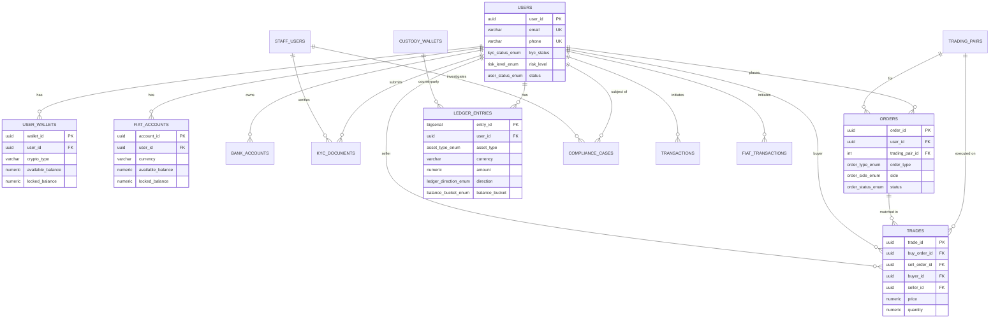

---

## 2. Detailed ER Diagram - User & Authentication Domain

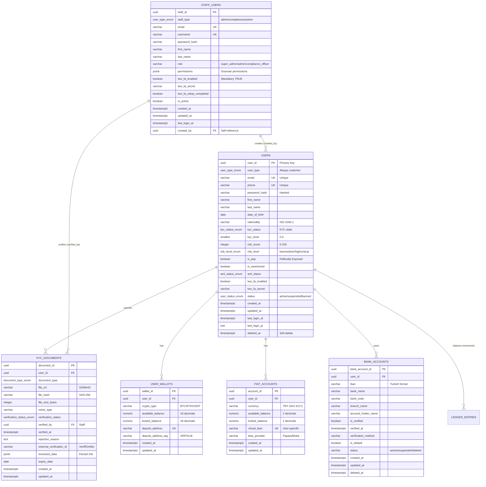

---

## 3. Detailed ER Diagram - Trading Domain

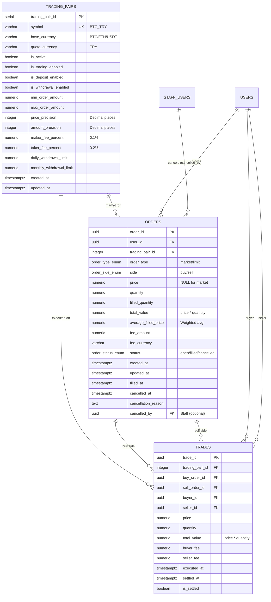

---

## 4. Detailed ER Diagram - Ledger & Balance Domain

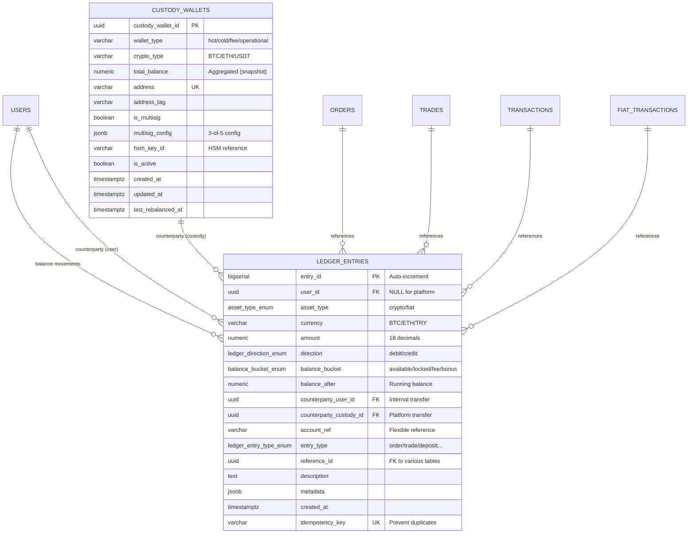

---

## 5. Detailed ER Diagram - Transactions Domain

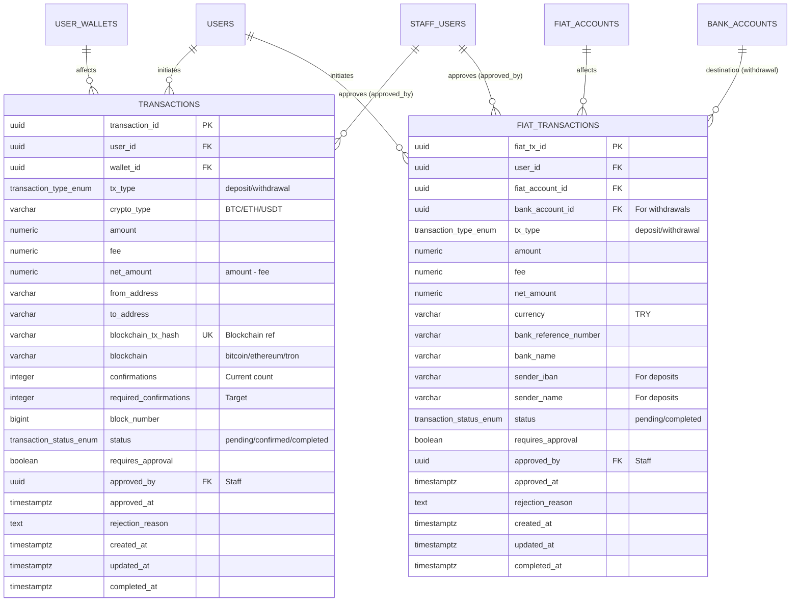

---

## 6. Detailed ER Diagram - Compliance Domain

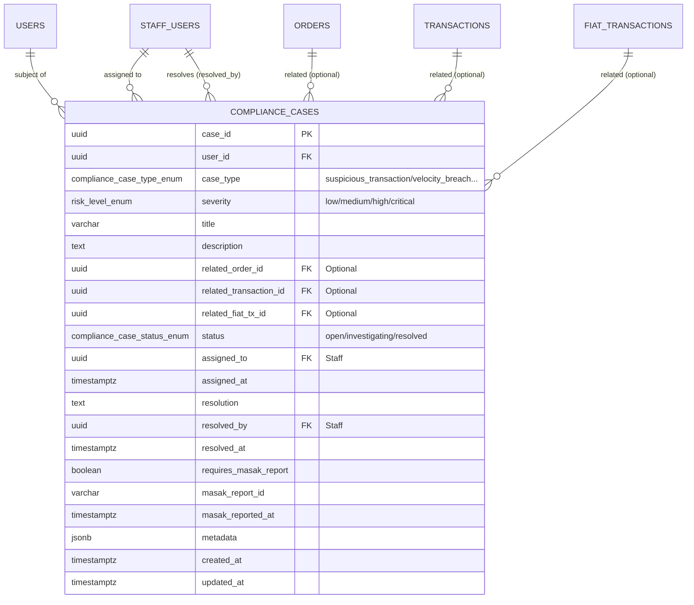

---

## 7. Detailed ER Diagram - Config & Settings Domain

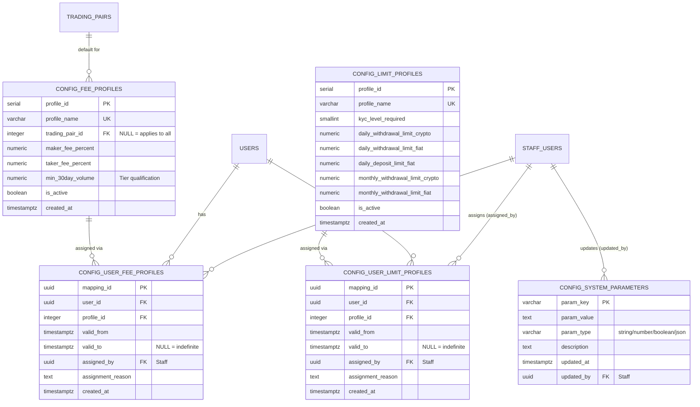

---

## 8. Detailed ER Diagram - Audit Domain

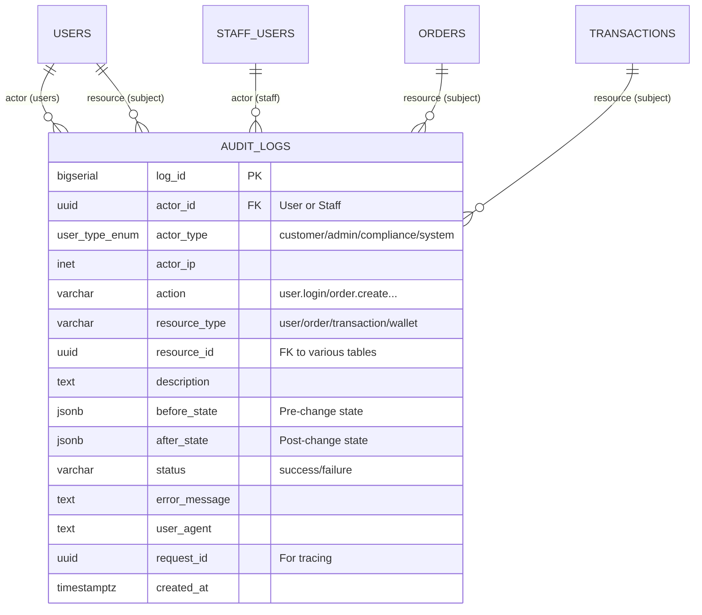

---

## 9. Schema Relationships Summary

### Cardinality Legend:
- `||--o{` : One-to-Many (1:N)
- `||--||` : One-to-One (1:1)
- `}o--o{` : Many-to-Many (N:M)
- `||--o|` : One-to-Zero-or-One (1:0..1)

### Key Relationships:

**Users Domain:**
- 1 User → N Wallets (crypto)
- 1 User → N Fiat Accounts
- 1 User → N Bank Accounts
- 1 User → N KYC Documents
- 1 Staff → N KYC Documents (verified_by)

**Trading Domain:**
- 1 User → N Orders
- 1 Trading Pair → N Orders
- 1 Order → N Trades (as buyer or seller)
- 1 Trade → 2 Orders (buy & sell)
- 1 Trade → 2 Users (buyer & seller)

**Ledger Domain:**
- 1 User → N Ledger Entries
- 1 Custody Wallet → N Ledger Entries (counterparty)
- 1 Order/Trade/Transaction → N Ledger Entries (reference)

**Transactions Domain:**
- 1 User → N Crypto Transactions
- 1 User → N Fiat Transactions
- 1 Bank Account → N Fiat Transactions (withdrawals)
- 1 Staff → N Transactions (approvals)

**Compliance Domain:**
- 1 User → N Compliance Cases
- 1 Staff → N Compliance Cases (assigned/resolved)
- 1 Compliance Case → 0..1 Order/Transaction (related)

**Config Domain:**
- 1 Fee Profile → N User Mappings (N:M through mapping table)
- 1 Limit Profile → N User Mappings (N:M through mapping table)
- 1 Staff → N Config Updates

**Audit Domain:**
- 1 User/Staff → N Audit Logs (actor)
- 1 Entity → N Audit Logs (resource)

---

## 10. Partitioning Strategy Visualization

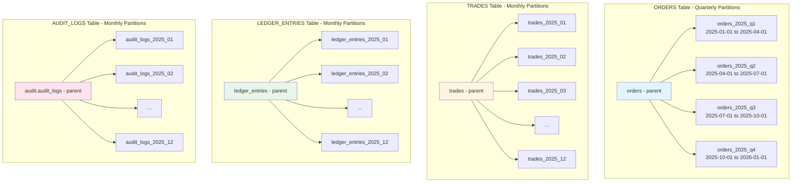

---

## 11. Data Flow Diagram - Order Placement & Settlement

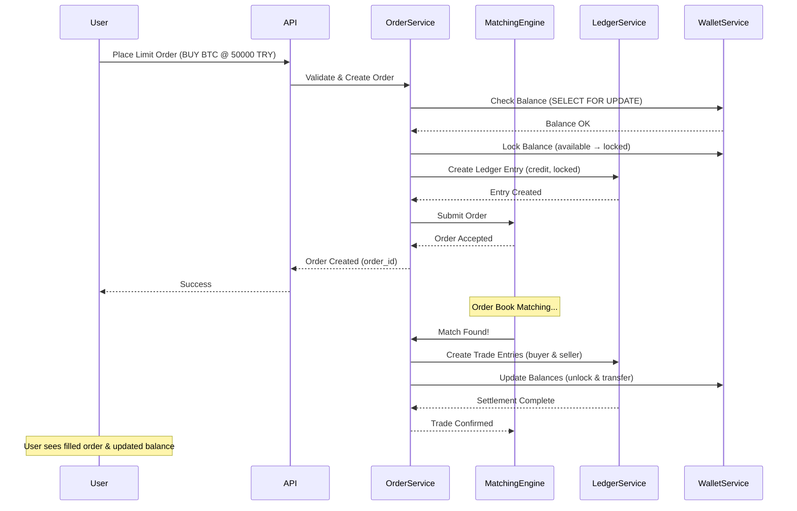

---

## 12. Balance Reconciliation Flow

```mermaid
graph TB
    subgraph "Source of Truth"
        LEDGER[Ledger Entries<br/>Double-Entry Bookkeeping]
    end
    
    subgraph "Snapshots"
        USER_WALLETS[user_wallets<br/>available + locked]
        FIAT_ACCOUNTS[fiat_accounts<br/>available + locked]
        CUSTODY[custody_wallets<br/>total_balance]
    end
    
    subgraph "Reconciliation"
        DAILY[Daily Job<br/>02:00 UTC]
        COMPARE[Compare Ledger Sum vs Wallet Balance]
        ALERT[Generate Alerts<br/>if discrepancy > 0.00000001]
    end
    
    LEDGER -->|SUM(debit - credit)| COMPARE
    USER_WALLETS -->|available + locked| COMPARE
    FIAT_ACCOUNTS -->|available + locked| COMPARE
    CUSTODY -->|total_balance| COMPARE
    
    DAILY --> COMPARE
    COMPARE --> ALERT
    
    ALERT -->|Log| AUDIT[Audit Logs]
    ALERT -->|Notify| COMPLIANCE[Compliance Team]
    
    style LEDGER fill:#4caf50,color:#fff
    style USER_WALLETS fill:#ff9800
    style FIAT_ACCOUNTS fill:#ff9800
    style CUSTODY fill:#ff9800
    style ALERT fill:#f44336,color:#fff
```

---

## 13. Indexes Strategy Visualization

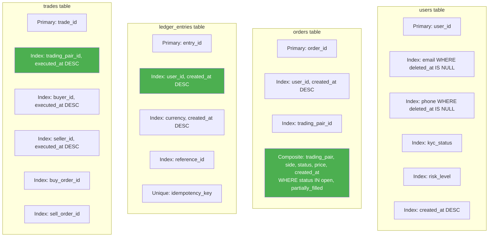

---

## 14. ENUM Types Hierarchy

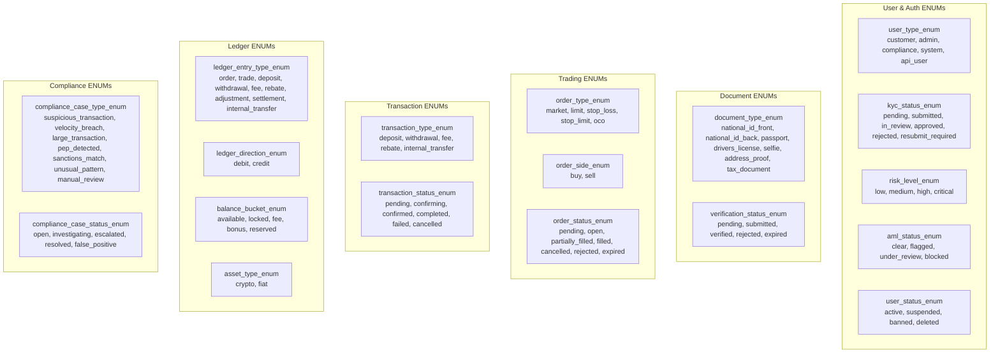

---

## 15. Complete Schema Visualization (All Tables)

```mermaid
graph TB
    subgraph "Core Domain"
        USERS[users<br/>15 columns<br/>Partitioned: No]
        STAFF[staff_users<br/>13 columns<br/>Partitioned: No]
        USER_WALLETS[user_wallets<br/>8 columns<br/>Partitioned: No]
        CUSTODY_WALLETS[custody_wallets<br/>13 columns<br/>Partitioned: No]
        FIAT_ACCOUNTS[fiat_accounts<br/>8 columns<br/>Partitioned: No]
        BANK_ACCOUNTS[bank_accounts<br/>12 columns<br/>Partitioned: No]
        KYC_DOCS[kyc_documents<br/>14 columns<br/>Partitioned: No]
    end
    
    subgraph "Trading Domain"
        TRADING_PAIRS[trading_pairs<br/>16 columns<br/>Partitioned: No]
        ORDERS[orders<br/>16 columns<br/>Partitioned: Yes Quarterly]
        TRADES[trades<br/>11 columns<br/>Partitioned: Yes Monthly]
    end
    
    subgraph "Ledger Domain"
        LEDGER[ledger_entries<br/>17 columns<br/>Partitioned: Yes Monthly<br/>IMMUTABLE]
    end
    
    subgraph "Transaction Domain"
        TRANSACTIONS[transactions<br/>21 columns<br/>Partitioned: No]
        FIAT_TXS[fiat_transactions<br/>17 columns<br/>Partitioned: No]
    end
    
    subgraph "Compliance Domain"
        COMPLIANCE[compliance_cases<br/>15 columns<br/>Partitioned: No]
    end
    
    subgraph "Config Domain"
        FEE_PROF[fee_profiles<br/>8 columns]
        LIMIT_PROF[limit_profiles<br/>9 columns]
        USER_FEE[user_fee_profiles<br/>7 columns]
        USER_LIMIT[user_limit_profiles<br/>7 columns]
        SYS_PARAMS[system_parameters<br/>5 columns]
    end
    
    subgraph "Audit Domain"
        AUDIT[audit.audit_logs<br/>14 columns<br/>Partitioned: Yes Monthly<br/>IMMUTABLE]
    end
    
    USERS --> USER_WALLETS
    USERS --> FIAT_ACCOUNTS
    USERS --> BANK_ACCOUNTS
    USERS --> KYC_DOCS
    USERS --> ORDERS
    USERS --> TRADES
    USERS --> LEDGER
    USERS --> TRANSACTIONS
    USERS --> FIAT_TXS
    USERS --> COMPLIANCE
    USERS --> USER_FEE
    USERS --> USER_LIMIT
    
    STAFF --> KYC_DOCS
    STAFF --> ORDERS
    STAFF --> TRANSACTIONS
    STAFF --> FIAT_TXS
    STAFF --> COMPLIANCE
    STAFF --> SYS_PARAMS
    
    TRADING_PAIRS --> ORDERS
    TRADING_PAIRS --> TRADES
    TRADING_PAIRS --> FEE_PROF
    
    ORDERS --> TRADES
    ORDERS --> LEDGER
    
    TRADES --> LEDGER
    
    TRANSACTIONS --> LEDGER
    FIAT_TXS --> LEDGER
    
    CUSTODY_WALLETS --> LEDGER
    
    FEE_PROF --> USER_FEE
    LIMIT_PROF --> USER_LIMIT
    
    style LEDGER fill:#4caf50,color:#fff
    style AUDIT fill:#4caf50,color:#fff
    style ORDERS fill:#2196f3,color:#fff
    style TRADES fill:#2196f3,color:#fff
```

---

## 16. Table Statistics & Size Estimates

| Table | Estimated Rows (Year 1) | Partition Strategy | Index Count | Notes |
|-------|-------------------------|-------------------|-------------|-------|
| **users** | 100,000 | No | 6 | Customer accounts |
| **staff_users** | 50 | No | 4 | Internal staff |
| **user_wallets** | 300,000 | No | 3 | 3 cryptos per user avg |
| **custody_wallets** | 20 | No | 3 | Platform wallets |
| **fiat_accounts** | 100,000 | No | 2 | 1 per user (TRY) |
| **bank_accounts** | 150,000 | No | 3 | 1.5 per user avg |
| **kyc_documents** | 400,000 | No | 4 | 4 docs per user avg |
| **trading_pairs** | 10 | No | 2 | BTC/ETH/USDT pairs |
| **orders** | 50M | Quarterly | 4 | High volume |
| **trades** | 10M | Monthly | 6 | Matched orders |
| **ledger_entries** | 100M | Monthly | 5 | **Source of truth** |
| **transactions** | 5M | No | 6 | Crypto dep/with |
| **fiat_transactions** | 10M | No | 6 | TRY dep/with |
| **compliance_cases** | 10,000 | No | 5 | Flagged cases |
| **audit.audit_logs** | 500M | Monthly | 4 | All actions logged |

**Total estimated DB size after 1 year:** ~500GB - 1TB

---

## Next Steps

✅ **ER Diagrams hazır!**

**Bunları kullanarak:**
1. **Database documentation** - Confluence/Wiki için export
2. **Developer onboarding** - Yeni geliştiriciler için referans
3. **Architecture review** - Banka/kurum ile review toplantıları
4. **API design** - ER'dan hareketle endpoint'leri tasarla

**Sırada ne var?**
- API Specification
- WebSocket Protocol
- Matching Engine Logic
- Sample Data & Testing

**Hangisiyle devam edelim?**
