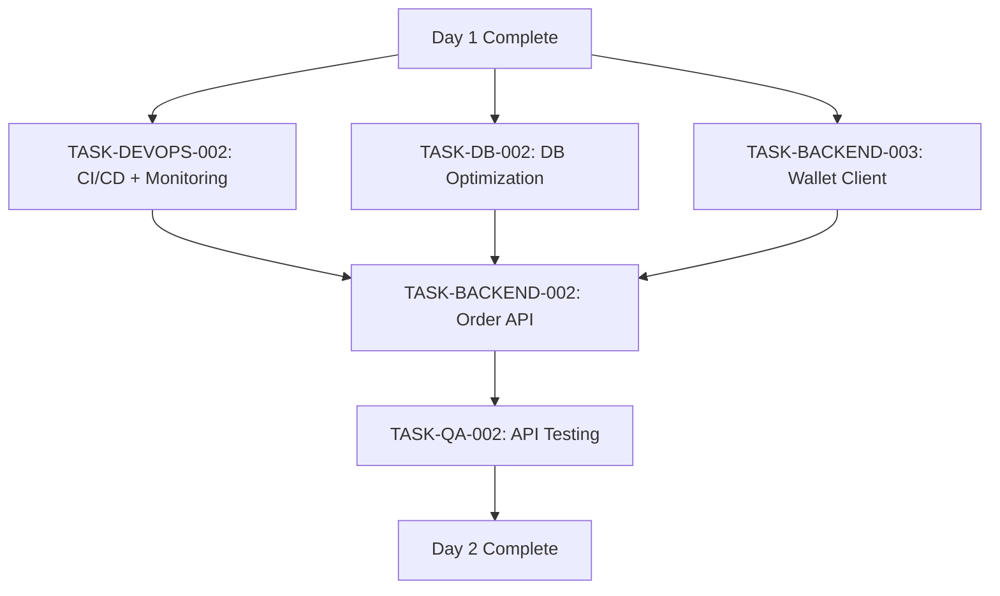

# Trade Engine Sprint 1 - Day 2 Task Assignments

**Date:** 2025-11-23
**Sprint:** Trade Engine Sprint 1 (Foundation & Infrastructure)
**Day:** 2 of 12
**Tech Lead:** Tech Lead Agent
**Status:** Ready for Execution

---

## Day 2 Overview

**Goal:** Advance infrastructure maturity and begin Order Management implementation

**Building on Day 1 Success:**
- Database: 97+ objects created with partitioning
- Docker: 4 services running (PostgreSQL, Redis, RabbitMQ, PgBouncer)
- Backend: Go HTTP server operational with health endpoints
- QA: 100+ tests passing, 80.9% code coverage

**Day 2 Focus Areas:**
1. CI/CD pipeline establishment (DevOps)
2. Monitoring & observability infrastructure (DevOps)
3. Order Management API foundation (Backend)
4. Wallet Service API extensions for trade settlement (Backend)
5. Database optimization and monitoring setup (Database)

**Total Story Points:** 4.5 points (from Sprint 1 total of 38)
**Total Estimated Hours:** 16 hours
**Target Completion:** End of Day 2 (6 PM)

**Critical Path:** TASK-DEVOPS-002 → TASK-BACKEND-002 (parallel with TASK-DB-002)

---

## Sprint 1 Progress Tracking

| Metric | Day 1 | Day 2 Target | Cumulative |
|--------|-------|--------------|------------|
| Story Points | 4.0 | 4.5 | 8.5 / 38 (22%) |
| Days Elapsed | 1 | 2 | 2 / 12 (17%) |
| Phase Progress | Foundation | Foundation + Order Mgmt | Phase 1: 20% |
| Test Coverage | 80.9% | >80% | Maintain |
| Services Running | 4 | 6 (add Prometheus, Grafana) | Infrastructure expansion |

---

## Task Assignment: TASK-DEVOPS-002

**Agent:** DevOps Agent
**Priority:** P0 (Critical - Infrastructure expansion)
**Story:** TE-107 (Monitoring & Observability) + TE-108 (CI/CD Pipeline)
**Sprint:** Trade Engine Sprint 1
**Estimated Hours:** 6 hours
**Story Points:** 2.0
**Deadline:** 2025-11-23 4:00 PM
**Dependencies:** TASK-DEVOPS-001 (Complete ✅)

### Description

Establish production-grade CI/CD pipeline and monitoring infrastructure. This includes GitHub Actions workflows for automated testing and deployment, plus Prometheus/Grafana stack for real-time observability.

### Acceptance Criteria

#### CI/CD Pipeline (GitHub Actions)
- [ ] GitHub Actions workflow created at `.github/workflows/trade-engine-ci.yml`
- [ ] Build step: Go build succeeds
- [ ] Test step: `go test ./...` runs on every PR
- [ ] Lint step: `golangci-lint` configured and passing
- [ ] Coverage step: Coverage report generated and uploaded
- [ ] Docker build step: Multi-stage Dockerfile builds successfully
- [ ] Docker push step: Image pushed to registry (on main branch merge)
- [ ] Workflow triggers: On PR creation, push to main
- [ ] Build time: < 5 minutes for full pipeline
- [ ] Status badges added to README.md

#### Monitoring Infrastructure (Prometheus + Grafana)
- [ ] Prometheus deployed via Docker Compose (port 9091)
- [ ] Grafana deployed via Docker Compose (port 3001)
- [ ] Prometheus configured to scrape Trade Engine `/metrics` endpoint
- [ ] Grafana configured with Prometheus datasource
- [ ] Initial dashboard created: "Trade Engine - System Health"
- [ ] Metrics exposed: HTTP request count, latency, go_routines, memory
- [ ] Alert rules configured: High latency (>200ms p99), service down
- [ ] Prometheus retention: 15 days minimum
- [ ] Grafana authentication enabled (admin/admin default)
- [ ] Documentation updated: `/services/trade-engine/docs/monitoring.md`

### Technical Specifications

#### GitHub Actions Workflow Structure

```yaml
name: Trade Engine CI/CD

on:
  push:
    branches: [main, develop]
    paths:
      - 'services/trade-engine/**'
  pull_request:
    branches: [main, develop]
    paths:
      - 'services/trade-engine/**'

jobs:
  test:
    runs-on: ubuntu-latest
    steps:
      - uses: actions/checkout@v4

      - name: Setup Go
        uses: actions/setup-go@v5
        with:
          go-version: '1.21'

      - name: Install dependencies
        working-directory: services/trade-engine
        run: go mod download

      - name: Run linter
        working-directory: services/trade-engine
        run: |
          go install github.com/golangci/golangci-lint/cmd/golangci-lint@latest
          golangci-lint run --timeout 5m

      - name: Run tests
        working-directory: services/trade-engine
        run: go test -v -race -coverprofile=coverage.out ./...

      - name: Upload coverage
        uses: codecov/codecov-action@v3
        with:
          files: ./services/trade-engine/coverage.out

  build:
    needs: test
    runs-on: ubuntu-latest
    steps:
      - uses: actions/checkout@v4

      - name: Build Docker image
        run: |
          cd services/trade-engine
          docker build -t trade-engine:${{ github.sha }} .

      - name: Push to registry (main only)
        if: github.ref == 'refs/heads/main'
        run: |
          echo "${{ secrets.DOCKER_PASSWORD }}" | docker login -u "${{ secrets.DOCKER_USERNAME }}" --password-stdin
          docker tag trade-engine:${{ github.sha }} mytrader/trade-engine:latest
          docker push mytrader/trade-engine:latest
```

#### Prometheus Configuration

```yaml
# services/trade-engine/monitoring/prometheus.yml
global:
  scrape_interval: 15s
  evaluation_interval: 15s

scrape_configs:
  - job_name: 'trade-engine'
    static_configs:
      - targets: ['trade-engine:9090']
    metrics_path: '/metrics'

  - job_name: 'postgres'
    static_configs:
      - targets: ['postgres-exporter:9187']

  - job_name: 'redis'
    static_configs:
      - targets: ['redis-exporter:9121']

alerting:
  alertmanagers:
    - static_configs:
        - targets: []  # Configure later

rule_files:
  - '/etc/prometheus/alerts.yml'
```

#### Alert Rules

```yaml
# services/trade-engine/monitoring/alerts.yml
groups:
  - name: trade_engine_alerts
    interval: 30s
    rules:
      - alert: HighLatency
        expr: histogram_quantile(0.99, http_request_duration_seconds_bucket) > 0.2
        for: 2m
        annotations:
          summary: "High request latency detected"
          description: "p99 latency is {{ $value }}s"

      - alert: ServiceDown
        expr: up{job="trade-engine"} == 0
        for: 1m
        annotations:
          summary: "Trade Engine service is down"

      - alert: HighErrorRate
        expr: rate(http_requests_total{status=~"5.."}[5m]) > 0.05
        for: 2m
        annotations:
          summary: "High error rate detected"
          description: "Error rate is {{ $value }}/sec"
```

#### Grafana Dashboard (System Health)

```json
{
  "dashboard": {
    "title": "Trade Engine - System Health",
    "panels": [
      {
        "title": "Request Rate",
        "targets": [
          {
            "expr": "rate(http_requests_total[5m])"
          }
        ]
      },
      {
        "title": "Latency (p50, p95, p99)",
        "targets": [
          {
            "expr": "histogram_quantile(0.50, http_request_duration_seconds_bucket)"
          },
          {
            "expr": "histogram_quantile(0.95, http_request_duration_seconds_bucket)"
          },
          {
            "expr": "histogram_quantile(0.99, http_request_duration_seconds_bucket)"
          }
        ]
      },
      {
        "title": "Go Routines",
        "targets": [
          {
            "expr": "go_goroutines"
          }
        ]
      },
      {
        "title": "Memory Usage",
        "targets": [
          {
            "expr": "go_memstats_alloc_bytes"
          }
        ]
      }
    ]
  }
}
```

### Handoff Notes

**From:** TASK-DEVOPS-001 (Docker infrastructure)
**Context:** All Docker services are healthy and running. Need to extend infrastructure with CI/CD automation and observability tools.

**Handoff To:** Backend Agent (TASK-BACKEND-002) and QA Agent (TASK-QA-002)
**What to provide:**
1. CI/CD pipeline URL and status
2. Prometheus endpoint: `http://localhost:9091`
3. Grafana dashboard URL: `http://localhost:3001` (admin/admin)
4. Metrics scraping confirmation
5. Alert rules documentation

### Verification Commands

```bash
# Navigate to project directory
cd /Users/musti/Documents/Projects/MyCrypto_Platform/services/trade-engine

# Update docker-compose.yml to add Prometheus and Grafana
docker-compose up -d prometheus grafana

# Verify Prometheus
curl http://localhost:9091/api/v1/targets

# Verify Grafana
curl http://localhost:3001/api/health

# Check metrics endpoint
curl http://localhost:9090/metrics

# Run CI/CD locally (using act - GitHub Actions locally)
act -j test

# Push to GitHub to trigger workflow
git add .github/workflows/trade-engine-ci.yml
git commit -m "Add CI/CD pipeline for Trade Engine"
git push origin main

# Monitor workflow
gh run list --workflow=trade-engine-ci.yml
```

### Definition of Done
- [ ] Code reviewed by Tech Lead
- [ ] CI/CD pipeline runs successfully on PR
- [ ] All tests pass in pipeline
- [ ] Docker image builds and pushes successfully
- [ ] Prometheus scraping metrics from Trade Engine
- [ ] Grafana dashboard displays real-time data
- [ ] Alert rules configured and tested
- [ ] Documentation updated with monitoring guide
- [ ] Handoff notes provided to Backend and QA agents

---

## Task Assignment: TASK-BACKEND-002

**Agent:** Backend Agent
**Priority:** P0 (Critical - Order Management foundation)
**Story:** TE-201 (Order Creation API - Part 1)
**Sprint:** Trade Engine Sprint 1
**Estimated Hours:** 5 hours
**Story Points:** 1.5
**Deadline:** 2025-11-23 5:00 PM
**Dependencies:** TASK-BACKEND-001 (Complete ✅), TASK-DB-001 (Complete ✅)

### Description

Begin implementation of Order Management API by creating the domain models, repository layer, and basic order creation endpoint. Focus on clean architecture with proper validation and error handling. This is Part 1 of TE-201 (full implementation will continue in Days 3-4).

**Scope for Day 2:**
- Domain models (Order, Trade, OrderBook entities)
- Repository interfaces and PostgreSQL implementations
- Basic POST /api/v1/orders endpoint (validation only, no matching yet)
- Request/response DTOs
- Error handling middleware
- Unit tests for domain and repository layers

### Acceptance Criteria

#### Domain Layer
- [ ] Order model created at `/internal/domain/order.go` with all fields
- [ ] Trade model created at `/internal/domain/trade.go`
- [ ] OrderBook model created at `/internal/domain/orderbook.go`
- [ ] ENUM types defined (OrderSide, OrderType, OrderStatus, TimeInForce)
- [ ] Validation methods implemented (ValidatePrice, ValidateQuantity)
- [ ] Domain tests created with >80% coverage

#### Repository Layer
- [ ] OrderRepository interface defined at `/internal/repository/order_repository.go`
- [ ] PostgreSQL implementation at `/internal/repository/postgres/order_repository.go`
- [ ] Repository methods: Create, GetByID, GetByUserID, Cancel, Update
- [ ] Transaction support for atomic operations
- [ ] Repository tests with database mocks
- [ ] Integration tests using testcontainers (PostgreSQL)

#### Service Layer
- [ ] OrderService interface at `/internal/service/order_service.go`
- [ ] OrderService implementation with validation logic
- [ ] Input validation: price, quantity, symbol, user existence
- [ ] Error types defined: ErrInvalidPrice, ErrInsufficientBalance, etc.
- [ ] Service tests with repository mocks

#### API Layer
- [ ] POST /api/v1/orders endpoint implemented
- [ ] Request DTO: PlaceOrderRequest with JSON tags
- [ ] Response DTO: OrderResponse with proper structure
- [ ] Error response format: `{"error": "...", "code": "...", "details": {}}`
- [ ] Status codes: 201 (created), 400 (validation), 401 (auth), 500 (server error)
- [ ] Request validation middleware
- [ ] API handler tests

#### Documentation
- [ ] API endpoint documented in README.md
- [ ] Swagger/OpenAPI annotations added to handler
- [ ] Sample curl commands provided
- [ ] Error codes documented

### Technical Specifications

#### Domain Model (Order)

```go
package domain

import (
    "time"
    "github.com/google/uuid"
    "github.com/shopspring/decimal"
)

type OrderSide string
const (
    OrderSideBuy  OrderSide = "BUY"
    OrderSideSell OrderSide = "SELL"
)

type OrderType string
const (
    OrderTypeMarket OrderType = "MARKET"
    OrderTypeLimit  OrderType = "LIMIT"
    OrderTypeStop   OrderType = "STOP"
)

type OrderStatus string
const (
    OrderStatusPending        OrderStatus = "PENDING"
    OrderStatusOpen           OrderStatus = "OPEN"
    OrderStatusPartiallyFilled OrderStatus = "PARTIALLY_FILLED"
    OrderStatusFilled         OrderStatus = "FILLED"
    OrderStatusCancelled      OrderStatus = "CANCELLED"
    OrderStatusRejected       OrderStatus = "REJECTED"
)

type TimeInForce string
const (
    TimeInForceGTC TimeInForce = "GTC"  // Good Till Cancelled
    TimeInForceIOC TimeInForce = "IOC"  // Immediate or Cancel
    TimeInForceFOK TimeInForce = "FOK"  // Fill or Kill
)

type Order struct {
    ID              uuid.UUID       `json:"id" gorm:"primaryKey;type:uuid"`
    UserID          uuid.UUID       `json:"user_id" gorm:"type:uuid;not null;index:idx_user_symbol_status"`
    Symbol          string          `json:"symbol" gorm:"size:20;not null;index:idx_symbol_status"`
    Side            OrderSide       `json:"side" gorm:"type:order_side_enum;not null"`
    Type            OrderType       `json:"type" gorm:"type:order_type_enum;not null;column:order_type"`
    Status          OrderStatus     `json:"status" gorm:"type:order_status_enum;not null;index:idx_status_created"`
    Quantity        decimal.Decimal `json:"quantity" gorm:"type:decimal(20,8);not null"`
    FilledQuantity  decimal.Decimal `json:"filled_quantity" gorm:"type:decimal(20,8);default:0"`
    Price           *decimal.Decimal `json:"price,omitempty" gorm:"type:decimal(20,8)"`
    StopPrice       *decimal.Decimal `json:"stop_price,omitempty" gorm:"type:decimal(20,8)"`
    TimeInForce     TimeInForce     `json:"time_in_force" gorm:"type:time_in_force_enum;default:'GTC'"`
    ClientOrderID   *string         `json:"client_order_id,omitempty" gorm:"size:100;uniqueIndex:idx_client_order"`
    CreatedAt       time.Time       `json:"created_at" gorm:"not null"`
    UpdatedAt       time.Time       `json:"updated_at" gorm:"not null"`
    FilledAt        *time.Time      `json:"filled_at,omitempty"`
    CancelledAt     *time.Time      `json:"cancelled_at,omitempty"`
}

func (o *Order) TableName() string {
    return "orders"
}

func (o *Order) Validate() error {
    if o.Quantity.LessThanOrEqual(decimal.Zero) {
        return ErrInvalidQuantity
    }

    if o.Type == OrderTypeLimit && (o.Price == nil || o.Price.LessThanOrEqual(decimal.Zero)) {
        return ErrInvalidPrice
    }

    if o.Type == OrderTypeStop && (o.StopPrice == nil || o.StopPrice.LessThanOrEqual(decimal.Zero)) {
        return ErrInvalidStopPrice
    }

    return nil
}

func (o *Order) RemainingQuantity() decimal.Decimal {
    return o.Quantity.Sub(o.FilledQuantity)
}

func (o *Order) IsFilled() bool {
    return o.FilledQuantity.Equal(o.Quantity)
}
```

#### Repository Interface

```go
package repository

import (
    "context"
    "github.com/google/uuid"
    "github.com/.../internal/domain"
)

type OrderRepository interface {
    Create(ctx context.Context, order *domain.Order) error
    GetByID(ctx context.Context, id uuid.UUID) (*domain.Order, error)
    GetByUserID(ctx context.Context, userID uuid.UUID, filters OrderFilters) ([]*domain.Order, error)
    Update(ctx context.Context, order *domain.Order) error
    Cancel(ctx context.Context, id uuid.UUID) error
    GetActiveOrders(ctx context.Context, symbol string) ([]*domain.Order, error)
}

type OrderFilters struct {
    Symbol      *string
    Status      *domain.OrderStatus
    Limit       int
    Offset      int
    OrderBy     string  // "created_at DESC"
}
```

#### PostgreSQL Repository Implementation

```go
package postgres

import (
    "context"
    "github.com/google/uuid"
    "gorm.io/gorm"
    "github.com/.../internal/domain"
    "github.com/.../internal/repository"
)

type orderRepository struct {
    db *gorm.DB
}

func NewOrderRepository(db *gorm.DB) repository.OrderRepository {
    return &orderRepository{db: db}
}

func (r *orderRepository) Create(ctx context.Context, order *domain.Order) error {
    order.ID = uuid.New()
    order.CreatedAt = time.Now()
    order.UpdatedAt = time.Now()
    order.Status = domain.OrderStatusPending

    return r.db.WithContext(ctx).Create(order).Error
}

func (r *orderRepository) GetByID(ctx context.Context, id uuid.UUID) (*domain.Order, error) {
    var order domain.Order
    err := r.db.WithContext(ctx).Where("id = ?", id).First(&order).Error
    if err == gorm.ErrRecordNotFound {
        return nil, repository.ErrOrderNotFound
    }
    return &order, err
}

func (r *orderRepository) GetByUserID(ctx context.Context, userID uuid.UUID, filters repository.OrderFilters) ([]*domain.Order, error) {
    query := r.db.WithContext(ctx).Where("user_id = ?", userID)

    if filters.Symbol != nil {
        query = query.Where("symbol = ?", *filters.Symbol)
    }

    if filters.Status != nil {
        query = query.Where("status = ?", *filters.Status)
    }

    if filters.OrderBy != "" {
        query = query.Order(filters.OrderBy)
    } else {
        query = query.Order("created_at DESC")
    }

    if filters.Limit > 0 {
        query = query.Limit(filters.Limit)
    }

    if filters.Offset > 0 {
        query = query.Offset(filters.Offset)
    }

    var orders []*domain.Order
    err := query.Find(&orders).Error
    return orders, err
}

func (r *orderRepository) Update(ctx context.Context, order *domain.Order) error {
    order.UpdatedAt = time.Now()
    return r.db.WithContext(ctx).Save(order).Error
}

func (r *orderRepository) Cancel(ctx context.Context, id uuid.UUID) error {
    now := time.Now()
    return r.db.WithContext(ctx).Model(&domain.Order{}).
        Where("id = ? AND status IN ?", id, []domain.OrderStatus{
            domain.OrderStatusOpen,
            domain.OrderStatusPartiallyFilled,
        }).
        Updates(map[string]interface{}{
            "status":       domain.OrderStatusCancelled,
            "cancelled_at": now,
            "updated_at":   now,
        }).Error
}
```

#### API Handler

```go
package httpapi

import (
    "encoding/json"
    "net/http"
    "github.com/.../internal/service"
)

type OrderHandler struct {
    orderService service.OrderService
    logger       *zap.Logger
}

type PlaceOrderRequest struct {
    Symbol        string  `json:"symbol" validate:"required,min=3,max=20"`
    Side          string  `json:"side" validate:"required,oneof=BUY SELL"`
    Type          string  `json:"type" validate:"required,oneof=MARKET LIMIT STOP"`
    Quantity      string  `json:"quantity" validate:"required,numeric"`
    Price         *string `json:"price,omitempty" validate:"omitempty,numeric"`
    StopPrice     *string `json:"stop_price,omitempty" validate:"omitempty,numeric"`
    TimeInForce   string  `json:"time_in_force" validate:"omitempty,oneof=GTC IOC FOK"`
    ClientOrderID *string `json:"client_order_id,omitempty" validate:"omitempty,max=100"`
}

type OrderResponse struct {
    ID             string  `json:"id"`
    Symbol         string  `json:"symbol"`
    Side           string  `json:"side"`
    Type           string  `json:"type"`
    Status         string  `json:"status"`
    Quantity       string  `json:"quantity"`
    FilledQuantity string  `json:"filled_quantity"`
    Price          *string `json:"price,omitempty"`
    CreatedAt      string  `json:"created_at"`
}

// PlaceOrder godoc
// @Summary Place a new order
// @Description Create a new order (market, limit, or stop)
// @Tags orders
// @Accept json
// @Produce json
// @Param request body PlaceOrderRequest true "Order details"
// @Success 201 {object} OrderResponse
// @Failure 400 {object} ErrorResponse
// @Failure 401 {object} ErrorResponse
// @Failure 500 {object} ErrorResponse
// @Router /api/v1/orders [post]
func (h *OrderHandler) PlaceOrder(w http.ResponseWriter, r *http.Request) {
    ctx := r.Context()

    var req PlaceOrderRequest
    if err := json.NewDecoder(r.Body).Decode(&req); err != nil {
        h.respondError(w, http.StatusBadRequest, "Invalid request body", err)
        return
    }

    // Get user ID from JWT context (set by auth middleware)
    userID, ok := ctx.Value("user_id").(uuid.UUID)
    if !ok {
        h.respondError(w, http.StatusUnauthorized, "Unauthorized", nil)
        return
    }

    // Validate request
    if err := h.validator.Struct(req); err != nil {
        h.respondError(w, http.StatusBadRequest, "Validation failed", err)
        return
    }

    // Convert to domain order
    order, err := h.toDomainOrder(userID, &req)
    if err != nil {
        h.respondError(w, http.StatusBadRequest, "Invalid order parameters", err)
        return
    }

    // Create order via service
    createdOrder, err := h.orderService.PlaceOrder(ctx, order)
    if err != nil {
        h.logger.Error("Failed to place order", zap.Error(err))
        h.respondError(w, http.StatusInternalServerError, "Failed to place order", err)
        return
    }

    // Respond with created order
    h.respondJSON(w, http.StatusCreated, h.toOrderResponse(createdOrder))
}

func (h *OrderHandler) respondJSON(w http.ResponseWriter, status int, data interface{}) {
    w.Header().Set("Content-Type", "application/json")
    w.WriteHeader(status)
    json.NewEncoder(w).Encode(data)
}

func (h *OrderHandler) respondError(w http.ResponseWriter, status int, message string, err error) {
    w.Header().Set("Content-Type", "application/json")
    w.WriteHeader(status)

    errResp := ErrorResponse{
        Error:   message,
        Code:    http.StatusText(status),
        Details: make(map[string]interface{}),
    }

    if err != nil {
        errResp.Details["error"] = err.Error()
    }

    json.NewEncoder(w).Encode(errResp)
}
```

### Handoff Notes

**From:** TASK-BACKEND-001 (HTTP server), TASK-DB-001 (Database schema)
**Context:** HTTP server is operational with health endpoints. Database schema is complete with orders table and partitions. Need to build Order Management API layer.

**Handoff To:** Backend Agent (Day 3 - matching engine), QA Agent (TASK-QA-002)
**What to provide:**
1. POST /api/v1/orders endpoint URL
2. Sample request/response payloads
3. Error codes documentation
4. Unit test coverage report
5. Integration test results
6. Curl command examples

### Verification Commands

```bash
# Navigate to trade-engine directory
cd /Users/musti/Documents/Projects/MyCrypto_Platform/services/trade-engine

# Run unit tests
go test -v -cover ./internal/domain/...
go test -v -cover ./internal/repository/...
go test -v -cover ./internal/service/...

# Run integration tests (with database)
go test -v -tags=integration ./internal/repository/postgres/...

# Start server
go run cmd/server/main.go

# Test POST /api/v1/orders (in another terminal)
curl -X POST http://localhost:8080/api/v1/orders \
  -H "Content-Type: application/json" \
  -H "Authorization: Bearer fake-jwt-token" \
  -d '{
    "symbol": "BTC/USDT",
    "side": "BUY",
    "type": "LIMIT",
    "quantity": "1.5",
    "price": "50000.00",
    "time_in_force": "GTC"
  }'

# Check code coverage
go test -coverprofile=coverage.out ./...
go tool cover -html=coverage.out

# Run linter
golangci-lint run ./...
```

### Definition of Done
- [ ] Code complete and self-reviewed
- [ ] Unit tests written and passing (coverage >80%)
- [ ] Integration tests passing with real database
- [ ] Code reviewed by Tech Lead
- [ ] Linter passing with no errors
- [ ] API endpoint responding correctly
- [ ] Error handling verified
- [ ] Documentation updated
- [ ] Handoff notes provided to QA agent

---

## Task Assignment: TASK-BACKEND-003

**Agent:** Backend Agent
**Priority:** P1 (High - Wallet integration foundation)
**Story:** TE-403 (Wallet Service Integration - Part 1)
**Sprint:** Trade Engine Sprint 1
**Estimated Hours:** 3 hours
**Story Points:** 1.0
**Deadline:** 2025-11-23 6:00 PM
**Dependencies:** None (parallel with TASK-BACKEND-002)

### Description

Extend Wallet Service with Trade Engine integration endpoints. These APIs will be called by Trade Engine when orders are placed, cancelled, or trades are executed. Focus on balance reservation/release and trade settlement interfaces.

**Scope for Day 2:**
- Wallet Service API client library for Trade Engine
- Reserve balance endpoint (lock funds when order placed)
- Release balance endpoint (unlock funds when order cancelled)
- API contract documentation
- Mock implementations for testing

**Note:** Full settlement logic (transfer funds after trade) will be implemented in Sprint 4.

### Acceptance Criteria

#### Wallet Service Client
- [ ] Wallet client package created at `/pkg/clients/wallet/wallet_client.go`
- [ ] gRPC or HTTP client configuration
- [ ] ReserveBalance method implemented
- [ ] ReleaseBalance method implemented
- [ ] Error handling with proper types
- [ ] Timeout configuration (5 seconds default)
- [ ] Retry logic with exponential backoff (3 retries)
- [ ] Circuit breaker pattern implemented
- [ ] Client tests with mocks

#### API Contracts
- [ ] Reserve balance request: `{user_id, asset, amount, order_id}`
- [ ] Reserve balance response: `{reservation_id, success, available_balance}`
- [ ] Release balance request: `{reservation_id, order_id}`
- [ ] Release balance response: `{success, released_amount}`
- [ ] Error types: InsufficientBalance, UserNotFound, ReservationNotFound
- [ ] API documentation in `/docs/wallet-integration.md`

#### Mock Implementation (for Day 2 testing)
- [ ] Mock Wallet Service created for testing
- [ ] Reserve always succeeds with fake reservation_id
- [ ] Release always succeeds
- [ ] Can be replaced with real Wallet Service later
- [ ] Environment flag to enable/disable mock

### Technical Specifications

#### Wallet Client Interface

```go
package wallet

import (
    "context"
    "github.com/google/uuid"
    "github.com/shopspring/decimal"
)

type WalletClient interface {
    ReserveBalance(ctx context.Context, req *ReserveBalanceRequest) (*ReserveBalanceResponse, error)
    ReleaseBalance(ctx context.Context, req *ReleaseBalanceRequest) (*ReleaseBalanceResponse, error)
    SettleTrade(ctx context.Context, req *SettleTradeRequest) (*SettleTradeResponse, error)  // Day 4+
}

type ReserveBalanceRequest struct {
    UserID  uuid.UUID       `json:"user_id"`
    Asset   string          `json:"asset"`   // "BTC", "USDT", etc.
    Amount  decimal.Decimal `json:"amount"`
    OrderID uuid.UUID       `json:"order_id"`
    Reason  string          `json:"reason"`  // "ORDER_PLACEMENT"
}

type ReserveBalanceResponse struct {
    ReservationID    uuid.UUID       `json:"reservation_id"`
    Success          bool            `json:"success"`
    AvailableBalance decimal.Decimal `json:"available_balance"`
    ReservedBalance  decimal.Decimal `json:"reserved_balance"`
}

type ReleaseBalanceRequest struct {
    ReservationID uuid.UUID `json:"reservation_id"`
    OrderID       uuid.UUID `json:"order_id"`
    Reason        string    `json:"reason"`  // "ORDER_CANCELLED", "ORDER_FILLED"
}

type ReleaseBalanceResponse struct {
    Success        bool            `json:"success"`
    ReleasedAmount decimal.Decimal `json:"released_amount"`
}

// Errors
var (
    ErrInsufficientBalance = errors.New("insufficient balance")
    ErrUserNotFound       = errors.New("user not found")
    ErrReservationNotFound = errors.New("reservation not found")
    ErrWalletServiceDown  = errors.New("wallet service unavailable")
)
```

#### HTTP Client Implementation

```go
package wallet

import (
    "bytes"
    "context"
    "encoding/json"
    "fmt"
    "net/http"
    "time"
    "github.com/sony/gobreaker"
)

type httpWalletClient struct {
    baseURL    string
    httpClient *http.Client
    breaker    *gobreaker.CircuitBreaker
}

func NewHTTPWalletClient(baseURL string) WalletClient {
    cb := gobreaker.NewCircuitBreaker(gobreaker.Settings{
        Name:        "wallet-service",
        MaxRequests: 3,
        Interval:    10 * time.Second,
        Timeout:     30 * time.Second,
        ReadyToTrip: func(counts gobreaker.Counts) bool {
            return counts.ConsecutiveFailures > 3
        },
    })

    return &httpWalletClient{
        baseURL: baseURL,
        httpClient: &http.Client{
            Timeout: 5 * time.Second,
        },
        breaker: cb,
    }
}

func (c *httpWalletClient) ReserveBalance(ctx context.Context, req *ReserveBalanceRequest) (*ReserveBalanceResponse, error) {
    result, err := c.breaker.Execute(func() (interface{}, error) {
        return c.doReserveBalance(ctx, req)
    })

    if err != nil {
        return nil, err
    }

    return result.(*ReserveBalanceResponse), nil
}

func (c *httpWalletClient) doReserveBalance(ctx context.Context, req *ReserveBalanceRequest) (*ReserveBalanceResponse, error) {
    url := fmt.Sprintf("%s/api/wallets/reserve", c.baseURL)

    body, err := json.Marshal(req)
    if err != nil {
        return nil, err
    }

    httpReq, err := http.NewRequestWithContext(ctx, "POST", url, bytes.NewReader(body))
    if err != nil {
        return nil, err
    }

    httpReq.Header.Set("Content-Type", "application/json")

    resp, err := c.httpClient.Do(httpReq)
    if err != nil {
        return nil, ErrWalletServiceDown
    }
    defer resp.Body.Close()

    if resp.StatusCode == http.StatusBadRequest {
        return nil, ErrInsufficientBalance
    }

    if resp.StatusCode != http.StatusOK {
        return nil, fmt.Errorf("wallet service error: %d", resp.StatusCode)
    }

    var response ReserveBalanceResponse
    if err := json.NewDecoder(resp.Body).Decode(&response); err != nil {
        return nil, err
    }

    return &response, nil
}

func (c *httpWalletClient) ReleaseBalance(ctx context.Context, req *ReleaseBalanceRequest) (*ReleaseBalanceResponse, error) {
    result, err := c.breaker.Execute(func() (interface{}, error) {
        return c.doReleaseBalance(ctx, req)
    })

    if err != nil {
        return nil, err
    }

    return result.(*ReleaseBalanceResponse), nil
}

func (c *httpWalletClient) doReleaseBalance(ctx context.Context, req *ReleaseBalanceRequest) (*ReleaseBalanceResponse, error) {
    url := fmt.Sprintf("%s/api/wallets/release", c.baseURL)

    body, err := json.Marshal(req)
    if err != nil {
        return nil, err
    }

    httpReq, err := http.NewRequestWithContext(ctx, "POST", url, bytes.NewReader(body))
    if err != nil {
        return nil, err
    }

    httpReq.Header.Set("Content-Type", "application/json")

    resp, err := c.httpClient.Do(httpReq)
    if err != nil {
        return nil, ErrWalletServiceDown
    }
    defer resp.Body.Close()

    if resp.StatusCode != http.StatusOK {
        return nil, fmt.Errorf("wallet service error: %d", resp.StatusCode)
    }

    var response ReleaseBalanceResponse
    if err := json.NewDecoder(resp.Body).Decode(&response); err != nil {
        return nil, err
    }

    return &response, nil
}
```

#### Mock Implementation for Testing

```go
package wallet

import (
    "context"
    "github.com/google/uuid"
    "github.com/shopspring/decimal"
)

type mockWalletClient struct {
    shouldFail bool
}

func NewMockWalletClient() WalletClient {
    return &mockWalletClient{shouldFail: false}
}

func (m *mockWalletClient) ReserveBalance(ctx context.Context, req *ReserveBalanceRequest) (*ReserveBalanceResponse, error) {
    if m.shouldFail {
        return nil, ErrInsufficientBalance
    }

    return &ReserveBalanceResponse{
        ReservationID:    uuid.New(),
        Success:          true,
        AvailableBalance: decimal.NewFromFloat(10000.0),
        ReservedBalance:  req.Amount,
    }, nil
}

func (m *mockWalletClient) ReleaseBalance(ctx context.Context, req *ReleaseBalanceRequest) (*ReleaseBalanceResponse, error) {
    if m.shouldFail {
        return nil, ErrReservationNotFound
    }

    return &ReleaseBalanceResponse{
        Success:        true,
        ReleasedAmount: decimal.NewFromFloat(100.0),
    }, nil
}
```

### Handoff Notes

**From:** Sprint planning and requirements
**Context:** Trade Engine needs to integrate with Wallet Service for balance management. Starting with reserve/release functionality for order lifecycle.

**Handoff To:** Backend Agent (TASK-BACKEND-002 - order service will use wallet client)
**What to provide:**
1. Wallet client import path
2. Configuration example (baseURL, timeout)
3. Mock vs real client usage guide
4. Error handling examples
5. Test coverage report

### Verification Commands

```bash
# Navigate to trade-engine directory
cd /Users/musti/Documents/Projects/MyCrypto_Platform/services/trade-engine

# Run wallet client tests
go test -v ./pkg/clients/wallet/...

# Test with mock client
go test -v -run TestOrderService_WithMockWallet ./internal/service/...

# Check circuit breaker behavior
go test -v -run TestWalletClient_CircuitBreaker ./pkg/clients/wallet/...

# Generate mocks (if using mockgen)
go generate ./pkg/clients/wallet/...
```

### Definition of Done
- [ ] Wallet client interface defined
- [ ] HTTP client implementation complete
- [ ] Mock client implementation complete
- [ ] Circuit breaker tested
- [ ] Retry logic tested
- [ ] Unit tests passing (coverage >80%)
- [ ] Integration with order service verified
- [ ] Documentation complete
- [ ] Code reviewed

---

## Task Assignment: TASK-DB-002

**Agent:** Database Agent
**Priority:** P1 (High - Performance & monitoring)
**Story:** TE-102 (Database Schema - Optimization)
**Sprint:** Trade Engine Sprint 1
**Estimated Hours:** 2 hours
**Story Points:** 0.5
**Deadline:** 2025-11-23 3:00 PM
**Dependencies:** TASK-DB-001 (Complete ✅)

### Description

Add database performance monitoring, query optimization, and additional utility functions. Set up pg_stat_statements for query analysis and create helper functions for partition management.

### Acceptance Criteria

#### Performance Monitoring
- [ ] pg_stat_statements extension enabled
- [ ] Slow query log configured (queries >100ms)
- [ ] Query performance baseline captured
- [ ] Index usage statistics collected
- [ ] Monitoring queries documented

#### Query Optimization
- [ ] EXPLAIN ANALYZE run on key queries (order listing, trade history)
- [ ] Additional indexes created if needed
- [ ] Partition pruning verified working
- [ ] Query plan analysis documented

#### Utility Functions
- [ ] Partition management function created (auto-create future partitions)
- [ ] Partition cleanup function (archive old partitions)
- [ ] Order book aggregation views created
- [ ] Helper functions for trade statistics

#### Documentation
- [ ] Performance tuning guide created
- [ ] Monitoring queries documented
- [ ] Partition management procedures documented

### Technical Specifications

#### Enable pg_stat_statements

```sql
-- Connect to database
\c trade_engine_db

-- Enable extension
CREATE EXTENSION IF NOT EXISTS pg_stat_statements;

-- Configure
ALTER SYSTEM SET shared_preload_libraries = 'pg_stat_statements';
ALTER SYSTEM SET pg_stat_statements.track = 'all';
ALTER SYSTEM SET pg_stat_statements.max = 10000;

-- Reload configuration
SELECT pg_reload_conf();
```

#### Monitoring Queries

```sql
-- Create monitoring schema
CREATE SCHEMA IF NOT EXISTS monitoring;

-- Top 10 slowest queries
CREATE OR REPLACE VIEW monitoring.slow_queries AS
SELECT
    query,
    calls,
    total_exec_time,
    mean_exec_time,
    max_exec_time,
    rows
FROM pg_stat_statements
ORDER BY mean_exec_time DESC
LIMIT 10;

-- Index usage statistics
CREATE OR REPLACE VIEW monitoring.index_usage AS
SELECT
    schemaname,
    tablename,
    indexname,
    idx_scan,
    idx_tup_read,
    idx_tup_fetch
FROM pg_stat_user_indexes
ORDER BY idx_scan DESC;

-- Table bloat check
CREATE OR REPLACE VIEW monitoring.table_bloat AS
SELECT
    schemaname,
    tablename,
    pg_size_pretty(pg_total_relation_size(schemaname||'.'||tablename)) as size,
    n_live_tup,
    n_dead_tup,
    ROUND(100.0 * n_dead_tup / NULLIF(n_live_tup + n_dead_tup, 0), 2) as bloat_pct
FROM pg_stat_user_tables
WHERE n_live_tup > 0
ORDER BY n_dead_tup DESC;
```

#### Partition Management Functions

```sql
-- Auto-create future partitions for orders table
CREATE OR REPLACE FUNCTION monitoring.create_future_order_partitions(months_ahead INT DEFAULT 3)
RETURNS void AS $$
DECLARE
    start_date DATE;
    end_date DATE;
    partition_name TEXT;
    i INT;
BEGIN
    FOR i IN 1..months_ahead LOOP
        start_date := DATE_TRUNC('month', CURRENT_DATE + (i || ' months')::INTERVAL);
        end_date := start_date + INTERVAL '1 month';
        partition_name := 'orders_' || TO_CHAR(start_date, 'YYYY_MM');

        EXECUTE format(
            'CREATE TABLE IF NOT EXISTS %I PARTITION OF orders
             FOR VALUES FROM (%L) TO (%L)',
            partition_name,
            start_date,
            end_date
        );

        RAISE NOTICE 'Created partition: %', partition_name;
    END LOOP;
END;
$$ LANGUAGE plpgsql;

-- Auto-create future partitions for trades table
CREATE OR REPLACE FUNCTION monitoring.create_future_trade_partitions(days_ahead INT DEFAULT 30)
RETURNS void AS $$
DECLARE
    start_date DATE;
    end_date DATE;
    partition_name TEXT;
    i INT;
BEGIN
    FOR i IN 1..days_ahead LOOP
        start_date := CURRENT_DATE + i;
        end_date := start_date + INTERVAL '1 day';
        partition_name := 'trades_' || TO_CHAR(start_date, 'YYYY_MM_DD');

        EXECUTE format(
            'CREATE TABLE IF NOT EXISTS %I PARTITION OF trades
             FOR VALUES FROM (%L) TO (%L)',
            partition_name,
            start_date,
            end_date
        );
    END LOOP;

    RAISE NOTICE 'Created % trade partitions', days_ahead;
END;
$$ LANGUAGE plpgsql;

-- Archive old partitions (detach and move to archive schema)
CREATE OR REPLACE FUNCTION monitoring.archive_old_partitions(retention_months INT DEFAULT 12)
RETURNS void AS $$
DECLARE
    partition_record RECORD;
    cutoff_date DATE;
BEGIN
    cutoff_date := CURRENT_DATE - (retention_months || ' months')::INTERVAL;

    -- Archive old order partitions
    FOR partition_record IN
        SELECT tablename FROM pg_tables
        WHERE schemaname = 'public'
        AND tablename LIKE 'orders_%'
        AND tablename < 'orders_' || TO_CHAR(cutoff_date, 'YYYY_MM')
    LOOP
        EXECUTE format('ALTER TABLE orders DETACH PARTITION %I', partition_record.tablename);
        RAISE NOTICE 'Detached old partition: %', partition_record.tablename;
    END LOOP;
END;
$$ LANGUAGE plpgsql;
```

#### Helper Views for Statistics

```sql
-- Order book depth aggregation
CREATE OR REPLACE VIEW monitoring.orderbook_depth_summary AS
SELECT
    symbol,
    side,
    COUNT(*) as price_levels,
    SUM(quantity) as total_quantity,
    MAX(updated_at) as last_update
FROM order_book
GROUP BY symbol, side;

-- Daily trade volume
CREATE OR REPLACE VIEW monitoring.daily_trade_volume AS
SELECT
    DATE(executed_at) as trade_date,
    symbol,
    COUNT(*) as trade_count,
    SUM(quantity) as total_quantity,
    SUM(quantity * price) as total_volume
FROM trades
WHERE executed_at >= CURRENT_DATE - INTERVAL '30 days'
GROUP BY DATE(executed_at), symbol
ORDER BY trade_date DESC, total_volume DESC;

-- Active orders summary
CREATE OR REPLACE VIEW monitoring.active_orders_summary AS
SELECT
    symbol,
    side,
    order_type,
    status,
    COUNT(*) as order_count,
    SUM(quantity - filled_quantity) as remaining_quantity
FROM orders
WHERE status IN ('OPEN', 'PARTIALLY_FILLED')
GROUP BY symbol, side, order_type, status;
```

### Handoff Notes

**From:** TASK-DB-001 (Database schema creation)
**Context:** Core schema is complete. Need to add monitoring, optimization, and maintenance tools.

**Handoff To:** Backend Agent (query optimization insights), DevOps (monitoring integration)
**What to provide:**
1. pg_stat_statements enabled status
2. Monitoring views location: `monitoring.*`
3. Slow query log location
4. Partition management cron job recommendations
5. Performance baseline metrics

### Verification Commands

```bash
# Connect to database
psql -h localhost -p 5433 -U trade_engine_user -d trade_engine_db

# Verify pg_stat_statements enabled
SELECT * FROM pg_stat_statements LIMIT 1;

# Check monitoring views
SELECT * FROM monitoring.slow_queries;
SELECT * FROM monitoring.index_usage;
SELECT * FROM monitoring.table_bloat;

# Create future partitions
SELECT monitoring.create_future_order_partitions(3);
SELECT monitoring.create_future_trade_partitions(30);

# Check orderbook depth
SELECT * FROM monitoring.orderbook_depth_summary;

# Check trade volume
SELECT * FROM monitoring.daily_trade_volume;

# Explain analyze key queries
EXPLAIN ANALYZE
SELECT * FROM orders WHERE user_id = 'some-uuid' AND status = 'OPEN';

# Check index usage
SELECT * FROM monitoring.index_usage WHERE tablename = 'orders';
```

### Definition of Done
- [ ] pg_stat_statements enabled and collecting data
- [ ] Monitoring views created and tested
- [ ] Partition management functions created
- [ ] Helper functions tested
- [ ] Documentation complete
- [ ] Performance baseline captured
- [ ] Handoff notes provided

---

## Task Assignment: TASK-QA-002

**Agent:** QA Agent
**Priority:** P1 (High - API validation)
**Story:** TE-108 (Testing - API endpoint testing)
**Sprint:** Trade Engine Sprint 1
**Estimated Hours:** 2 hours
**Story Points:** 0.5
**Deadline:** 2025-11-23 6:00 PM
**Dependencies:** TASK-BACKEND-002 (must complete to test endpoint)

### Description

Create comprehensive API endpoint tests for the new POST /api/v1/orders endpoint. Include positive tests, negative tests, edge cases, and performance validation.

### Acceptance Criteria

#### Test Suite
- [ ] API test suite created at `/tests/integration/api/orders_test.go`
- [ ] Positive tests: valid orders created successfully
- [ ] Negative tests: validation errors, authentication failures
- [ ] Edge cases: boundary values, unusual inputs
- [ ] Performance tests: latency under load
- [ ] All tests passing

#### Test Coverage
- [ ] Request validation tests (all fields)
- [ ] Authentication/authorization tests
- [ ] Error response format tests
- [ ] Status code validation tests
- [ ] Response payload validation tests
- [ ] Idempotency tests (if implemented)

#### Documentation
- [ ] Test cases documented
- [ ] API test report generated
- [ ] Performance metrics captured
- [ ] Bug report template used (if bugs found)

### Technical Specifications

#### API Test Suite

```go
package api_test

import (
    "bytes"
    "encoding/json"
    "net/http"
    "net/http/httptest"
    "testing"
    "github.com/stretchr/testify/assert"
    "github.com/stretchr/testify/require"
)

func TestPlaceOrder_ValidLimitOrder_Success(t *testing.T) {
    // Setup
    server := setupTestServer(t)
    defer server.Close()

    // Create request
    reqBody := map[string]interface{}{
        "symbol":        "BTC/USDT",
        "side":          "BUY",
        "type":          "LIMIT",
        "quantity":      "1.5",
        "price":         "50000.00",
        "time_in_force": "GTC",
    }

    body, _ := json.Marshal(reqBody)
    req := httptest.NewRequest("POST", "/api/v1/orders", bytes.NewReader(body))
    req.Header.Set("Content-Type", "application/json")
    req.Header.Set("Authorization", "Bearer valid-token")

    // Execute
    resp := httptest.NewRecorder()
    server.Handler.ServeHTTP(resp, req)

    // Assert
    assert.Equal(t, http.StatusCreated, resp.Code)

    var response map[string]interface{}
    err := json.Unmarshal(resp.Body.Bytes(), &response)
    require.NoError(t, err)

    assert.NotEmpty(t, response["id"])
    assert.Equal(t, "BTC/USDT", response["symbol"])
    assert.Equal(t, "BUY", response["side"])
    assert.Equal(t, "LIMIT", response["type"])
    assert.Equal(t, "PENDING", response["status"])
    assert.Equal(t, "1.5", response["quantity"])
    assert.Equal(t, "0", response["filled_quantity"])
}

func TestPlaceOrder_InvalidQuantity_BadRequest(t *testing.T) {
    server := setupTestServer(t)
    defer server.Close()

    testCases := []struct {
        name     string
        quantity string
        wantErr  string
    }{
        {"Zero quantity", "0", "quantity must be greater than 0"},
        {"Negative quantity", "-1.5", "quantity must be greater than 0"},
        {"Non-numeric quantity", "abc", "invalid quantity format"},
    }

    for _, tc := range testCases {
        t.Run(tc.name, func(t *testing.T) {
            reqBody := map[string]interface{}{
                "symbol":   "BTC/USDT",
                "side":     "BUY",
                "type":     "LIMIT",
                "quantity": tc.quantity,
                "price":    "50000.00",
            }

            body, _ := json.Marshal(reqBody)
            req := httptest.NewRequest("POST", "/api/v1/orders", bytes.NewReader(body))
            req.Header.Set("Content-Type", "application/json")
            req.Header.Set("Authorization", "Bearer valid-token")

            resp := httptest.NewRecorder()
            server.Handler.ServeHTTP(resp, req)

            assert.Equal(t, http.StatusBadRequest, resp.Code)

            var errResp map[string]interface{}
            json.Unmarshal(resp.Body.Bytes(), &errResp)
            assert.Contains(t, errResp["error"], tc.wantErr)
        })
    }
}

func TestPlaceOrder_MissingAuth_Unauthorized(t *testing.T) {
    server := setupTestServer(t)
    defer server.Close()

    reqBody := map[string]interface{}{
        "symbol":   "BTC/USDT",
        "side":     "BUY",
        "type":     "LIMIT",
        "quantity": "1.5",
        "price":    "50000.00",
    }

    body, _ := json.Marshal(reqBody)
    req := httptest.NewRequest("POST", "/api/v1/orders", bytes.NewReader(body))
    req.Header.Set("Content-Type", "application/json")
    // No Authorization header

    resp := httptest.NewRecorder()
    server.Handler.ServeHTTP(resp, req)

    assert.Equal(t, http.StatusUnauthorized, resp.Code)
}

func TestPlaceOrder_PerformanceCheck(t *testing.T) {
    server := setupTestServer(t)
    defer server.Close()

    reqBody := map[string]interface{}{
        "symbol":   "BTC/USDT",
        "side":     "BUY",
        "type":     "LIMIT",
        "quantity": "1.5",
        "price":    "50000.00",
    }

    body, _ := json.Marshal(reqBody)

    // Measure latency for 100 requests
    latencies := make([]time.Duration, 100)
    for i := 0; i < 100; i++ {
        req := httptest.NewRequest("POST", "/api/v1/orders", bytes.NewReader(body))
        req.Header.Set("Content-Type", "application/json")
        req.Header.Set("Authorization", "Bearer valid-token")

        start := time.Now()
        resp := httptest.NewRecorder()
        server.Handler.ServeHTTP(resp, req)
        latencies[i] = time.Since(start)

        assert.Equal(t, http.StatusCreated, resp.Code)
    }

    // Calculate p50, p95, p99
    sort.Slice(latencies, func(i, j int) bool {
        return latencies[i] < latencies[j]
    })

    p50 := latencies[50]
    p95 := latencies[95]
    p99 := latencies[99]

    t.Logf("Latency p50: %v, p95: %v, p99: %v", p50, p95, p99)

    // Assert performance targets
    assert.Less(t, p99, 100*time.Millisecond, "p99 latency should be < 100ms")
}
```

### Handoff Notes

**From:** TASK-BACKEND-002 (Order API implementation)
**Context:** POST /api/v1/orders endpoint is implemented. Need comprehensive testing before declaring it production-ready.

**Handoff To:** Tech Lead (test report), Backend Agent (bug fixes if needed)
**What to provide:**
1. Test execution report
2. Test coverage metrics
3. Performance test results
4. List of bugs found (if any)
5. Recommendations for Day 3

### Verification Commands

```bash
# Run API tests
cd /Users/musti/Documents/Projects/MyCrypto_Platform/services/trade-engine
go test -v -tags=integration ./tests/integration/api/...

# Run with coverage
go test -v -tags=integration -coverprofile=coverage-api.out ./tests/integration/api/...
go tool cover -html=coverage-api.out

# Run performance tests
go test -v -run TestPlaceOrder_PerformanceCheck ./tests/integration/api/...

# Generate test report
go test -v -json ./tests/integration/api/... > api-test-results.json
```

### Definition of Done
- [ ] All test cases implemented
- [ ] All tests passing
- [ ] Test coverage >80%
- [ ] Performance tests pass
- [ ] Test report generated
- [ ] Bugs documented (if any)
- [ ] Recommendations provided

---

## Day 2 Success Criteria

**All tasks must meet Definition of Done:**
- [ ] Code complete and self-reviewed
- [ ] Unit tests written and passing (≥80% coverage)
- [ ] Integration tests passing (where applicable)
- [ ] Code reviewed by Tech Lead
- [ ] Documentation updated
- [ ] Handoff notes provided to dependent tasks

**Infrastructure Success:**
- [ ] CI/CD pipeline operational
- [ ] Prometheus and Grafana running
- [ ] Metrics being collected
- [ ] Alerts configured

**Code Success:**
- [ ] Order API endpoint responds correctly
- [ ] Wallet client integration complete
- [ ] Database monitoring enabled
- [ ] All tests passing

**Quality Success:**
- [ ] API tests complete
- [ ] Test coverage >80%
- [ ] Zero P0 bugs
- [ ] Performance targets met

---

## Day 2 Dependencies and Execution Order



**Execution Strategy:**
1. **Morning (9 AM - 12 PM):** Start TASK-DEVOPS-002, TASK-DB-002, TASK-BACKEND-003 in parallel
2. **Afternoon (1 PM - 4 PM):** Complete parallel tasks, start TASK-BACKEND-002
3. **Evening (4 PM - 6 PM):** Complete TASK-BACKEND-002, run TASK-QA-002
4. **End of Day (6 PM):** Day 2 standup and status report

---

## Estimated Completion Time

| Task | Agent | Hours | Start | End | Status |
|------|-------|-------|-------|-----|--------|
| TASK-DEVOPS-002 | DevOps | 6h | 9:00 AM | 4:00 PM | Pending |
| TASK-DB-002 | Database | 2h | 9:00 AM | 12:00 PM | Pending |
| TASK-BACKEND-003 | Backend | 3h | 9:00 AM | 1:00 PM | Pending |
| TASK-BACKEND-002 | Backend | 5h | 1:00 PM | 5:00 PM | Pending |
| TASK-QA-002 | QA | 2h | 5:00 PM | 6:00 PM | Pending |
| **Total** | - | **16h** | - | - | - |

**Agent Utilization:**
- DevOps Agent: 6 hours (75% of 8-hour day)
- Database Agent: 2 hours (25% of 8-hour day)
- Backend Agent: 8 hours (100% of 8-hour day) ⚠️ **At capacity**
- QA Agent: 2 hours (25% of 8-hour day)

**Note:** Backend Agent is at full capacity. If any task takes longer than estimated, it will push into Day 3.

---

## Risk Assessment

### High Risk
- **Backend Agent capacity:** 8 hours of work allocated (100% utilization)
  - **Mitigation:** Backend Agent should focus on core functionality, defer nice-to-haves
  - **Contingency:** If running over, TASK-BACKEND-003 can be simplified to mock-only

### Medium Risk
- **CI/CD pipeline complexity:** First-time GitHub Actions setup may have surprises
  - **Mitigation:** Use standard Go templates, test locally with `act`
  - **Contingency:** Manual build/test process as fallback

### Low Risk
- **Database optimization:** Straightforward monitoring setup
- **API testing:** Building on Day 1 test framework

---

## Communication Plan

### Morning Standup (9:00 AM)
- Review Day 1 achievements
- Assign Day 2 tasks
- Clarify dependencies
- Set expectations

### Midday Check-in (12:00 PM)
- DevOps: CI/CD progress update
- Database: Monitoring setup status
- Backend: Wallet client completion

### Afternoon Check-in (3:00 PM)
- Backend: Order API progress
- Identify blockers
- Adjust timeline if needed

### Evening Standup (6:00 PM)
- Review completed tasks
- Test results from QA Agent
- Plan Day 3 tasks
- Update sprint burndown

---

## Metrics to Track

### Velocity
- Story points completed: 4.5 / 4.5 (target 100%)
- Story points cumulative: 8.5 / 38 (target 22%)

### Quality
- Test coverage: Maintain >80%
- Test pass rate: 100%
- Critical bugs: 0

### Performance
- CI/CD build time: <5 minutes
- API endpoint latency: <100ms (p99)
- Database query time: <50ms

### Team Health
- Agent utilization: 50-80% (healthy range)
- Blockers: <1 per day
- Handoff quality: Clear and complete

---

## Next Steps After Day 2

### Day 3 Preview
Assuming Day 2 completes successfully:

1. **Order Management (continued):**
   - Complete TE-201: Order Creation API with balance checks
   - Begin TE-202: Order Cancellation API
   - Integrate wallet client with order service

2. **Matching Engine (start):**
   - Begin TE-301: In-Memory Order Book design
   - Implement basic order book data structure
   - Write unit tests for order book operations

3. **Infrastructure:**
   - Expand CI/CD with deployment automation
   - Add more Grafana dashboards
   - Configure alerting rules

**Estimated Day 3 workload:** 5-6 story points

---

## Appendix: Task Summary Table

| Task ID | Agent | Priority | Story Points | Hours | Dependencies | Status |
|---------|-------|----------|--------------|-------|--------------|--------|
| TASK-DEVOPS-002 | DevOps | P0 | 2.0 | 6h | TASK-DEVOPS-001 ✅ | Pending |
| TASK-DB-002 | Database | P1 | 0.5 | 2h | TASK-DB-001 ✅ | Pending |
| TASK-BACKEND-003 | Backend | P1 | 1.0 | 3h | None | Pending |
| TASK-BACKEND-002 | Backend | P0 | 1.5 | 5h | TASK-BACKEND-001 ✅, TASK-DB-001 ✅ | Pending |
| TASK-QA-002 | QA | P1 | 0.5 | 2h | TASK-BACKEND-002 | Pending |
| **TOTAL** | - | - | **4.5** | **16h** | - | - |

---

**Tech Lead Sign-off Required:**
- [ ] All Day 2 tasks assigned and understood
- [ ] Dependencies verified
- [ ] Risks acknowledged and mitigated
- [ ] Agents ready to execute

**Tech Lead:** ___________________  **Date:** 2025-11-23

---

**End of Day 2 Task Assignments**
