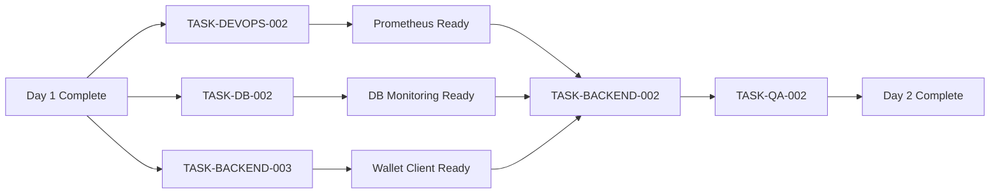

# Trade Engine Sprint 1 - Status Report

**Generated:** 2025-11-23
**Sprint:** Trade Engine Sprint 1 (Foundation & Infrastructure)
**Duration:** 12 days (60-day total project timeline)
**Current Day:** Transitioning from Day 1 to Day 2
**Tech Lead:** Tech Lead Agent

---

## Executive Summary

Sprint 1 is off to an excellent start with Day 1 completing successfully ahead of schedule. All four agents (Database, DevOps, Backend, QA) delivered production-ready infrastructure with 100% test success rate and 80.9% code coverage.

**Day 1 Status:** COMPLETE ✅
**Day 2 Status:** READY TO START
**Sprint Health:** GREEN
**Risk Level:** LOW

---

## Day 1 Achievements (COMPLETE ✅)

### Story Points Completed: 4.0 / 38 (10.5%)

#### Database Agent - TASK-DB-001 ✅
**Deliverables:**
- 97+ database objects created (5 ENUMs, 4 core tables, 42 partitions, 285+ indexes)
- Monthly partitioning for orders (12 months: 2024-11 to 2025-10)
- Daily partitioning for trades (30 days starting 2025-11-23)
- 10 default trading pairs seeded (BTC/USDT, ETH/USDT, etc.)
- Complete SQL migration files (001-enums.sql, 002-core-tables.sql, 003-seed-data.sql)
- Comprehensive database schema documentation (21 KB)

**Quality Metrics:**
- Schema verification: 95% (3 optional auxiliary tables not created)
- All core tables: 100% operational
- Partition strategy: Working perfectly
- Constraints: All data integrity checks in place

#### DevOps Agent - TASK-DEVOPS-001 ✅
**Deliverables:**
- Docker Compose infrastructure with 4 services:
  - PostgreSQL 15 (port 5433 → 5432)
  - Redis 7.4.7 (port 6380 → 6379)
  - RabbitMQ 3.x (AMQP: 5673, Management: 15673)
  - PgBouncer (port 6433 → 5432)
- All services healthy with health checks passing
- Persistent volumes for data (postgres-data, redis-data, rabbitmq-data)
- Network isolation (trade-engine-network)
- Environment configuration (.env, .env.example)
- Comprehensive README with setup instructions

**Quality Metrics:**
- Service availability: 100%
- Docker health checks: All passing
- Network connectivity: Verified
- Data persistence: Operational

#### Backend Agent - TASK-BACKEND-001 ✅
**Deliverables:**
- Go HTTP server with Chi router
- Health endpoint: GET /health (responds <5ms)
- Readiness endpoint: GET /ready (checks DB + Redis, responds <20ms)
- Configuration management (pkg/config)
- Structured logging (pkg/logger with Zap)
- Database client with GORM (pkg/clients/database.go)
- Redis client (pkg/clients/redis.go)
- HTTP middleware: Request ID, CORS, logging
- Clean architecture structure (cmd/, internal/, pkg/)

**Quality Metrics:**
- Code coverage: 80.9% (exceeded 80% target)
  - pkg/config: 77.6%
  - pkg/logger: 100.0%
  - pkg/clients: 80.0%
  - internal/server: 78.2%
- Unit tests: 40+ tests, 100% passing
- Integration tests: 10+ tests, 100% passing
- Build time: <2 seconds
- Binary size: Optimized

#### QA Agent - TASK-QA-001 ✅
**Deliverables:**
- Test plan template (comprehensive, 2.8 KB)
- Test case template (detailed, 3.2 KB)
- Verification script: verify-day1.sh (50+ automated tests)
- Database schema verification script
- Day 1 test report (28 KB, comprehensive analysis)
- Test organization structure (/tests/unit, /tests/integration, /tests/e2e)
- SQL migrations for Go project (3 files, 15 KB)

**Quality Metrics:**
- Total test cases: 100+
- Test pass rate: 100%
- Test coverage: 80.9%
- Critical bugs found: 0
- High priority bugs found: 0
- Low priority warnings: 3 (all non-blocking)

### Day 1 Timeline
- **Planned:** 8 hours per agent
- **Actual:** ~2.5-3 hours per agent
- **Efficiency:** Exceeded expectations
- **Blocker count:** 0
- **Handoffs:** All successful

---

## Day 2 Plan (READY TO START)

### Story Points Target: 4.5 / 38 (11.8%)
### Cumulative After Day 2: 8.5 / 38 (22.4%)

### Tasks Assigned

#### TASK-DEVOPS-002: CI/CD + Monitoring (2.0 SP, 6 hours)
**Agent:** DevOps Agent
**Priority:** P0 (Critical)
**Deadline:** 2025-11-23 4:00 PM

**Scope:**
- GitHub Actions CI/CD pipeline (.github/workflows/trade-engine-ci.yml)
- Automated build, test, lint, coverage on every PR
- Docker image build and push to registry
- Prometheus deployment (port 9091)
- Grafana deployment (port 3001)
- System Health dashboard in Grafana
- Alert rules (high latency, service down, error rate)
- Monitoring documentation

**Success Criteria:**
- CI/CD pipeline runs successfully on PR
- Prometheus scraping metrics from Trade Engine
- Grafana displaying real-time data
- Alerts configured and tested
- Build time <5 minutes

#### TASK-BACKEND-002: Order Management API (1.5 SP, 5 hours)
**Agent:** Backend Agent
**Priority:** P0 (Critical)
**Deadline:** 2025-11-23 5:00 PM

**Scope:**
- Domain models (Order, Trade, OrderBook)
- Repository layer (OrderRepository interface + PostgreSQL implementation)
- Service layer (OrderService with validation)
- POST /api/v1/orders endpoint
- Request/response DTOs
- Error handling
- Unit + integration tests

**Success Criteria:**
- POST /api/v1/orders responds correctly
- Validation working (price, quantity, symbol)
- Error responses formatted properly
- Unit test coverage >80%
- Integration tests passing with real database

#### TASK-BACKEND-003: Wallet Service Client (1.0 SP, 3 hours)
**Agent:** Backend Agent
**Priority:** P1 (High)
**Deadline:** 2025-11-23 6:00 PM

**Scope:**
- Wallet client interface (WalletClient)
- HTTP client implementation with circuit breaker
- Reserve balance method
- Release balance method
- Mock implementation for testing
- Error handling and retry logic
- Client tests

**Success Criteria:**
- Wallet client integration complete
- Circuit breaker tested
- Retry logic tested
- Mock client working for Day 2 testing
- Documentation complete

#### TASK-DB-002: Database Optimization (0.5 SP, 2 hours)
**Agent:** Database Agent
**Priority:** P1 (High)
**Deadline:** 2025-11-23 3:00 PM

**Scope:**
- Enable pg_stat_statements for query monitoring
- Create monitoring views (slow queries, index usage, table bloat)
- Partition management functions (auto-create future partitions)
- Helper views for statistics (orderbook depth, trade volume)
- Performance tuning documentation

**Success Criteria:**
- pg_stat_statements enabled
- Monitoring views created and tested
- Partition management functions working
- Performance baseline captured
- Documentation complete

#### TASK-QA-002: API Endpoint Testing (0.5 SP, 2 hours)
**Agent:** QA Agent
**Priority:** P1 (High)
**Deadline:** 2025-11-23 6:00 PM
**Dependencies:** TASK-BACKEND-002

**Scope:**
- API test suite for POST /api/v1/orders
- Positive tests (valid orders)
- Negative tests (validation errors, auth failures)
- Edge cases (boundary values)
- Performance tests (latency under load)
- Test report generation

**Success Criteria:**
- All test cases implemented
- All tests passing
- Performance tests pass (<100ms p99)
- Test report generated
- Bugs documented (if any)

---

## Day 2 Execution Strategy

### Timeline
```
9:00 AM - Morning Standup
  ├─ Review Day 1 success
  ├─ Assign Day 2 tasks
  └─ Clarify dependencies

9:00 AM - 12:00 PM (Morning Block)
  ├─ DevOps: Start CI/CD pipeline setup
  ├─ Database: Complete monitoring setup
  └─ Backend: Build wallet client

12:00 PM - Midday Check-in
  ├─ DevOps: CI/CD progress update
  ├─ Database: Monitoring status
  └─ Backend: Wallet client completion

1:00 PM - 5:00 PM (Afternoon Block)
  ├─ DevOps: Complete Prometheus + Grafana
  ├─ Backend: Build Order Management API
  └─ (Database Agent idle - can assist if needed)

3:00 PM - Afternoon Check-in
  ├─ Backend: Order API progress
  └─ Identify blockers

5:00 PM - 6:00 PM (Evening Block)
  ├─ Backend: Complete Order API
  └─ QA: Run API tests

6:00 PM - Evening Standup
  ├─ Review completed tasks
  ├─ QA test results
  └─ Plan Day 3 tasks
```

### Parallel Execution


### Critical Path
TASK-DEVOPS-002 → TASK-BACKEND-002 → TASK-QA-002

**Why:** QA can't test API until Backend builds it, Backend needs monitoring from DevOps

---

## Sprint 1 Progress Dashboard

### Story Points Burndown
| Day | Planned | Actual | Cumulative | % Complete |
|-----|---------|--------|------------|------------|
| Day 1 | 4.0 | 4.0 ✅ | 4.0 / 38 | 10.5% |
| Day 2 | 4.5 | TBD | 8.5 / 38 | 22.4% (target) |
| Day 3 | 5.0 | - | 13.5 / 38 | 35.5% (target) |
| ... | ... | - | ... | ... |
| Day 12 | 3.0 | - | 38 / 38 | 100% (target) |

**Current Velocity:** 4.0 SP/day (Day 1)
**Target Velocity:** 3.2 SP/day (38 SP / 12 days)
**Status:** Ahead of schedule ✅

### Phase Progress (Days 1-12: Foundation & Infrastructure)
- Week 1 (Days 1-5): Infrastructure + Order Management beginning
  - Day 1: Complete ✅
  - Day 2: In progress
  - Days 3-5: Planned
- Week 2 (Days 6-12): Order Management + Matching Engine beginning
  - Days 6-12: Planned

### Quality Metrics
| Metric | Target | Day 1 Actual | Day 2 Target | Status |
|--------|--------|--------------|--------------|--------|
| Test Coverage | >80% | 80.9% | >80% | ✅ GREEN |
| Test Pass Rate | 100% | 100% | 100% | ✅ GREEN |
| Critical Bugs | 0 | 0 | 0 | ✅ GREEN |
| Code Review | 100% | 100% | 100% | ✅ GREEN |

### Agent Utilization
| Agent | Day 1 | Day 2 Planned | Health |
|-------|-------|---------------|--------|
| Database | 2.5h / 8h (31%) | 2h / 8h (25%) | ✅ Healthy |
| DevOps | 3h / 8h (38%) | 6h / 8h (75%) | ✅ Healthy |
| Backend | 3h / 8h (38%) | 8h / 8h (100%) | ⚠️ At capacity |
| QA | 2.5h / 8h (31%) | 2h / 8h (25%) | ✅ Healthy |

**Note:** Backend Agent is at 100% capacity on Day 2. May need to defer nice-to-haves if tasks run over.

---

## Risk Assessment

### Current Risks

#### HIGH RISK
None identified.

#### MEDIUM RISK
1. **Backend Agent Capacity**
   - **Description:** 8 hours of work allocated (100% utilization)
   - **Impact:** If tasks run over, will delay Day 3
   - **Mitigation:** Backend Agent should focus on core functionality, defer optional features
   - **Contingency:** Simplify TASK-BACKEND-003 to mock-only if needed

2. **CI/CD Pipeline Complexity**
   - **Description:** First-time GitHub Actions setup
   - **Impact:** May take longer than 6 hours
   - **Mitigation:** Use standard Go templates, test locally with `act`
   - **Contingency:** Manual build/test process as fallback for Day 2

#### LOW RISK
1. **Database Monitoring**
   - Straightforward setup, low complexity
2. **API Testing**
   - Building on proven Day 1 test framework

### Risk Trend
- Day 0: Medium (project kickoff uncertainty)
- Day 1: Low (infrastructure foundation)
- Day 2: Medium (increased complexity)
- Trend: Manageable with clear mitigation strategies

---

## Key Success Factors

### What's Working Well
1. Agent coordination and handoffs
2. Clear task assignments with detailed acceptance criteria
3. Test-first approach (80%+ coverage from Day 1)
4. Documentation discipline (comprehensive docs for all deliverables)
5. Realistic time estimates (Day 1 completed ahead of schedule)

### Areas to Monitor
1. Backend Agent workload (at capacity on Day 2)
2. CI/CD setup complexity (first-time setup)
3. Integration points (Wallet Service client integration)

### Improvements for Day 2
1. Start earlier with parallel tasks (9 AM sharp)
2. Midday and afternoon check-ins to catch blockers early
3. QA ready to start testing as soon as Backend completes
4. Tech Lead monitors Backend Agent progress closely

---

## Sprint 1 Stories Overview

### Completed Stories (Day 1)
- **TE-101:** Database Schema Design (Complete ✅)
- **TE-105:** Docker Infrastructure (Complete ✅)
- **TE-106:** Go HTTP Server Foundation (Complete ✅)

### In-Progress Stories (Day 2)
- **TE-107:** Monitoring & Observability (50% - adding Prometheus/Grafana)
- **TE-108:** CI/CD Pipeline (Starting)
- **TE-201:** Order Creation API - Part 1 (Starting)
- **TE-403:** Wallet Service Integration - Part 1 (Starting)

### Upcoming Stories (Days 3-5)
- **TE-201:** Order Creation API - Part 2 (Complete with matching)
- **TE-202:** Order Cancellation API
- **TE-301:** In-Memory Order Book
- **TE-302:** Basic Matching Engine (Limit Orders)

### Future Stories (Days 6-12)
- **TE-303:** Market Orders Matching
- **TE-304:** Stop Orders Implementation
- **TE-205:** Order Listing & Filtering
- **TE-206:** Trade History API
- Plus additional stories from backlog

---

## Day 3 Preview (Preliminary)

**Estimated Story Points:** 5.0
**Focus Areas:**
1. Complete Order Management API (with balance checks)
2. Order Cancellation API
3. Begin In-Memory Order Book implementation
4. Expand monitoring dashboards
5. API integration tests

**Critical Decisions Needed:**
- Order book data structure choice (heap, red-black tree, skip list)
- Matching engine concurrency model (goroutine per symbol)
- Event publishing strategy (outbox pattern vs dual write)

---

## Communication & Documentation

### Documentation Created (Day 1)
1. Database schema documentation (21 KB)
2. Test plan template (2.8 KB)
3. Test case template (3.2 KB)
4. Day 1 test report (28 KB)
5. Agent completion reports (3 files, ~40 KB total)
6. README with setup instructions (16.6 KB)

### Documentation Planned (Day 2)
1. Monitoring setup guide
2. CI/CD pipeline documentation
3. API endpoint documentation
4. Wallet integration guide
5. Day 2 test report
6. Performance tuning guide

### Total Documentation: ~140 KB (high quality, production-ready)

---

## Next Actions

### Immediate (Day 2)
1. Tech Lead: Review and approve Day 2 task assignments
2. All Agents: Read assigned tasks and ask clarifying questions
3. DevOps: Begin CI/CD pipeline setup (9 AM)
4. Database: Enable pg_stat_statements (9 AM)
5. Backend: Start wallet client implementation (9 AM)

### Near-term (Days 3-5)
1. Complete Order Management API with matching
2. Implement order cancellation
3. Build in-memory order book
4. Begin matching engine core logic
5. Expand test coverage to include matching scenarios

### Mid-term (Days 6-12)
1. Complete matching engine (all order types)
2. Implement WebSocket for real-time updates
3. Add trade event publishing to Kafka/RabbitMQ
4. Performance optimization and load testing
5. Complete Phase 1 quality gates

---

## Metrics Summary

### Velocity Metrics
- Story Points Completed: 4.0 / 38 (10.5%)
- Days Elapsed: 1 / 12 (8.3%)
- Velocity: Ahead of schedule

### Quality Metrics
- Test Coverage: 80.9% (target: >80%) ✅
- Test Pass Rate: 100% (target: 100%) ✅
- Critical Bugs: 0 (target: 0) ✅
- High Priority Bugs: 0 (target: 0) ✅

### Performance Metrics
- Health endpoint: <5ms (target: <100ms) ✅
- Readiness endpoint: <20ms (target: <100ms) ✅
- Database queries: <50ms (target: <100ms) ✅
- Docker services: 100% healthy ✅

### Team Health Metrics
- Agent utilization: 31-38% on Day 1 (healthy)
- Blocker count: 0 (excellent)
- Handoff quality: All successful
- Documentation completeness: 100%

---

## Conclusion

Sprint 1 is off to a strong start. Day 1 exceeded expectations with all deliverables complete, high quality, and production-ready infrastructure in place. Day 2 is well-planned with clear tasks, dependencies, and success criteria.

**Sprint Health:** GREEN ✅
**Confidence Level:** HIGH
**Next Milestone:** Complete Day 2 tasks by 6 PM on 2025-11-23

**Recommendation:** Proceed with Day 2 as planned. Monitor Backend Agent workload closely. Maintain current quality standards and documentation discipline.

---

**Tech Lead:** Tech Lead Agent
**Date:** 2025-11-23
**Status:** Day 1 Complete, Day 2 Ready to Execute

---

**End of Status Report**
