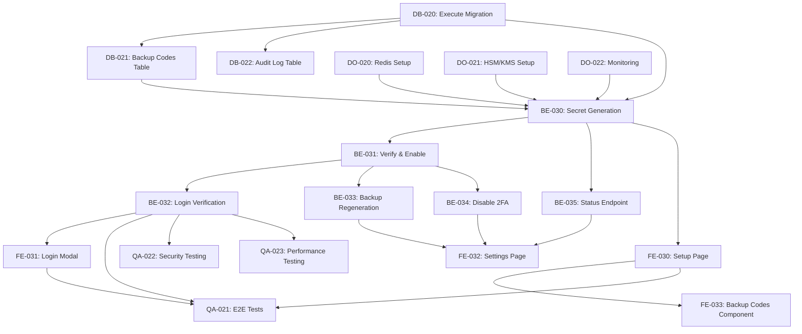

# Day 6 Sprint Plan - Story 1.4: Two-Factor Authentication (2FA)

## Sprint Context
- **Date:** Day 6 of Sprint 1
- **Story:** 1.4 - Two-Factor Authentication Implementation
- **Story Points:** 8
- **Team Capacity:** 5 agents working in parallel where possible
- **Prerequisites:** Stories 1.1, 1.2, 1.3 completed; 2FA prep from Day 3 completed

## Executive Summary
Implement complete TOTP-based 2FA system including setup flow, login verification, backup codes, and management capabilities. The system must be compatible with Google Authenticator/Authy and meet security requirements for cryptocurrency exchange operations.

## Technical Architecture Decisions
- **TOTP Library:** speakeasy (Node.js) for TOTP generation/validation
- **QR Code Library:** qrcode for generating QR codes
- **Encryption:** AES-256-GCM for secret encryption at rest
- **Backup Codes:** 10 single-use codes, 8 characters each (format: XXXX-XXXX)
- **Time Window:** 30 seconds with ±1 window tolerance
- **Rate Limiting:** 3 attempts per 30 seconds for TOTP validation

---

## Task Breakdown by Agent

### Database Tasks (Database Engineer)

#### DB-020: Execute 2FA Schema Migration
**Agent:** database-engineer
**Priority:** P0
**Estimated Time:** 30 minutes
**Dependencies:** None

**Description:**
Execute the 2FA database migration that was designed in Day 3 (DB-003). This includes creating the two_factor_auth table and adding necessary columns to the users table.

**Acceptance Criteria:**
- [ ] Migration script executed successfully
- [ ] two_factor_auth table created with all required columns
- [ ] users table updated with two_fa_enabled flag
- [ ] Indexes created for performance optimization
- [ ] Rollback script tested and validated

**Design References:**
- File: /Users/musti/Documents/Projects/MyCrypto_Platform/Inputs/crypto-exchange-database-schema-v2.md
- Section: Two-Factor Authentication Schema

---

#### DB-021: Create Backup Codes Table
**Agent:** database-engineer
**Priority:** P0
**Estimated Time:** 45 minutes
**Dependencies:** DB-020

**Description:**
Design and implement the backup_codes table to store hashed single-use backup codes for 2FA recovery.

**Acceptance Criteria:**
- [ ] backup_codes table created with columns: id, user_id, code_hash, used_at, created_at
- [ ] Foreign key relationship with users table
- [ ] Index on user_id for fast lookup
- [ ] Constraint to ensure max 10 codes per user
- [ ] Migration includes sample data for testing

**SQL Schema:**
```sql
CREATE TABLE backup_codes (
    id UUID PRIMARY KEY DEFAULT gen_random_uuid(),
    user_id UUID NOT NULL REFERENCES users(id) ON DELETE CASCADE,
    code_hash VARCHAR(255) NOT NULL,
    used_at TIMESTAMP,
    created_at TIMESTAMP DEFAULT CURRENT_TIMESTAMP,
    CONSTRAINT unique_user_code UNIQUE(user_id, code_hash)
);

CREATE INDEX idx_backup_codes_user_id ON backup_codes(user_id);
```

---

#### DB-022: Create 2FA Audit Log Table
**Agent:** database-engineer
**Priority:** P1
**Estimated Time:** 30 minutes
**Dependencies:** DB-020

**Description:**
Create an audit log table specifically for 2FA events to track all 2FA-related activities for compliance and security monitoring.

**Acceptance Criteria:**
- [ ] two_factor_audit_log table created
- [ ] Columns: id, user_id, event_type, ip_address, user_agent, metadata, created_at
- [ ] Partitioned by month for performance
- [ ] Immutable (no UPDATE/DELETE triggers)

---

### Backend Tasks (Backend NestJS Developer)

#### BE-030: Implement 2FA Secret Generation Endpoint
**Agent:** backend-nestjs-developer
**Priority:** P0
**Estimated Time:** 90 minutes
**Dependencies:** DB-020, DB-021

**Description:**
Implement POST /api/v1/auth/2fa/setup endpoint to generate TOTP secret and QR code for initial 2FA setup.

**Acceptance Criteria:**
- [ ] Generate 32-character base32 TOTP secret using speakeasy
- [ ] Generate QR code containing otpauth:// URL
- [ ] Generate 10 backup codes (format: XXXX-XXXX)
- [ ] Store encrypted secret temporarily (15-minute TTL in Redis)
- [ ] Return QR code as base64 image and backup codes
- [ ] Include setup token for verification step
- [ ] Rate limited to 5 requests per hour per user

**Implementation Details:**
```typescript
// Expected Response Structure
{
  "qrCode": "data:image/png;base64,...",
  "backupCodes": ["ABCD-1234", "EFGH-5678", ...],
  "setupToken": "setup_token_uuid",
  "expiresAt": "2025-11-19T11:00:00Z"
}
```

---

#### BE-031: Implement 2FA Verification & Enable Endpoint
**Agent:** backend-nestjs-developer
**Priority:** P0
**Estimated Time:** 75 minutes
**Dependencies:** BE-030

**Description:**
Implement POST /api/v1/auth/2fa/verify-setup endpoint to verify TOTP code and permanently enable 2FA.

**Acceptance Criteria:**
- [ ] Validate setup token (check expiry and ownership)
- [ ] Verify TOTP code with ±1 time window
- [ ] Encrypt secret with AES-256-GCM and store permanently
- [ ] Hash backup codes with bcrypt and store
- [ ] Set two_fa_enabled flag to true
- [ ] Clear temporary data from Redis
- [ ] Log audit event
- [ ] Send confirmation email

**Security Requirements:**
- Prevent replay attacks with nonce
- Ensure atomic transaction for all database updates
- Rate limit: 3 attempts per setup token

---

#### BE-032: Implement 2FA Login Verification
**Agent:** backend-nestjs-developer
**Priority:** P0
**Estimated Time:** 60 minutes
**Dependencies:** BE-031

**Description:**
Modify existing login endpoint to require 2FA verification when enabled for user.

**Acceptance Criteria:**
- [ ] Check two_fa_enabled flag after password verification
- [ ] Return partial token with 2FA challenge required
- [ ] Implement POST /api/v1/auth/2fa/verify endpoint
- [ ] Validate TOTP code or backup code
- [ ] Mark backup code as used if applicable
- [ ] Issue full JWT tokens after successful 2FA
- [ ] Log authentication event

**Flow:**
1. User submits email/password
2. If 2FA enabled, return: `{ requiresTwoFactor: true, challengeToken: "..." }`
3. User submits 2FA code with challenge token
4. System validates and returns full JWT tokens

---

#### BE-033: Implement Backup Code Regeneration
**Agent:** backend-nestjs-developer
**Priority:** P1
**Estimated Time:** 45 minutes
**Dependencies:** BE-031

**Description:**
Implement POST /api/v1/auth/2fa/regenerate-backup-codes endpoint to generate new backup codes.

**Acceptance Criteria:**
- [ ] Require current TOTP code for authorization
- [ ] Generate 10 new backup codes
- [ ] Invalidate all old backup codes
- [ ] Hash and store new codes
- [ ] Return plain codes to user (one-time display)
- [ ] Log security event
- [ ] Send notification email

---

#### BE-034: Implement 2FA Disable Endpoint
**Agent:** backend-nestjs-developer
**Priority:** P1
**Estimated Time:** 45 minutes
**Dependencies:** BE-031

**Description:**
Implement DELETE /api/v1/auth/2fa endpoint to disable 2FA for a user.

**Acceptance Criteria:**
- [ ] Require current TOTP code for authorization
- [ ] Clear 2FA secret from database
- [ ] Delete all backup codes
- [ ] Set two_fa_enabled to false
- [ ] Invalidate all active sessions
- [ ] Send security alert email
- [ ] Log critical security event

---

#### BE-035: Implement 2FA Status Endpoint
**Agent:** backend-nestjs-developer
**Priority:** P2
**Estimated Time:** 30 minutes
**Dependencies:** BE-030

**Description:**
Implement GET /api/v1/auth/2fa/status endpoint to check 2FA configuration status.

**Acceptance Criteria:**
- [ ] Return 2FA enabled status
- [ ] Return number of remaining backup codes
- [ ] Return last 2FA activity timestamp
- [ ] Include trusted devices if implemented

---

### Frontend Tasks (Frontend React Developer)

#### FE-030: Create 2FA Setup Page
**Agent:** frontend-react-developer
**Priority:** P0
**Estimated Time:** 120 minutes
**Dependencies:** BE-030

**Description:**
Create a comprehensive 2FA setup page with QR code display and verification flow.

**Acceptance Criteria:**
- [ ] Display QR code for scanning with authenticator app
- [ ] Show manual entry key as alternative
- [ ] Display backup codes with copy functionality
- [ ] Force user to confirm backup codes saved
- [ ] Verification step with 6-digit code input
- [ ] Success confirmation with security tips
- [ ] Responsive design for mobile/desktop

**UI Components:**
- QR code display component
- Backup codes display with print option
- TOTP input field with auto-focus
- Step indicator (Setup → Verify → Complete)

---

#### FE-031: Implement 2FA Login Modal
**Agent:** frontend-react-developer
**Priority:** P0
**Estimated Time:** 90 minutes
**Dependencies:** BE-032

**Description:**
Create 2FA verification modal that appears during login flow when 2FA is enabled.

**Acceptance Criteria:**
- [ ] Modal appears after successful password authentication
- [ ] 6-digit TOTP input with numeric keyboard on mobile
- [ ] "Use backup code" option with different input format
- [ ] Remember device for 30 days checkbox
- [ ] Resend/trouble links
- [ ] Auto-submit when 6 digits entered
- [ ] Error handling with retry limit display

**UX Requirements:**
- Auto-focus on code input
- Clear error messages
- Loading state during verification
- Smooth transition from login form

---

#### FE-032: Create 2FA Settings Management Page
**Agent:** frontend-react-developer
**Priority:** P1
**Estimated Time:** 90 minutes
**Dependencies:** BE-033, BE-034, BE-035

**Description:**
Build 2FA management interface in user settings/security section.

**Acceptance Criteria:**
- [ ] Show current 2FA status (enabled/disabled)
- [ ] Enable 2FA button (if disabled)
- [ ] Disable 2FA with confirmation dialog
- [ ] Regenerate backup codes functionality
- [ ] Display remaining backup codes count
- [ ] Show last 2FA activity
- [ ] Security recommendations section

**Features:**
- Toggle switch for 2FA with confirmation
- Backup codes management section
- Trusted devices list (if implemented)
- Security activity log

---

#### FE-033: Implement Backup Code Display Component
**Agent:** frontend-react-developer
**Priority:** P1
**Estimated Time:** 60 minutes
**Dependencies:** FE-030

**Description:**
Create reusable component for displaying and managing backup codes.

**Acceptance Criteria:**
- [ ] Grid layout for backup codes (2 columns)
- [ ] Copy all codes button
- [ ] Download as text file option
- [ ] Print-friendly layout
- [ ] Mark used codes (grayed out)
- [ ] Warning about single-use nature
- [ ] Secure storage recommendations

---

### DevOps Tasks (DevOps Engineer)

#### DO-020: Configure Redis for 2FA Temporary Storage
**Agent:** devops-engineer
**Priority:** P0
**Estimated Time:** 45 minutes
**Dependencies:** None

**Description:**
Set up Redis instance for temporary 2FA setup token storage with appropriate TTL and security configurations.

**Acceptance Criteria:**
- [ ] Redis instance configured with persistence
- [ ] TTL set to 15 minutes for setup tokens
- [ ] Encryption in transit enabled
- [ ] Backup strategy defined
- [ ] Connection pooling configured
- [ ] Monitoring alerts set up

**Configuration:**
```yaml
redis:
  maxmemory: 256mb
  maxmemory-policy: volatile-lru
  timeout: 300
  tcp-keepalive: 60
  databases: 2  # 0: sessions, 1: 2FA temp
```

---

#### DO-021: Set Up HSM/KMS for Secret Encryption
**Agent:** devops-engineer
**Priority:** P0
**Estimated Time:** 60 minutes
**Dependencies:** None

**Description:**
Configure Hardware Security Module or Key Management Service for encrypting 2FA secrets at rest.

**Acceptance Criteria:**
- [ ] KMS/HSM service configured (AWS KMS or similar)
- [ ] Encryption keys generated and rotated
- [ ] IAM roles configured for auth service access
- [ ] Key rotation policy established (90 days)
- [ ] Audit logging enabled for key usage
- [ ] Disaster recovery plan for key loss

---

#### DO-022: Configure 2FA Monitoring & Alerts
**Agent:** devops-engineer
**Priority:** P1
**Estimated Time:** 45 minutes
**Dependencies:** BE-030, BE-031, BE-032

**Description:**
Set up monitoring and alerting for 2FA-related metrics and security events.

**Acceptance Criteria:**
- [ ] Prometheus metrics for 2FA setup/verify rates
- [ ] Alert for unusual 2FA failure patterns
- [ ] Dashboard showing 2FA adoption rate
- [ ] Alert for backup code exhaustion
- [ ] Security event log aggregation
- [ ] Compliance reporting queries

**Metrics to Track:**
- 2FA setup success/failure rate
- TOTP validation success/failure rate
- Backup code usage rate
- Average setup completion time

---

### QA Tasks (QA Engineer)

#### QA-020: Create 2FA Test Plan
**Agent:** qa-engineer
**Priority:** P0
**Estimated Time:** 60 minutes
**Dependencies:** None

**Description:**
Develop comprehensive test plan covering all 2FA functionality including edge cases and security scenarios.

**Acceptance Criteria:**
- [ ] Test cases for setup flow (happy path + errors)
- [ ] Test cases for login with 2FA
- [ ] Backup code testing scenarios
- [ ] Security test cases (replay attacks, timing)
- [ ] Performance test cases (concurrent setups)
- [ ] Mobile app testing considerations

**Test Scenarios:**
1. Setup and verification flow
2. Login with valid/invalid TOTP
3. Backup code usage and exhaustion
4. Time drift handling
5. Concurrent setup attempts
6. Rate limiting verification

---

#### QA-021: Implement 2FA E2E Tests
**Agent:** qa-engineer
**Priority:** P0
**Estimated Time:** 120 minutes
**Dependencies:** FE-030, FE-031, BE-030, BE-031, BE-032

**Description:**
Write end-to-end automated tests for critical 2FA user flows using Cypress or Playwright.

**Acceptance Criteria:**
- [ ] E2E test for complete setup flow
- [ ] E2E test for login with 2FA
- [ ] E2E test for backup code usage
- [ ] E2E test for disabling 2FA
- [ ] E2E test for rate limiting
- [ ] Tests run in CI/CD pipeline

**Test Coverage:**
```javascript
// Critical paths to test
- User enables 2FA successfully
- User logs in with TOTP code
- User logs in with backup code
- User regenerates backup codes
- User disables 2FA
- System handles invalid codes correctly
```

---

#### QA-022: Security Testing for 2FA
**Agent:** qa-engineer
**Priority:** P0
**Estimated Time:** 90 minutes
**Dependencies:** All BE tasks

**Description:**
Perform security-focused testing on 2FA implementation including penetration testing scenarios.

**Acceptance Criteria:**
- [ ] Test TOTP replay attack prevention
- [ ] Test timing attack resistance
- [ ] Verify secret encryption at rest
- [ ] Test rate limiting effectiveness
- [ ] Verify backup code single-use
- [ ] Test session invalidation on 2FA disable

**Security Tests:**
- Attempt code reuse within time window
- Brute force TOTP codes
- Attempt to bypass 2FA on protected endpoints
- SQL injection on 2FA endpoints
- XSS attempts on QR code generation

---

#### QA-023: Performance Testing for 2FA
**Agent:** qa-engineer
**Priority:** P2
**Estimated Time:** 60 minutes
**Dependencies:** All BE tasks, DO-020

**Description:**
Load test 2FA endpoints to ensure system can handle expected load during peak usage.

**Acceptance Criteria:**
- [ ] Setup endpoint handles 100 req/sec
- [ ] Verify endpoint handles 500 req/sec
- [ ] Redis performs under load
- [ ] Database queries optimized (<50ms)
- [ ] No memory leaks identified
- [ ] Graceful degradation under extreme load

---

## Dependency Graph



## Execution Timeline (Day 6)

### Phase 1: Foundation (09:00 - 10:30)
**Parallel Execution:**
- Database Engineer: DB-020 (30 min), DB-021 (45 min)
- DevOps Engineer: DO-020 (45 min), DO-021 (60 min)
- QA Engineer: QA-020 (60 min)

### Phase 2: Backend Core (10:30 - 13:00)
**Sequential/Parallel:**
- Backend Developer: BE-030 (90 min), starts BE-031
- Database Engineer: DB-022 (30 min), then assists backend
- DevOps Engineer: DO-022 (45 min)
- Frontend Developer: Starts FE-030 UI mockups
- QA Engineer: Begins test case implementation

### Phase 3: Integration (13:00 - 16:00)
**Parallel Execution:**
- Backend Developer: BE-031 (75 min), BE-032 (60 min)
- Frontend Developer: FE-030 (120 min)
- QA Engineer: QA-021 setup (60 min)

### Phase 4: Extended Features (16:00 - 18:00)
**Parallel Execution:**
- Backend Developer: BE-033 (45 min), BE-034 (45 min)
- Frontend Developer: FE-031 (90 min)
- QA Engineer: QA-022 (90 min)

### Phase 5: Finalization (18:00 - 19:00)
**All Hands:**
- Backend Developer: BE-035 (30 min)
- Frontend Developer: FE-033 (60 min)
- QA Engineer: QA-021 completion
- DevOps: System validation
- Database: Performance verification

## Risk Mitigation

### Identified Risks
1. **TOTP Library Compatibility:** Ensure speakeasy works with Google Authenticator/Authy
2. **Secret Encryption:** HSM/KMS setup complexity
3. **Redis Persistence:** Ensure setup tokens survive Redis restart
4. **Frontend QR Code:** Cross-browser compatibility
5. **Rate Limiting:** Balance security vs user experience

### Mitigation Strategies
- Have fallback TOTP library (otplib) ready
- Use application-level encryption if HSM delayed
- Configure Redis AOF persistence
- Test QR code on multiple devices early
- Implement exponential backoff for rate limiting

## Success Criteria

### Functional Requirements
- [ ] Users can enable 2FA with QR code scanning
- [ ] 2FA verification required on login when enabled
- [ ] Backup codes generated and functional
- [ ] Users can disable 2FA with proper authorization
- [ ] All endpoints properly secured

### Performance Requirements
- [ ] Setup completion < 30 seconds
- [ ] TOTP verification < 200ms
- [ ] System handles 100 concurrent setups
- [ ] Redis response time < 10ms

### Security Requirements
- [ ] Secrets encrypted at rest with AES-256
- [ ] Rate limiting prevents brute force
- [ ] Backup codes single-use only
- [ ] Audit logging for all 2FA events
- [ ] No sensitive data in logs

## Communication Protocols

### Standup Format (09:00)
- Previous day completion status
- Today's task assignments
- Identified blockers
- Resource needs

### Mid-day Sync (13:00)
- Morning progress check
- Afternoon task confirmation
- Integration point verification

### End of Day Report (18:00)
- Completed tasks
- Integration test results
- Next day preparation
- Blocker escalation

## Handoff Notes

### From Day 5 Completion
- Auth service fully functional with JWT
- Login/logout flows tested and deployed
- Password reset implemented and secure
- Database performance optimized
- Frontend auth context established

### To Day 7 Planning
- 2FA fully implemented and tested
- All Sprint 1 stories complete
- Ready for comprehensive integration testing
- Documentation needs updating
- Performance benchmarking required

## Agent-Specific Notes

### Database Engineer
- Ensure backup codes table has proper constraints
- Consider partitioning audit log table by month
- Create read-replica friendly indexes

### Backend Developer
- Use transaction for atomic 2FA enable operation
- Implement proper error codes for different failure scenarios
- Consider implementing trusted device feature (future)

### Frontend Developer
- Ensure QR code is high contrast for better scanning
- Implement proper loading states for all async operations
- Consider accessibility for 2FA input (screen readers)

### DevOps Engineer
- Monitor Redis memory usage closely
- Set up automated key rotation for KMS
- Ensure backup strategy includes Redis data

### QA Engineer
- Focus on security test cases given crypto exchange context
- Test with real authenticator apps (not just simulators)
- Document any performance bottlenecks found

---

## Appendices

### A. API Endpoint Summary
```
POST   /api/v1/auth/2fa/setup          - Generate QR and backup codes
POST   /api/v1/auth/2fa/verify-setup   - Verify and enable 2FA
POST   /api/v1/auth/2fa/verify         - Verify during login
POST   /api/v1/auth/2fa/regenerate-backup-codes - New backup codes
DELETE /api/v1/auth/2fa                - Disable 2FA
GET    /api/v1/auth/2fa/status         - Check 2FA status
```

### B. Database Tables Created
- two_factor_auth (from migration)
- backup_codes (new)
- two_factor_audit_log (new)

### C. Required Environment Variables
```
TOTP_ISSUER=MyCrypto_Platform
TOTP_WINDOW=1
KMS_KEY_ID=<from DevOps setup>
REDIS_2FA_DB=1
2FA_SETUP_TTL=900
```

### D. Security Checklist
- [ ] Secrets never logged in plaintext
- [ ] All 2FA events audit logged
- [ ] Rate limiting on all endpoints
- [ ] Encryption keys properly managed
- [ ] Backup codes hashed with bcrypt
- [ ] Time-constant comparison for codes

---

**Document Version:** 1.0
**Created By:** Tech Lead Orchestrator
**Date:** Day 6 Sprint Planning
**Status:** Ready for Execution