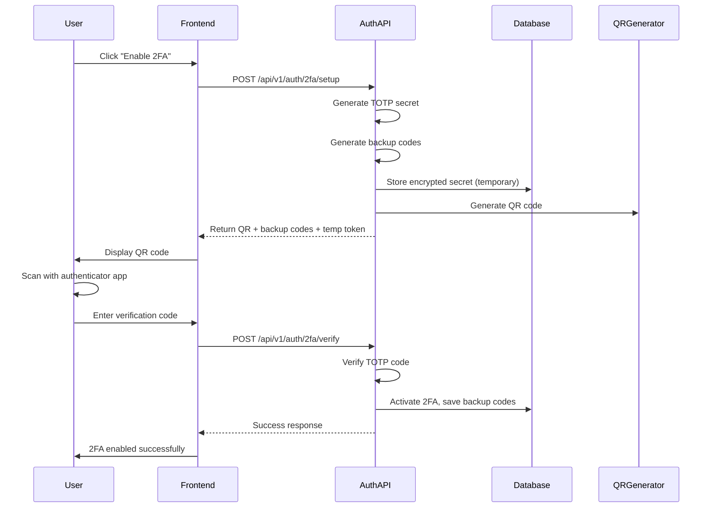
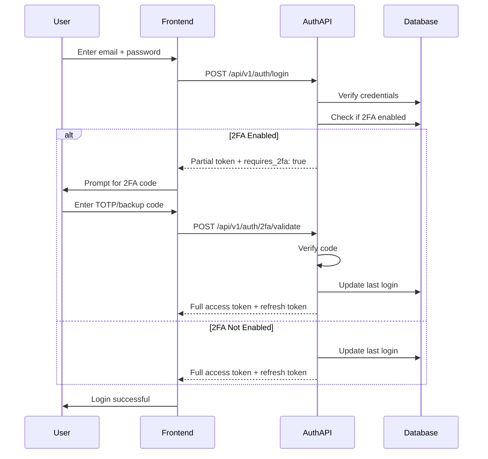
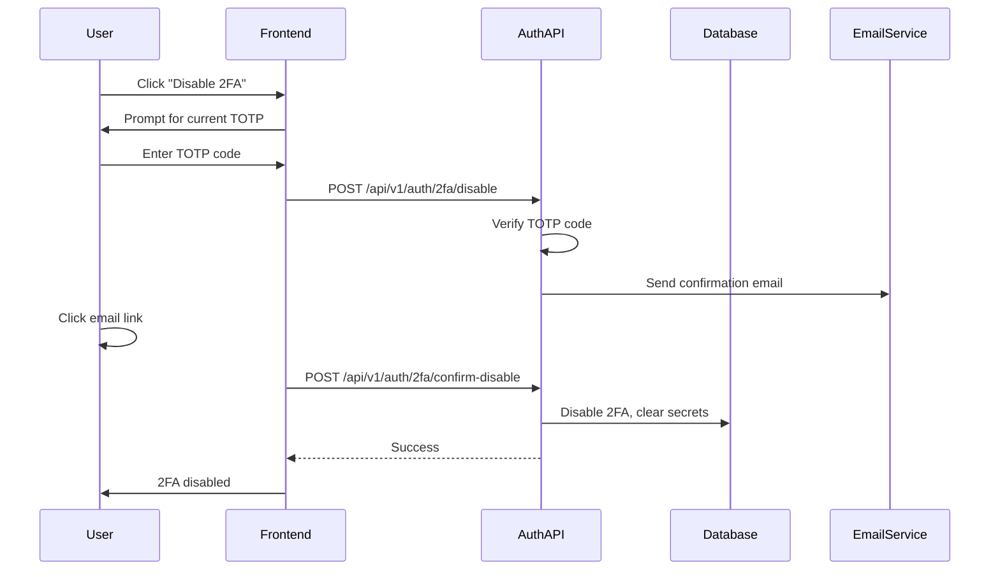

# Two-Factor Authentication (2FA) Implementation Plan

**Version:** 1.0
**Date:** 2025-11-19
**Author:** Backend Development Team
**Status:** Draft

---

## Executive Summary

This document outlines the implementation plan for Two-Factor Authentication (2FA) using Time-based One-Time Password (TOTP) for the cryptocurrency exchange platform. The implementation will support authenticator apps like Google Authenticator and Authy, providing an additional security layer for user accounts.

---

## 1. Library Selection and Recommendation

### 1.1 TOTP Libraries Evaluation

| Library | Version | TypeScript Support | Maintenance | Weekly Downloads | Recommendation |
|---------|---------|-------------------|-------------|------------------|----------------|
| **otpauth** | 9.2.x | Full | Active | ~63,000 | ✅ **RECOMMENDED** |
| otplib | 12.0.x | Full | Low Activity | ~40,000 | ⚠️ Consider |
| speakeasy | 2.0.0 | Via @types | **Abandoned** | ~70,000 | ❌ Do Not Use |
| @levminer/speakeasy | 1.0.x | Full | Fork, Active | ~5,000 | ⚠️ Alternative |

### 1.2 Recommended Choice: `otpauth`

**Reasons for Selection:**
- Actively maintained with regular updates
- Native TypeScript support
- No external dependencies
- Comprehensive API for TOTP/HOTP
- Compatible with Google Authenticator
- Strong community adoption (63K weekly downloads)
- Well-documented with clear examples

**Installation:**
```bash
npm install otpauth --save
```

### 1.3 QR Code Generation Library

**Recommended:** `qrcode` (v1.5.x)
- TypeScript support via @types/qrcode
- Generate QR codes as data URLs
- Async/await support
- Wide adoption (2M+ weekly downloads)

**Installation:**
```bash
npm install qrcode --save
npm install @types/qrcode --save-dev
```

---

## 2. Security Considerations

### 2.1 TOTP Secret Storage
- **Encryption:** AES-256-GCM encryption for TOTP secrets
- **Key Management:** Use environment variable for encryption key
- **Database:** Store encrypted secrets in `two_fa_secret` column
- **Never expose:** Raw secrets should never be logged or returned in API responses

### 2.2 Backup Codes
- **Generation:** 8 codes, 8 alphanumeric characters each
- **Format:** XXXX-XXXX (for readability)
- **Storage:** Hash with Argon2id before storing
- **Usage:** Single-use only, mark as used after verification
- **Regeneration:** Allow users to regenerate new codes (invalidates old ones)

### 2.3 Time Drift Handling
- **Window:** Allow ±1 window (30 seconds before/after)
- **Algorithm:** Check current window, then ±1 window
- **Rate Limiting:** Max 3 verification attempts per 30 seconds
- **Lock:** Temporary lock after 5 consecutive failures

### 2.4 Recovery Mechanisms
- **Primary:** Backup codes (8 single-use codes)
- **Secondary:** Email-based recovery with admin approval
- **Account Recovery:** Disable 2FA via email confirmation + identity verification

---

## 3. Implementation Approach

### 3.1 2FA Setup Flow



### 3.2 2FA Login Flow



### 3.3 2FA Disable Flow



---

## 4. API Contract

### 4.1 Initialize 2FA Setup
**POST** `/api/v1/auth/2fa/setup`

**Headers:**
```json
{
  "Authorization": "Bearer {access_token}"
}
```

**Response (200 OK):**
```json
{
  "success": true,
  "data": {
    "qr_code": "data:image/png;base64,...",
    "manual_entry_key": "JBSWY3DPEHPK3PXP",
    "backup_codes": [
      "A1B2-C3D4",
      "E5F6-G7H8",
      "I9J0-K1L2",
      "M3N4-O5P6",
      "Q7R8-S9T0",
      "U1V2-W3X4",
      "Y5Z6-A7B8",
      "C9D0-E1F2"
    ],
    "setup_token": "tmp_2fa_setup_abc123"
  },
  "meta": {
    "timestamp": "2025-11-19T10:30:45.123Z",
    "request_id": "req_abc123"
  }
}
```

### 4.2 Verify and Enable 2FA
**POST** `/api/v1/auth/2fa/verify`

**Headers:**
```json
{
  "Authorization": "Bearer {access_token}"
}
```

**Body:**
```json
{
  "code": "123456",
  "setup_token": "tmp_2fa_setup_abc123"
}
```

**Response (200 OK):**
```json
{
  "success": true,
  "data": {
    "message": "Two-factor authentication enabled successfully"
  },
  "meta": {
    "timestamp": "2025-11-19T10:30:45.123Z",
    "request_id": "req_abc123"
  }
}
```

### 4.3 Validate 2FA During Login
**POST** `/api/v1/auth/2fa/validate`

**Body:**
```json
{
  "code": "123456",
  "partial_token": "partial_jwt_token",
  "trust_device": false
}
```

**Response (200 OK):**
```json
{
  "success": true,
  "data": {
    "access_token": "eyJhbGciOiJIUzI1NiIs...",
    "refresh_token": "eyJhbGciOiJIUzI1NiIs...",
    "expires_in": 900
  },
  "meta": {
    "timestamp": "2025-11-19T10:30:45.123Z",
    "request_id": "req_abc123"
  }
}
```

### 4.4 Disable 2FA
**POST** `/api/v1/auth/2fa/disable`

**Headers:**
```json
{
  "Authorization": "Bearer {access_token}"
}
```

**Body:**
```json
{
  "code": "123456",
  "password": "current_password"
}
```

**Response (200 OK):**
```json
{
  "success": true,
  "data": {
    "message": "Confirmation email sent. Please check your email to complete disabling 2FA."
  },
  "meta": {
    "timestamp": "2025-11-19T10:30:45.123Z",
    "request_id": "req_abc123"
  }
}
```

### 4.5 Regenerate Backup Codes
**POST** `/api/v1/auth/2fa/backup-codes`

**Headers:**
```json
{
  "Authorization": "Bearer {access_token}"
}
```

**Body:**
```json
{
  "code": "123456"
}
```

**Response (200 OK):**
```json
{
  "success": true,
  "data": {
    "backup_codes": [
      "N1O2-P3Q4",
      "R5S6-T7U8",
      "V9W0-X1Y2",
      "Z3A4-B5C6",
      "D7E8-F9G0",
      "H1I2-J3K4",
      "L5M6-N7O8",
      "P9Q0-R1S2"
    ]
  },
  "meta": {
    "timestamp": "2025-11-19T10:30:45.123Z",
    "request_id": "req_abc123"
  }
}
```

---

## 5. Error Codes and Handling

| Error Code | HTTP Status | Message | Scenario |
|------------|-------------|---------|----------|
| `2FA_ALREADY_ENABLED` | 400 | Two-factor authentication is already enabled | User tries to setup 2FA when already active |
| `2FA_NOT_ENABLED` | 400 | Two-factor authentication is not enabled | User tries to disable/validate when 2FA not active |
| `INVALID_2FA_CODE` | 401 | Invalid verification code | Wrong TOTP or backup code |
| `2FA_CODE_EXPIRED` | 401 | Verification code has expired | TOTP outside time window |
| `INVALID_SETUP_TOKEN` | 400 | Invalid or expired setup token | Setup token not found or expired |
| `TOO_MANY_ATTEMPTS` | 429 | Too many verification attempts | Rate limit exceeded |
| `BACKUP_CODE_USED` | 400 | This backup code has already been used | Attempting to reuse backup code |
| `NO_BACKUP_CODES_LEFT` | 400 | All backup codes have been used | Need to regenerate codes |

---

## 6. Implementation Checklist

### Phase 1: Core Implementation (Day 6)
- [ ] Install otpauth and qrcode libraries
- [ ] Create TwoFactorService with core methods
- [ ] Implement TOTP secret generation and encryption
- [ ] Implement QR code generation
- [ ] Create backup codes generation logic
- [ ] Implement TOTP verification logic
- [ ] Add rate limiting for verification attempts

### Phase 2: API Endpoints (Day 6)
- [ ] Create TwoFactorController
- [ ] Implement /2fa/setup endpoint
- [ ] Implement /2fa/verify endpoint
- [ ] Implement /2fa/validate endpoint
- [ ] Implement /2fa/disable endpoint
- [ ] Implement /2fa/backup-codes endpoint

### Phase 3: Integration & Testing (Day 6)
- [ ] Update login flow for 2FA validation
- [ ] Add 2FA guards for protected routes
- [ ] Write unit tests (>80% coverage)
- [ ] Write integration tests
- [ ] Update OpenAPI documentation

### Phase 4: Security Hardening (Day 6)
- [ ] Implement encryption for TOTP secrets
- [ ] Add audit logging for 2FA events
- [ ] Implement temporary lockout after failures
- [ ] Add monitoring alerts for suspicious activity

---

## 7. Monitoring and Metrics

### Key Metrics to Track
- 2FA adoption rate (% of users with 2FA enabled)
- Failed verification attempts
- Backup code usage frequency
- Average setup completion time
- Device trust usage

### Logging Events
```json
{
  "event": "2fa.setup.initiated",
  "user_id": "usr_123",
  "ip": "192.168.1.1",
  "timestamp": "2025-11-19T10:30:45.123Z"
}
```

Event Types:
- `2fa.setup.initiated`
- `2fa.setup.completed`
- `2fa.verification.success`
- `2fa.verification.failed`
- `2fa.disabled`
- `2fa.backup_code.used`
- `2fa.backup_codes.regenerated`

---

## 8. Future Enhancements (Post-MVP)

1. **SMS-based 2FA** - Alternative to TOTP
2. **Hardware Key Support** - WebAuthn/FIDO2
3. **Biometric Authentication** - For mobile apps
4. **Risk-based Authentication** - Adaptive 2FA requirements
5. **Multiple 2FA Methods** - Allow users to configure multiple methods
6. **Push Notifications** - App-based push for approval

---

## 9. Appendix

### A. Sample Implementation Code

```typescript
// Using otpauth library
import { TOTP } from 'otpauth';
import * as QRCode from 'qrcode';
import * as crypto from 'crypto';

export class TwoFactorService {
  generateSecret(userId: string, email: string): string {
    const totp = new TOTP({
      issuer: 'MyCrypto Exchange',
      label: email,
      algorithm: 'SHA1',
      digits: 6,
      period: 30,
      secret: undefined // Will generate random secret
    });

    return totp.secret.base32;
  }

  async generateQRCode(secret: string, email: string): Promise<string> {
    const totp = new TOTP({
      issuer: 'MyCrypto Exchange',
      label: email,
      algorithm: 'SHA1',
      digits: 6,
      period: 30,
      secret: secret
    });

    const uri = totp.toString();
    return await QRCode.toDataURL(uri);
  }

  verifyToken(secret: string, token: string): boolean {
    const totp = new TOTP({
      issuer: 'MyCrypto Exchange',
      label: '',
      algorithm: 'SHA1',
      digits: 6,
      period: 30,
      secret: secret
    });

    // Check current window and ±1 window for time drift
    const delta = totp.validate({ token, window: 1 });
    return delta !== null;
  }

  generateBackupCodes(count: number = 8): string[] {
    const codes: string[] = [];
    for (let i = 0; i < count; i++) {
      const code = crypto.randomBytes(4).toString('hex').toUpperCase();
      codes.push(`${code.slice(0, 4)}-${code.slice(4)}`);
    }
    return codes;
  }
}
```

### B. Database Schema Updates

```sql
-- Already exists in user.entity.ts
-- two_fa_enabled: boolean
-- two_fa_secret: varchar(512) - encrypted
-- backup_codes: text - JSON array of hashed codes
-- two_fa_enabled_at: timestamp

-- Additional tracking table (optional)
CREATE TABLE two_fa_events (
  id UUID PRIMARY KEY DEFAULT gen_random_uuid(),
  user_id UUID REFERENCES users(id),
  event_type VARCHAR(50) NOT NULL,
  ip_address INET,
  user_agent TEXT,
  metadata JSONB,
  created_at TIMESTAMP DEFAULT NOW()
);

CREATE INDEX idx_two_fa_events_user_id ON two_fa_events(user_id);
CREATE INDEX idx_two_fa_events_created_at ON two_fa_events(created_at);
```

---

**Document Status:** Ready for Review
**Next Steps:** Implement according to this plan in BE-010 task (Day 6)
**Dependencies:** Database schema (DB-003) already completed